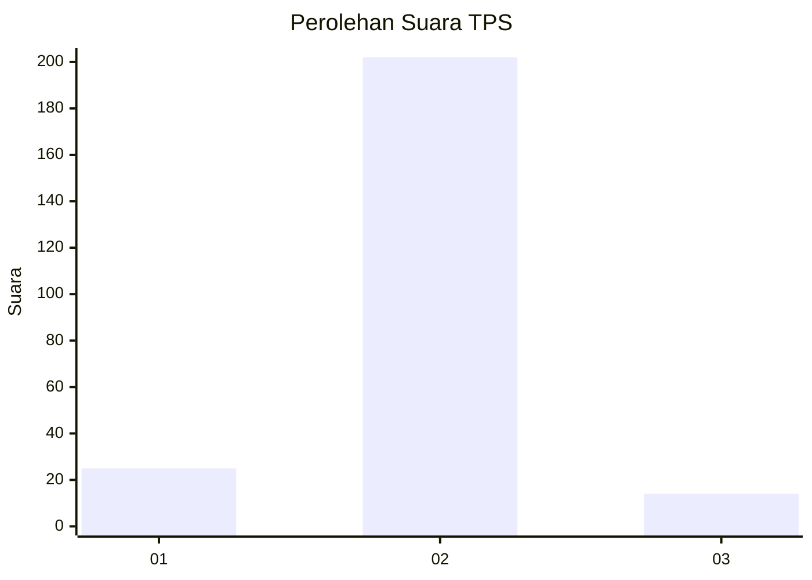
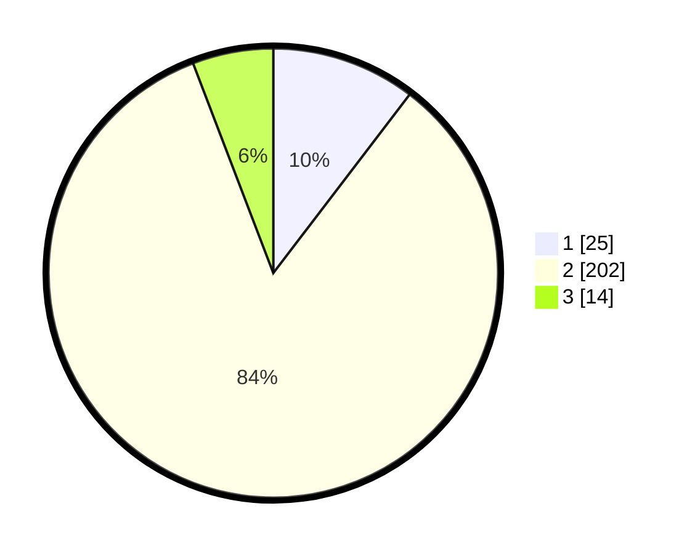

# Hasil

## Grafik

## Tabel

| No. | Nama Paslon    | Suara | Suara (raw) | Persentase |
|:--- |:-------------- | -----:| -----------:| ----------:|
| 1   | ANIES MUHAIMIN | 25    | [25][p-1]   | 10,37      |
| 2   | PRABOWO GIBRAN | 202   | [202][p-2]  | 83,82      |
| 3   | GANJAR MAHFUD  | 14    | [14][p-3]   | 5,81       |

[p-1]: https://github.com/gigit-pemilu/pemilu-2024-35-jawa-timur/blob/main/pilpres/hitung-suara/sub/35-jawa-timur/sub/11-bondowoso/sub/19-sempol/sub/2002-kalianyar/sub/003-tps/sub/paslon-1.txt
[p-2]: https://github.com/gigit-pemilu/pemilu-2024-35-jawa-timur/blob/main/pilpres/hitung-suara/sub/35-jawa-timur/sub/11-bondowoso/sub/19-sempol/sub/2002-kalianyar/sub/003-tps/sub/paslon-2.txt
[p-3]: https://github.com/gigit-pemilu/pemilu-2024-35-jawa-timur/blob/main/pilpres/hitung-suara/sub/35-jawa-timur/sub/11-bondowoso/sub/19-sempol/sub/2002-kalianyar/sub/003-tps/sub/paslon-3.txt

## Foto C Plano

https://sirekap-obj-formc.kpu.go.id/5bd9/pemilu/ppwp/35/11/19/20/02/3511192002003-20240217-144308--32398ec1-ee8d-4b0f-8849-1128c63305c2.jpg

https://sirekap-obj-formc.kpu.go.id/5bd9/pemilu/ppwp/35/11/19/20/02/3511192002003-20240215-142308--df2e8891-5a4c-497c-9835-f5ccc947df38.jpg

https://sirekap-obj-formc.kpu.go.id/5bd9/pemilu/ppwp/35/11/19/20/02/3511192002003-20240215-142442--501a2e9f-9c71-48b9-89f0-5fb662aad3da.jpg

## Metadata

| Key        | Value               |
| ---------- | ------------------- |
| Time Stamp | 2024-02-17 14:45:18 |

