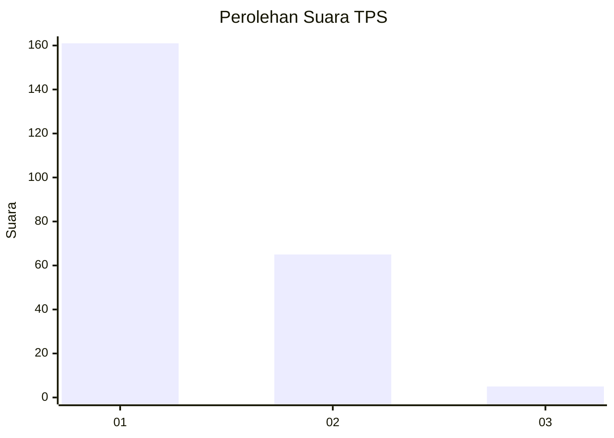
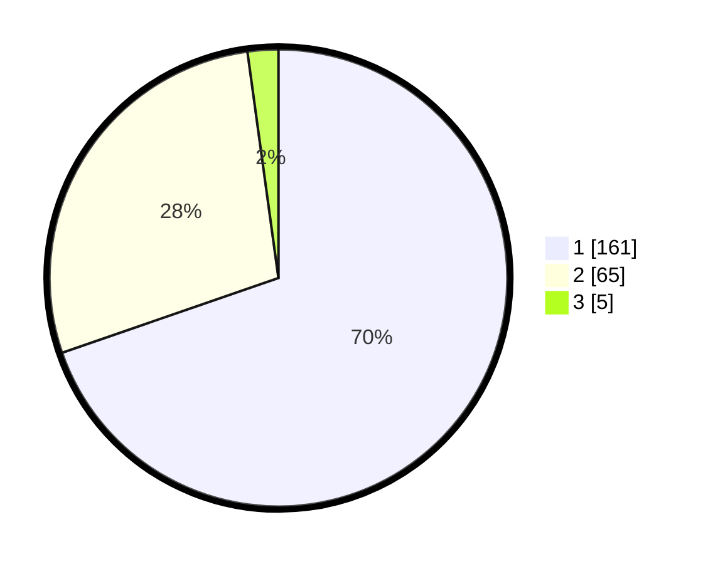

# Hasil

## Grafik

## Tabel

| No. | Nama Paslon    | Suara | Suara (raw) | Persentase |
|:--- |:-------------- | -----:| -----------:| ----------:|
| 1   | ANIES MUHAIMIN | 161   | [161][p-1]  | 69,70      |
| 2   | PRABOWO GIBRAN | 65    | [65][p-2]   | 28,14      |
| 3   | GANJAR MAHFUD  | 5     | [5][p-3]    | 2,16       |

[p-1]: https://github.com/gigit-pemilu/pemilu-2024-35-jawa-timur/blob/main/pilpres/hitung-suara/sub/35-jawa-timur/sub/11-bondowoso/sub/19-sempol/sub/2005-kali-gedang/sub/003-tps/sub/paslon-1.txt
[p-2]: https://github.com/gigit-pemilu/pemilu-2024-35-jawa-timur/blob/main/pilpres/hitung-suara/sub/35-jawa-timur/sub/11-bondowoso/sub/19-sempol/sub/2005-kali-gedang/sub/003-tps/sub/paslon-2.txt
[p-3]: https://github.com/gigit-pemilu/pemilu-2024-35-jawa-timur/blob/main/pilpres/hitung-suara/sub/35-jawa-timur/sub/11-bondowoso/sub/19-sempol/sub/2005-kali-gedang/sub/003-tps/sub/paslon-3.txt

## Foto C Plano

https://sirekap-obj-formc.kpu.go.id/5e74/pemilu/ppwp/35/11/19/20/05/3511192005003-20240215-151905--5abc6519-f2fb-468a-b1c8-daea520ee34a.jpg

https://sirekap-obj-formc.kpu.go.id/5e74/pemilu/ppwp/35/11/19/20/05/3511192005003-20240215-152036--af95ff91-cd8f-43a9-a3f7-dd380c010dd9.jpg

https://sirekap-obj-formc.kpu.go.id/5e74/pemilu/ppwp/35/11/19/20/05/3511192005003-20240215-152134--5e2480ee-9992-4330-8576-bf53ff9866de.jpg

## Metadata

| Key        | Value               |
| ---------- | ------------------- |
| Time Stamp | 2024-02-16 08:00:28 |

