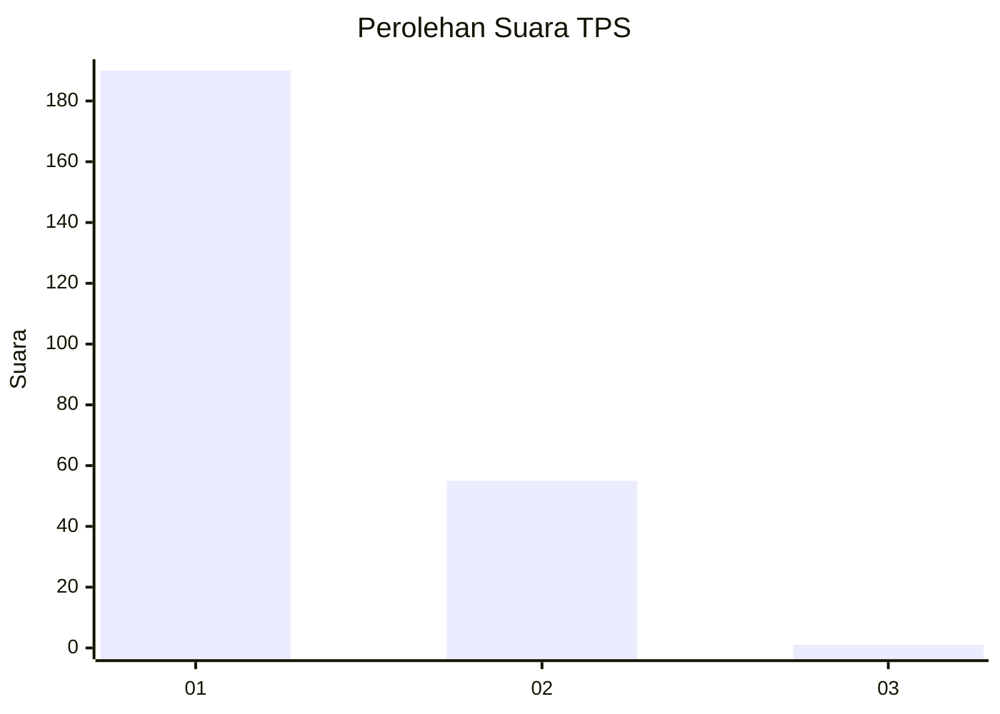
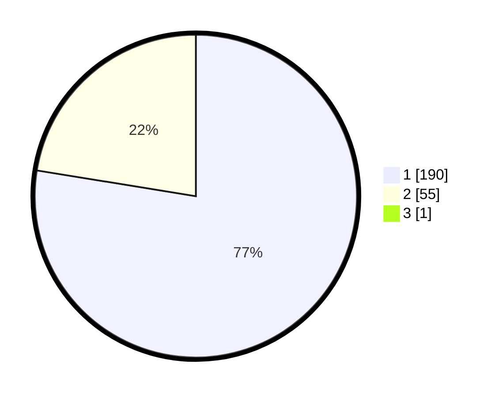

# Hasil

## Grafik

## Tabel

| No. | Nama Paslon    | Suara | Suara (raw) | Persentase |
|:--- |:-------------- | -----:| -----------:| ----------:|
| 1   | ANIES MUHAIMIN | 190   | [190][p-1]  | 77,24      |
| 2   | PRABOWO GIBRAN | 55    | [55][p-2]   | 22,36      |
| 3   | GANJAR MAHFUD  | 1     | [1][p-3]    | 0,41       |

[p-1]: https://github.com/gigit-pemilu/pemilu-2024-35-jawa-timur/blob/main/pilpres/hitung-suara/sub/35-jawa-timur/sub/11-bondowoso/sub/19-sempol/sub/2005-kali-gedang/sub/005-tps/sub/paslon-1.txt
[p-2]: https://github.com/gigit-pemilu/pemilu-2024-35-jawa-timur/blob/main/pilpres/hitung-suara/sub/35-jawa-timur/sub/11-bondowoso/sub/19-sempol/sub/2005-kali-gedang/sub/005-tps/sub/paslon-2.txt
[p-3]: https://github.com/gigit-pemilu/pemilu-2024-35-jawa-timur/blob/main/pilpres/hitung-suara/sub/35-jawa-timur/sub/11-bondowoso/sub/19-sempol/sub/2005-kali-gedang/sub/005-tps/sub/paslon-3.txt

## Foto C Plano

https://sirekap-obj-formc.kpu.go.id/16f0/pemilu/ppwp/35/11/19/20/05/3511192005005-20240215-152156--1dba391b-b5fb-46db-a137-541b629b9c2c.jpg

https://sirekap-obj-formc.kpu.go.id/16f0/pemilu/ppwp/35/11/19/20/05/3511192005005-20240215-152256--cb39759f-092d-4b25-b85f-90a9beae65be.jpg

https://sirekap-obj-formc.kpu.go.id/16f0/pemilu/ppwp/35/11/19/20/05/3511192005005-20240215-152408--08fd5492-d12a-40ca-a8b0-522e74c108a2.jpg

## Metadata

| Key        | Value               |
| ---------- | ------------------- |
| Time Stamp | 2024-02-16 08:00:28 |

