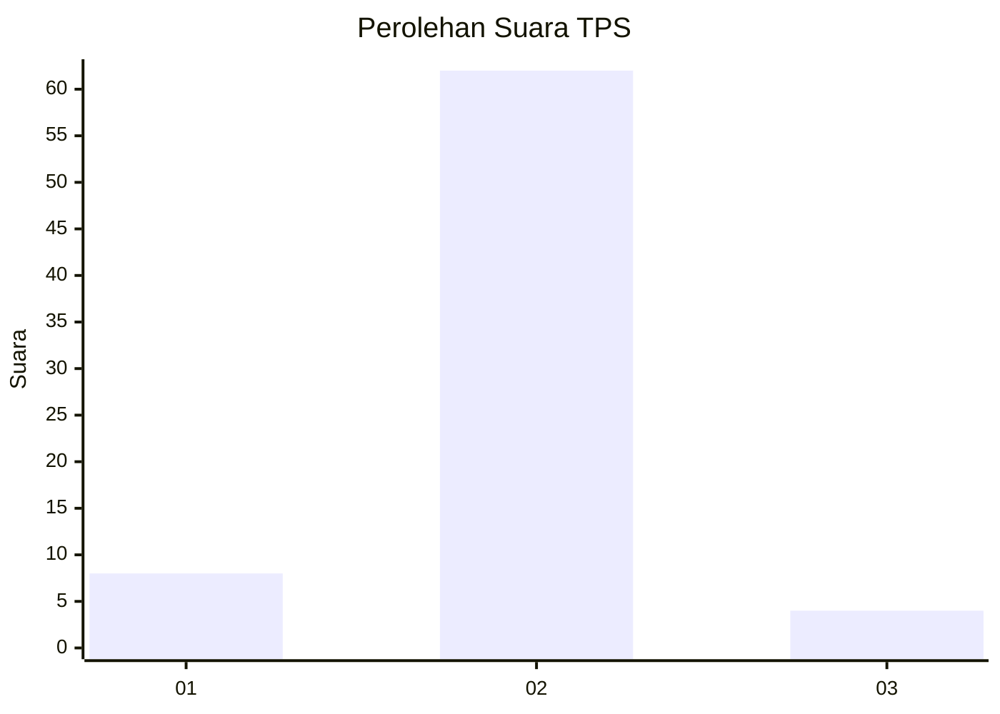
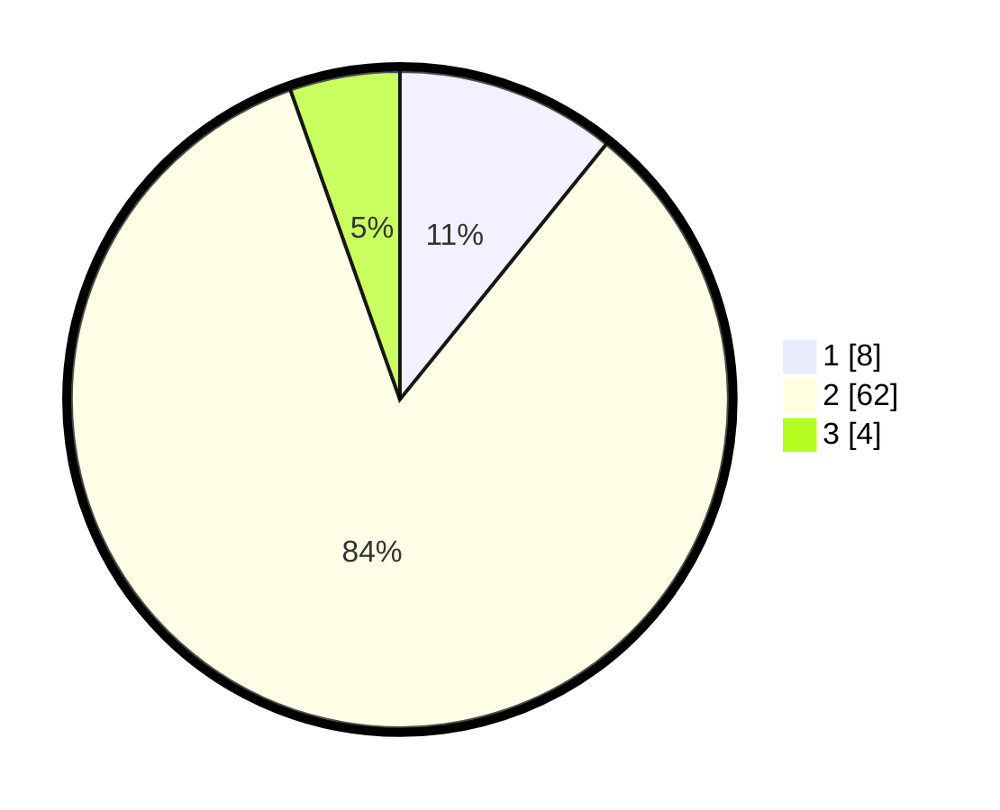

# Hasil

## Grafik

## Tabel

| No. | Nama Paslon    | Suara | Suara (raw) | Persentase |
|:--- |:-------------- | -----:| -----------:| ----------:|
| 1   | ANIES MUHAIMIN | 8     | [8][p-1]    | 10,81      |
| 2   | PRABOWO GIBRAN | 62    | [62][p-2]   | 83,78      |
| 3   | GANJAR MAHFUD  | 4     | [4][p-3]    | 5,41       |

[p-1]: https://github.com/gigit-pemilu/pemilu-2024/blob/main/pilpres/hitung-suara/sub/35-jawa-timur/sub/11-bondowoso/sub/19-sempol/sub/2006-sumber-rejo/sub/005-tps/sub/paslon-1.txt
[p-2]: https://github.com/gigit-pemilu/pemilu-2024/blob/main/pilpres/hitung-suara/sub/35-jawa-timur/sub/11-bondowoso/sub/19-sempol/sub/2006-sumber-rejo/sub/005-tps/sub/paslon-2.txt
[p-3]: https://github.com/gigit-pemilu/pemilu-2024/blob/main/pilpres/hitung-suara/sub/35-jawa-timur/sub/11-bondowoso/sub/19-sempol/sub/2006-sumber-rejo/sub/005-tps/sub/paslon-3.txt

## Foto C Plano

https://sirekap-obj-formc.kpu.go.id/e661/pemilu/ppwp/35/11/19/20/06/3511192006005-20240216-102019--88863ecb-0f90-46ed-b8a8-1338765312a7.jpg

https://sirekap-obj-formc.kpu.go.id/e661/pemilu/ppwp/35/11/19/20/06/3511192006005-20240216-102117--98809d41-0cf9-4a8b-914f-6599211125f7.jpg

https://sirekap-obj-formc.kpu.go.id/e661/pemilu/ppwp/35/11/19/20/06/3511192006005-20240216-102244--1d9c61d5-a86e-43de-94c4-8acbfc646daa.jpg

## Metadata

| Key        | Value               |
| ---------- | ------------------- |
| Time Stamp | 2024-02-16 22:01:00 |

## DATA PEMILIH TETAP

Jumlah pemilih dalam DPT: **99**.
 * L: **50**.
 * P: **49**.

## DATA PENGGUNA HAK PILIH

Jumlah pengguna hak pilih dalam DPT: **76**.
 * L: **37**.
 * P: **39**.

Jumlah pengguna hak pilih dalam DPTb: **1**.
 * L: **1**.
 * P: **0**.

Jumlah pengguna hak pilih dalam DPK: **0**.
 * L: **0**.
 * P: **0**.

Jumlah pengguna hak pilih: **77**.
 * L: **38**.
 * P: **39**.

## JUMLAH SUARA SAH DAN TIDAK SAH

JUMLAH SELURUH SUARA SAH: **74**.

JUMLAH SUARA TIDAK SAH: **3**.

JUMLAH SELURUH SUARA SAH DAN SUARA TIDAK SAH: **77**.

