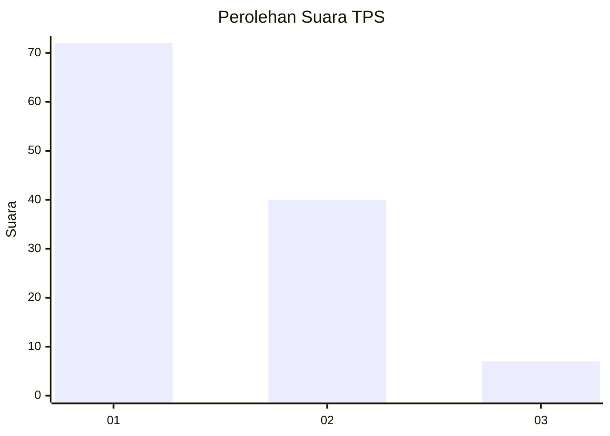
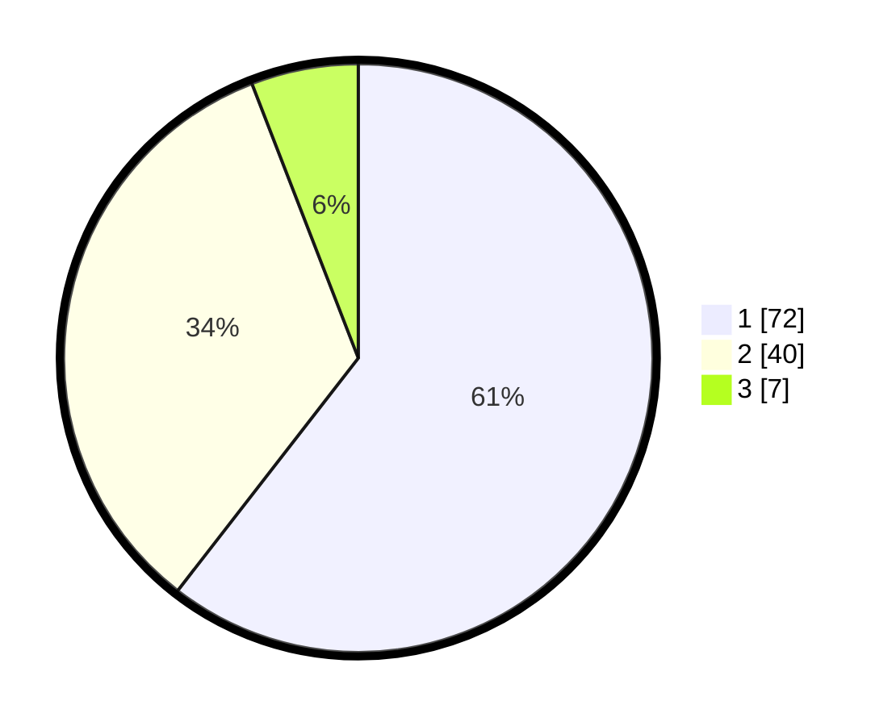

# Hasil

## Grafik

## Tabel

| No. | Nama Paslon    | Suara | Suara (raw) | Persentase |
|:--- |:-------------- | -----:| -----------:| ----------:|
| 1   | ANIES MUHAIMIN | 72    | [72][p-1]   | 60,50      |
| 2   | PRABOWO GIBRAN | 40    | [40][p-2]   | 33,61      |
| 3   | GANJAR MAHFUD  | 7     | [7][p-3]    | 5,88       |

[p-1]: https://github.com/gigit-pemilu/pemilu-2024/blob/main/pilpres/hitung-suara/sub/35-jawa-timur/sub/11-bondowoso/sub/20-binakal/sub/2001-gadingsari/sub/008-tps/sub/paslon-1.txt
[p-2]: https://github.com/gigit-pemilu/pemilu-2024/blob/main/pilpres/hitung-suara/sub/35-jawa-timur/sub/11-bondowoso/sub/20-binakal/sub/2001-gadingsari/sub/008-tps/sub/paslon-2.txt
[p-3]: https://github.com/gigit-pemilu/pemilu-2024/blob/main/pilpres/hitung-suara/sub/35-jawa-timur/sub/11-bondowoso/sub/20-binakal/sub/2001-gadingsari/sub/008-tps/sub/paslon-3.txt

## Foto C Plano

https://sirekap-obj-formc.kpu.go.id/2ab6/pemilu/ppwp/35/11/20/20/01/3511202001008-20240214-224200--41f850c1-c11c-4368-a6f7-5f08c321ce3a.jpg

https://sirekap-obj-formc.kpu.go.id/2ab6/pemilu/ppwp/35/11/20/20/01/3511202001008-20240214-224345--0bd969c0-5301-4591-8eb2-d26feed9a1a6.jpg

https://sirekap-obj-formc.kpu.go.id/2ab6/pemilu/ppwp/35/11/20/20/01/3511202001008-20240215-092729--8e1f1698-97c2-48b1-9eaa-ac2eda7346a5.jpg

## Metadata

| Key        | Value               |
| ---------- | ------------------- |
| Time Stamp | 2024-02-16 09:30:28 |

