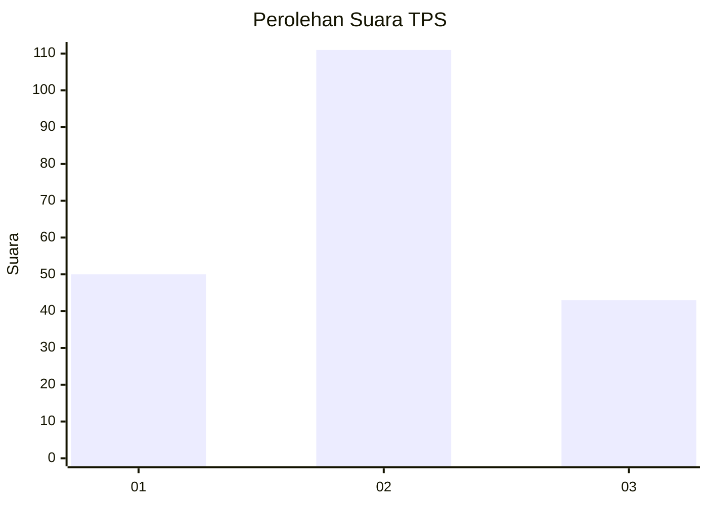
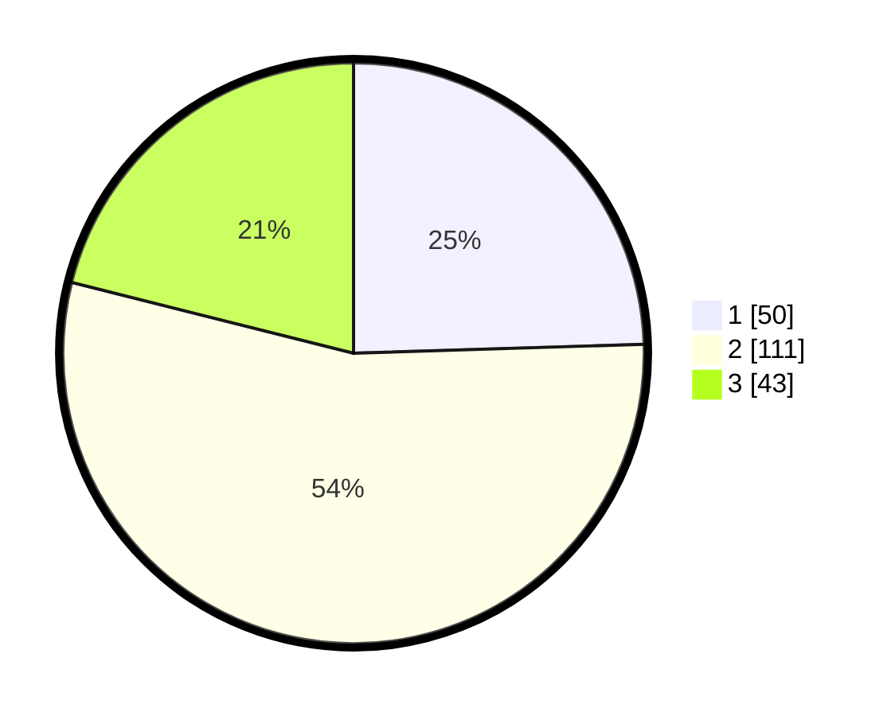

# Hasil

## Grafik

## Tabel

| No. | Nama Paslon    | Suara | Suara (raw) | Persentase |
|:--- |:-------------- | -----:| -----------:| ----------:|
| 1   | ANIES MUHAIMIN | 50    | [50][p-1]   | 24,51      |
| 2   | PRABOWO GIBRAN | 111   | [111][p-2]  | 54,41      |
| 3   | GANJAR MAHFUD  | 43    | [43][p-3]   | 21,08      |

[p-1]: https://github.com/gigit-pemilu/pemilu-2024/blob/main/pilpres/hitung-suara/sub/35-jawa-timur/sub/11-bondowoso/sub/20-binakal/sub/2006-jeruksoksok/sub/003-tps/sub/paslon-1.txt
[p-2]: https://github.com/gigit-pemilu/pemilu-2024/blob/main/pilpres/hitung-suara/sub/35-jawa-timur/sub/11-bondowoso/sub/20-binakal/sub/2006-jeruksoksok/sub/003-tps/sub/paslon-2.txt
[p-3]: https://github.com/gigit-pemilu/pemilu-2024/blob/main/pilpres/hitung-suara/sub/35-jawa-timur/sub/11-bondowoso/sub/20-binakal/sub/2006-jeruksoksok/sub/003-tps/sub/paslon-3.txt

## Foto C Plano

https://sirekap-obj-formc.kpu.go.id/8269/pemilu/ppwp/35/11/20/20/06/3511202006003-20240214-155657--f2ff933b-a23c-4243-8981-5566e33d39ba.jpg

https://sirekap-obj-formc.kpu.go.id/8269/pemilu/ppwp/35/11/20/20/06/3511202006003-20240214-155754--6d358268-4d8b-4f96-9709-3736b6b2522c.jpg

https://sirekap-obj-formc.kpu.go.id/8269/pemilu/ppwp/35/11/20/20/06/3511202006003-20240214-155852--86fa054b-416f-4029-80c4-9f695bb84561.jpg

## Metadata

| Key        | Value               |
| ---------- | ------------------- |
| Time Stamp | 2024-02-16 09:30:28 |

