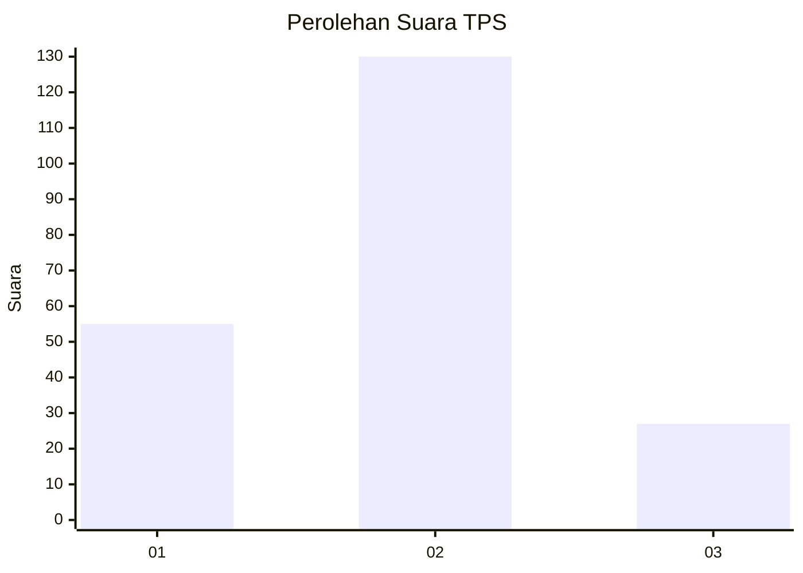
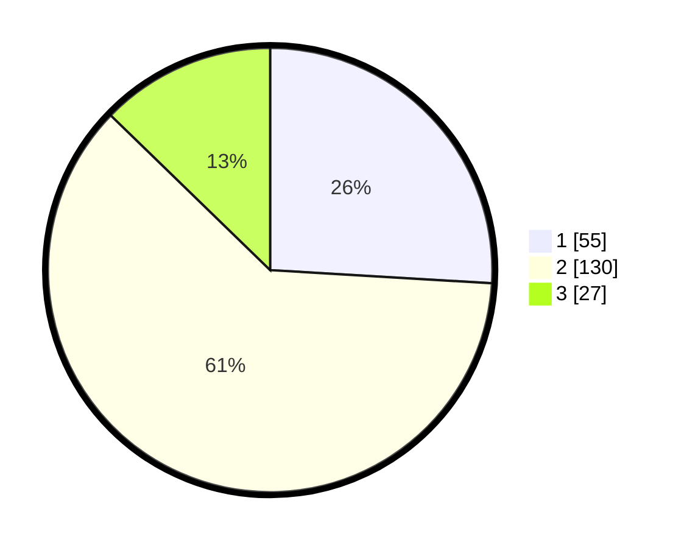

# Hasil

## Grafik

## Tabel

| No. | Nama Paslon    | Suara | Suara (raw) | Persentase |
|:--- |:-------------- | -----:| -----------:| ----------:|
| 1   | ANIES MUHAIMIN | 55    | [55][p-1]   | 25,94      |
| 2   | PRABOWO GIBRAN | 130   | [130][p-2]  | 61,32      |
| 3   | GANJAR MAHFUD  | 27    | [27][p-3]   | 12,74      |

[p-1]: https://github.com/gigit-pemilu/pemilu-2024/blob/main/pilpres/hitung-suara/sub/35-jawa-timur/sub/11-bondowoso/sub/20-binakal/sub/2006-jeruksoksok/sub/005-tps/sub/paslon-1.txt
[p-2]: https://github.com/gigit-pemilu/pemilu-2024/blob/main/pilpres/hitung-suara/sub/35-jawa-timur/sub/11-bondowoso/sub/20-binakal/sub/2006-jeruksoksok/sub/005-tps/sub/paslon-2.txt
[p-3]: https://github.com/gigit-pemilu/pemilu-2024/blob/main/pilpres/hitung-suara/sub/35-jawa-timur/sub/11-bondowoso/sub/20-binakal/sub/2006-jeruksoksok/sub/005-tps/sub/paslon-3.txt

## Foto C Plano

https://sirekap-obj-formc.kpu.go.id/b60a/pemilu/ppwp/35/11/20/20/06/3511202006005-20240214-155532--acf073eb-0754-4e3d-b072-c39f1f9fd39b.jpg

https://sirekap-obj-formc.kpu.go.id/b60a/pemilu/ppwp/35/11/20/20/06/3511202006005-20240214-162210--564774eb-2e2c-4b16-a4b2-7b6cd5e66ae4.jpg

https://sirekap-obj-formc.kpu.go.id/b60a/pemilu/ppwp/35/11/20/20/06/3511202006005-20240214-155845--1b3b6f62-808f-413b-a1f5-4851ddf40d90.jpg

## Metadata

| Key        | Value               |
| ---------- | ------------------- |
| Time Stamp | 2024-02-16 09:30:28 |

