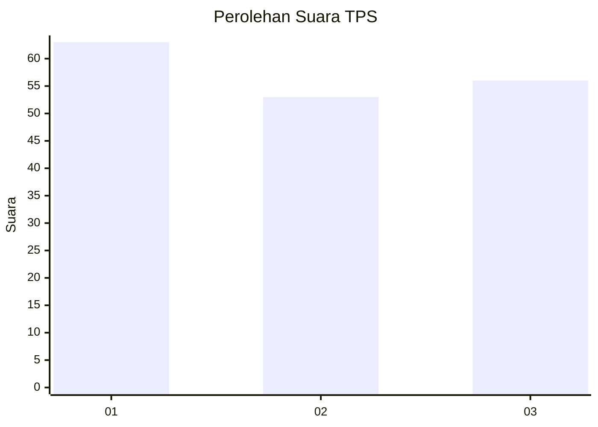
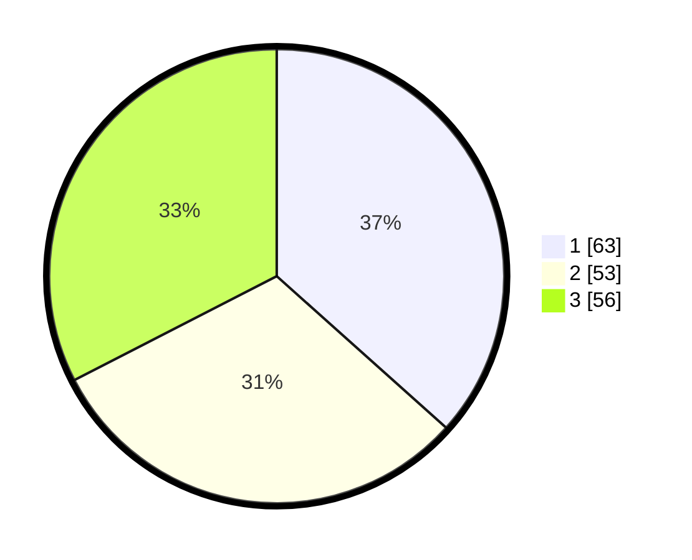

# Hasil

## Grafik

## Tabel

| No. | Nama Paslon    | Suara | Suara (raw) | Persentase |
|:--- |:-------------- | -----:| -----------:| ----------:|
| 1   | ANIES MUHAIMIN | 63    | [63][p-1]   | 36,63      |
| 2   | PRABOWO GIBRAN | 53    | [53][p-2]   | 30,81      |
| 3   | GANJAR MAHFUD  | 56    | [56][p-3]   | 32,56      |

[p-1]: https://github.com/gigit-pemilu/pemilu-2024/blob/main/pilpres/hitung-suara/sub/35-jawa-timur/sub/11-bondowoso/sub/20-binakal/sub/2007-sumber-tengah/sub/004-tps/sub/paslon-1.txt
[p-2]: https://github.com/gigit-pemilu/pemilu-2024/blob/main/pilpres/hitung-suara/sub/35-jawa-timur/sub/11-bondowoso/sub/20-binakal/sub/2007-sumber-tengah/sub/004-tps/sub/paslon-2.txt
[p-3]: https://github.com/gigit-pemilu/pemilu-2024/blob/main/pilpres/hitung-suara/sub/35-jawa-timur/sub/11-bondowoso/sub/20-binakal/sub/2007-sumber-tengah/sub/004-tps/sub/paslon-3.txt

## Foto C Plano

https://sirekap-obj-formc.kpu.go.id/6f6c/pemilu/ppwp/35/11/20/20/07/3511202007004-20240214-192915--3a3fffb4-9700-48e7-bed2-f7aca8228b57.jpg

https://sirekap-obj-formc.kpu.go.id/6f6c/pemilu/ppwp/35/11/20/20/07/3511202007004-20240214-195257--db7fd04b-ffff-42c5-8179-3e0bdfbdc11e.jpg

## Metadata

| Key        | Value               |
| ---------- | ------------------- |
| Time Stamp | 2024-02-24 22:31:28 |

