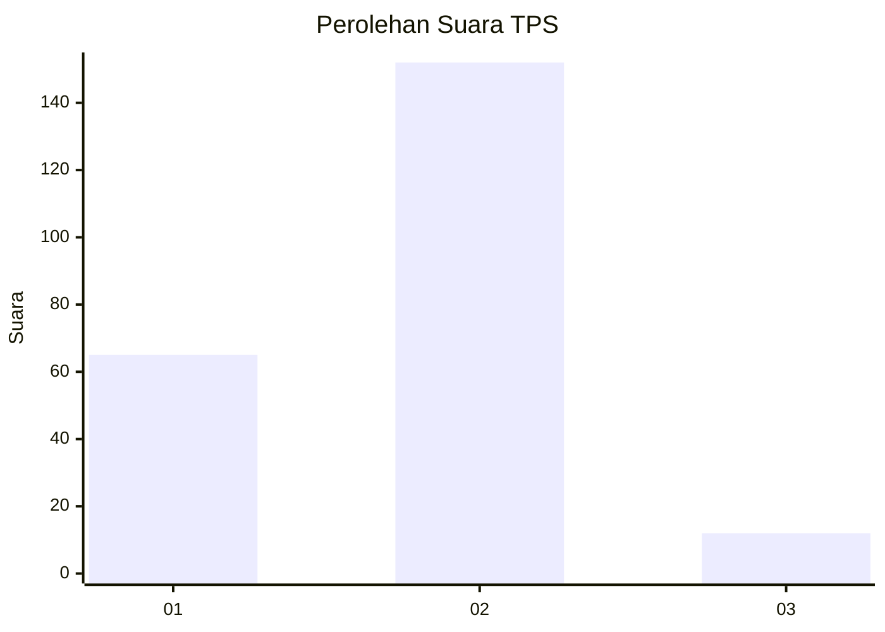
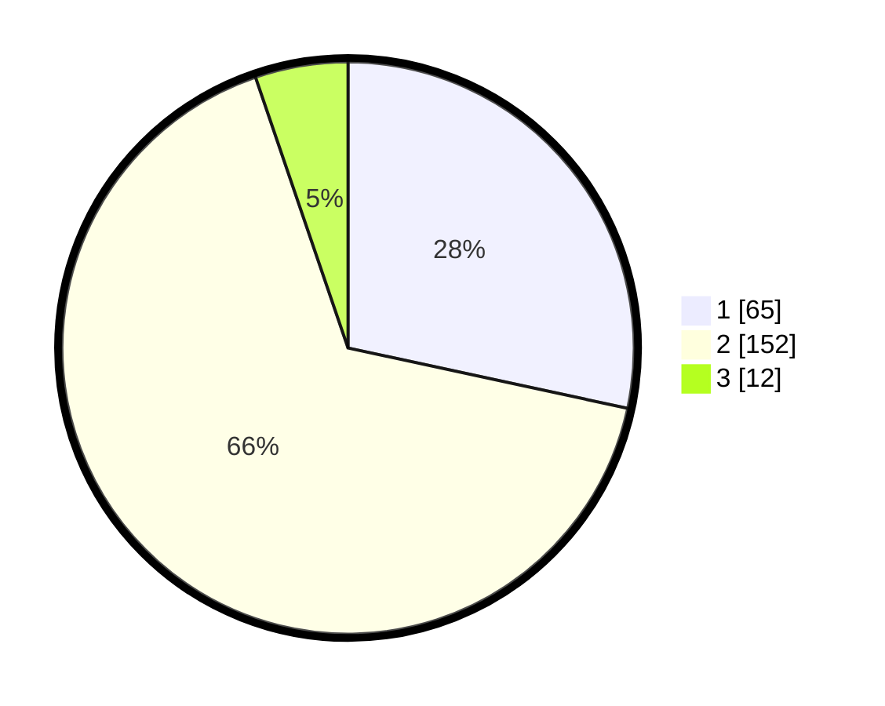

# Hasil

## Grafik

## Tabel

| No. | Nama Paslon    | Suara | Suara (raw) | Persentase |
|:--- |:-------------- | -----:| -----------:| ----------:|
| 1   | ANIES MUHAIMIN | 65    | [65][p-1]   | 28,38      |
| 2   | PRABOWO GIBRAN | 152   | [152][p-2]  | 66,38      |
| 3   | GANJAR MAHFUD  | 12    | [12][p-3]   | 5,24       |

[p-1]: https://github.com/gigit-pemilu/pemilu-2024-35-jawa-timur/blob/main/pilpres/hitung-suara/sub/35-jawa-timur/sub/11-bondowoso/sub/21-taman-krocok/sub/2003-kemuningan/sub/002-tps/sub/paslon-1.txt
[p-2]: https://github.com/gigit-pemilu/pemilu-2024-35-jawa-timur/blob/main/pilpres/hitung-suara/sub/35-jawa-timur/sub/11-bondowoso/sub/21-taman-krocok/sub/2003-kemuningan/sub/002-tps/sub/paslon-2.txt
[p-3]: https://github.com/gigit-pemilu/pemilu-2024-35-jawa-timur/blob/main/pilpres/hitung-suara/sub/35-jawa-timur/sub/11-bondowoso/sub/21-taman-krocok/sub/2003-kemuningan/sub/002-tps/sub/paslon-3.txt

## Foto C Plano

https://sirekap-obj-formc.kpu.go.id/94a0/pemilu/ppwp/35/11/21/20/03/3511212003002-20240215-000814--8579e045-f203-4516-bbc9-f768b46567bc.jpg

https://sirekap-obj-formc.kpu.go.id/94a0/pemilu/ppwp/35/11/21/20/03/3511212003002-20240215-000901--d7797b68-0b9d-4722-b4a4-358e5209fb03.jpg

https://sirekap-obj-formc.kpu.go.id/94a0/pemilu/ppwp/35/11/21/20/03/3511212003002-20240215-000952--64a76cbf-2227-47bc-ac9d-699603256e6c.jpg

## Metadata

| Key        | Value               |
| ---------- | ------------------- |
| Time Stamp | 2024-02-16 11:00:29 |

