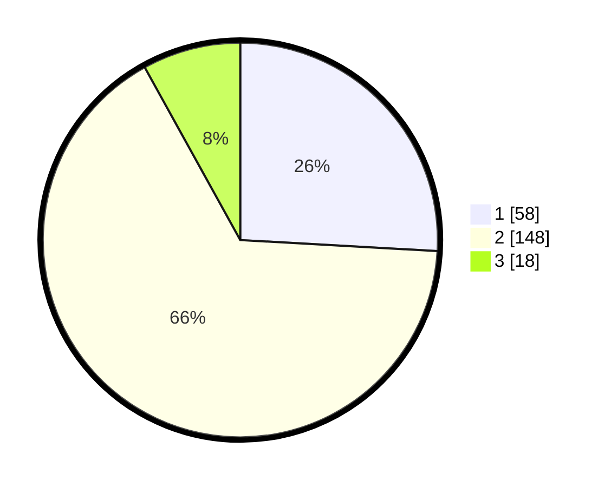

# Hasil

## Grafik

## Tabel

| No. | Nama Paslon    | Suara | Suara (raw) | Persentase |
|:--- |:-------------- | -----:| -----------:| ----------:|
| 1   | ANIES MUHAIMIN | 58    | [58][p-1]   | 25,89      |
| 2   | PRABOWO GIBRAN | 148   | [148][p-2]  | 66,07      |
| 3   | GANJAR MAHFUD  | 18    | [18][p-3]   | 8,04       |

[p-1]: https://github.com/gigit-pemilu/pemilu-2024-35-jawa-timur/blob/main/pilpres/hitung-suara/sub/35-jawa-timur/sub/11-bondowoso/sub/21-taman-krocok/sub/2003-kemuningan/sub/003-tps/sub/paslon-1.txt
[p-2]: https://github.com/gigit-pemilu/pemilu-2024-35-jawa-timur/blob/main/pilpres/hitung-suara/sub/35-jawa-timur/sub/11-bondowoso/sub/21-taman-krocok/sub/2003-kemuningan/sub/003-tps/sub/paslon-2.txt
[p-3]: https://github.com/gigit-pemilu/pemilu-2024-35-jawa-timur/blob/main/pilpres/hitung-suara/sub/35-jawa-timur/sub/11-bondowoso/sub/21-taman-krocok/sub/2003-kemuningan/sub/003-tps/sub/paslon-3.txt

## Foto C Plano

https://sirekap-obj-formc.kpu.go.id/b9d0/pemilu/ppwp/35/11/21/20/03/3511212003003-20240215-103242--af2150cf-8d33-4c52-96b1-f756fabd0206.jpg

https://sirekap-obj-formc.kpu.go.id/b9d0/pemilu/ppwp/35/11/21/20/03/3511212003003-20240215-103413--d25b91d0-9640-4517-b316-5cfbbdad3b40.jpg

https://sirekap-obj-formc.kpu.go.id/b9d0/pemilu/ppwp/35/11/21/20/03/3511212003003-20240215-103530--0c991a4a-097f-4a3b-b52d-59a5d80571be.jpg

## Metadata

| Key        | Value               |
| ---------- | ------------------- |
| Time Stamp | 2024-02-16 11:00:29 |

