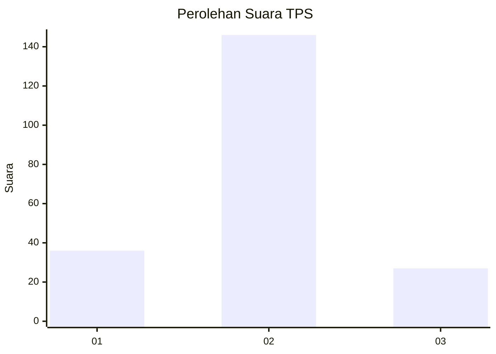
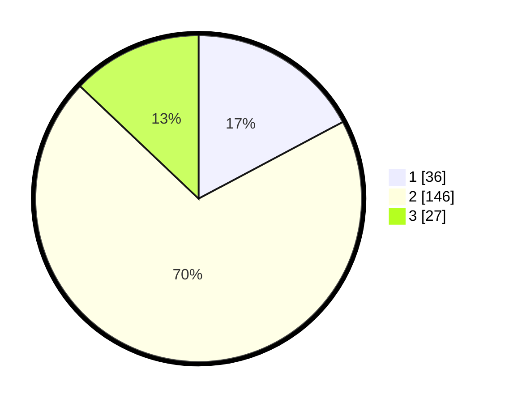

# Hasil

## Grafik

## Tabel

| No. | Nama Paslon    | Suara | Suara (raw) | Persentase |
|:--- |:-------------- | -----:| -----------:| ----------:|
| 1   | ANIES MUHAIMIN | 36    | [36][p-1]   | 17,22      |
| 2   | PRABOWO GIBRAN | 146   | [146][p-2]  | 69,86      |
| 3   | GANJAR MAHFUD  | 27    | [27][p-3]   | 12,92      |

[p-1]: https://github.com/gigit-pemilu/pemilu-2024/blob/main/pilpres/hitung-suara/sub/35-jawa-timur/sub/11-bondowoso/sub/22-botolinggo/sub/2001-lumutan/sub/001-tps/sub/paslon-1.txt
[p-2]: https://github.com/gigit-pemilu/pemilu-2024/blob/main/pilpres/hitung-suara/sub/35-jawa-timur/sub/11-bondowoso/sub/22-botolinggo/sub/2001-lumutan/sub/001-tps/sub/paslon-2.txt
[p-3]: https://github.com/gigit-pemilu/pemilu-2024/blob/main/pilpres/hitung-suara/sub/35-jawa-timur/sub/11-bondowoso/sub/22-botolinggo/sub/2001-lumutan/sub/001-tps/sub/paslon-3.txt

## Foto C Plano

https://sirekap-obj-formc.kpu.go.id/616b/pemilu/ppwp/35/11/22/20/01/3511222001001-20240214-215919--8880f1b9-4d78-4b73-ab25-d0cdc6be5f47.jpg

https://sirekap-obj-formc.kpu.go.id/616b/pemilu/ppwp/35/11/22/20/01/3511222001001-20240218-015200--1c128a23-3426-4f13-ba7a-6e4b8df845af.jpg

https://sirekap-obj-formc.kpu.go.id/616b/pemilu/ppwp/35/11/22/20/01/3511222001001-20240218-015342--00032aca-1db3-453d-9a53-eb1a5a069923.jpg

## Metadata

| Key        | Value               |
| ---------- | ------------------- |
| Time Stamp | 2024-02-21 16:00:00 |

