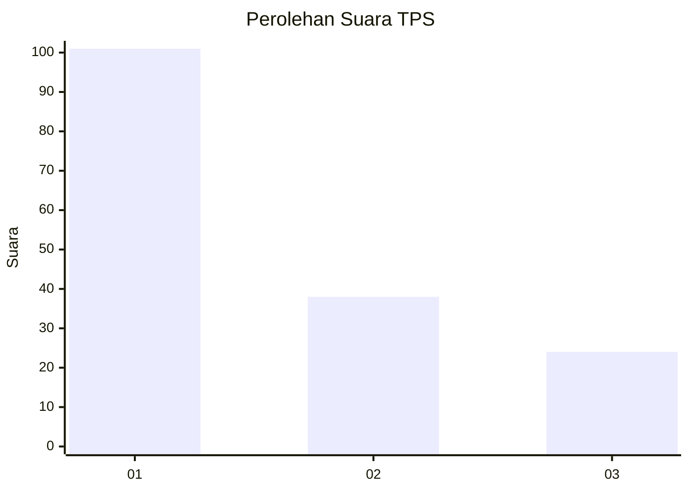
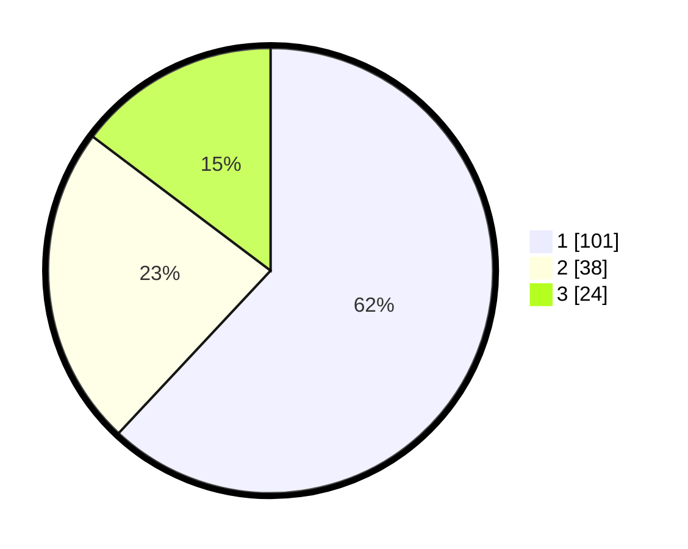

# Hasil

## Grafik

## Tabel

| No. | Nama Paslon    | Suara | Suara (raw) | Persentase |
|:--- |:-------------- | -----:| -----------:| ----------:|
| 1   | ANIES MUHAIMIN | 101   | [101][p-1]  | 61,96      |
| 2   | PRABOWO GIBRAN | 38    | [38][p-2]   | 23,31      |
| 3   | GANJAR MAHFUD  | 24    | [24][p-3]   | 14,72      |

[p-1]: https://github.com/gigit-pemilu/pemilu-2024/blob/main/pilpres/hitung-suara/sub/35-jawa-timur/sub/11-bondowoso/sub/22-botolinggo/sub/2004-penang/sub/003-tps/sub/paslon-1.txt
[p-2]: https://github.com/gigit-pemilu/pemilu-2024/blob/main/pilpres/hitung-suara/sub/35-jawa-timur/sub/11-bondowoso/sub/22-botolinggo/sub/2004-penang/sub/003-tps/sub/paslon-2.txt
[p-3]: https://github.com/gigit-pemilu/pemilu-2024/blob/main/pilpres/hitung-suara/sub/35-jawa-timur/sub/11-bondowoso/sub/22-botolinggo/sub/2004-penang/sub/003-tps/sub/paslon-3.txt

## Foto C Plano

https://sirekap-obj-formc.kpu.go.id/5081/pemilu/ppwp/35/11/22/20/04/3511222004003-20240215-094418--338f5656-aa2a-456b-96e3-e204ddb387ba.jpg

https://sirekap-obj-formc.kpu.go.id/5081/pemilu/ppwp/35/11/22/20/04/3511222004003-20240215-094532--6419ae79-f53b-49ee-b235-00c894b2a57e.jpg

https://sirekap-obj-formc.kpu.go.id/5081/pemilu/ppwp/35/11/22/20/04/3511222004003-20240215-094742--916e58e2-3d29-4092-92b9-203592a8b42b.jpg

## Metadata

| Key        | Value               |
| ---------- | ------------------- |
| Time Stamp | 2024-02-16 17:30:00 |

