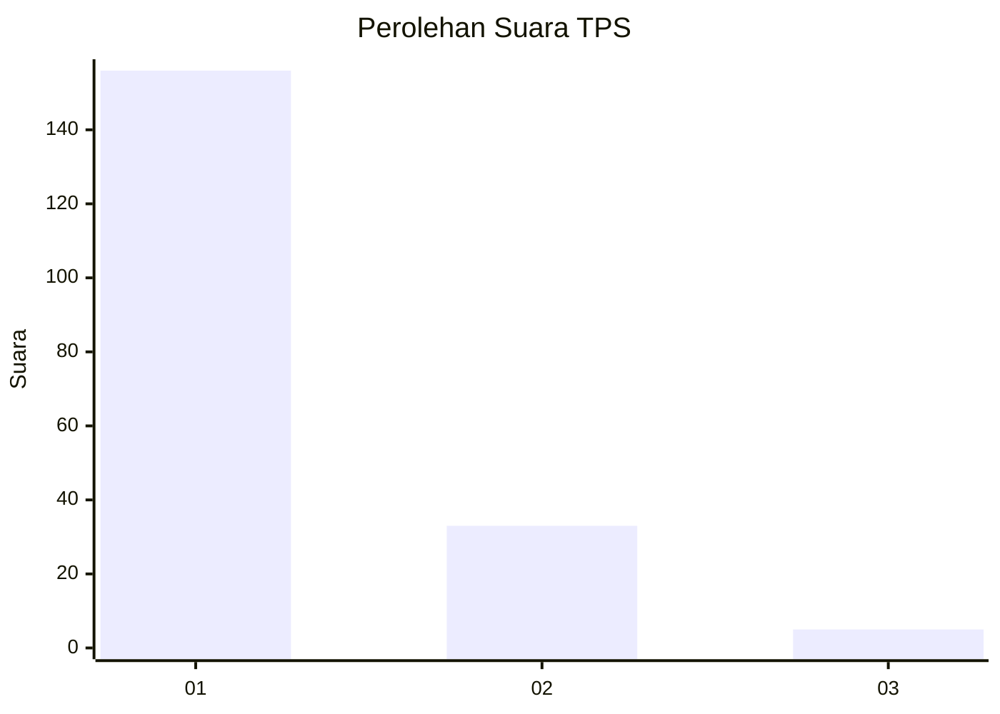
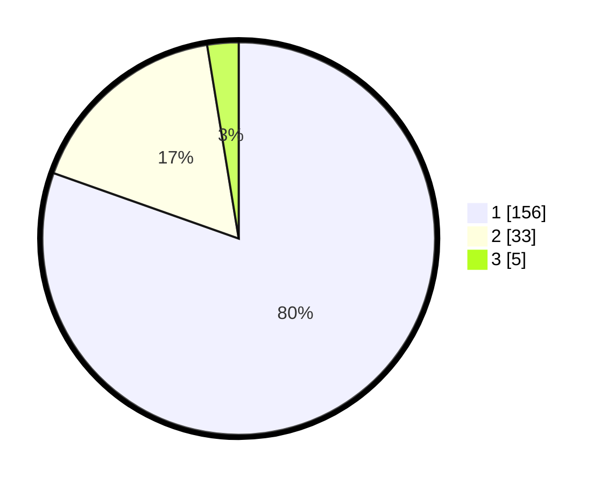

# Hasil

## Grafik

## Tabel

| No. | Nama Paslon    | Suara | Suara (raw) | Persentase |
|:--- |:-------------- | -----:| -----------:| ----------:|
| 1   | ANIES MUHAIMIN | 156   | [156][p-1]  | 80,41      |
| 2   | PRABOWO GIBRAN | 33    | [33][p-2]   | 17,01      |
| 3   | GANJAR MAHFUD  | 5     | [5][p-3]    | 2,58       |

[p-1]: https://github.com/gigit-pemilu/pemilu-2024-35-jawa-timur/blob/main/pilpres/hitung-suara/sub/35-jawa-timur/sub/11-bondowoso/sub/22-botolinggo/sub/2006-klekehan/sub/003-tps/sub/paslon-1.txt
[p-2]: https://github.com/gigit-pemilu/pemilu-2024-35-jawa-timur/blob/main/pilpres/hitung-suara/sub/35-jawa-timur/sub/11-bondowoso/sub/22-botolinggo/sub/2006-klekehan/sub/003-tps/sub/paslon-2.txt
[p-3]: https://github.com/gigit-pemilu/pemilu-2024-35-jawa-timur/blob/main/pilpres/hitung-suara/sub/35-jawa-timur/sub/11-bondowoso/sub/22-botolinggo/sub/2006-klekehan/sub/003-tps/sub/paslon-3.txt

## Foto C Plano

https://sirekap-obj-formc.kpu.go.id/1554/pemilu/ppwp/35/11/22/20/06/3511222006003-20240215-101802--91fe5866-beef-41ad-a5ed-83401c862722.jpg

https://sirekap-obj-formc.kpu.go.id/1554/pemilu/ppwp/35/11/22/20/06/3511222006003-20240215-102109--f90e9c12-2be5-47a1-aca8-88bc1b75a0dd.jpg

https://sirekap-obj-formc.kpu.go.id/1554/pemilu/ppwp/35/11/22/20/06/3511222006003-20240215-102334--94e31989-2edd-4162-b001-30c9df24b55b.jpg

## Metadata

| Key        | Value               |
| ---------- | ------------------- |
| Time Stamp | 2024-02-24 22:31:28 |

