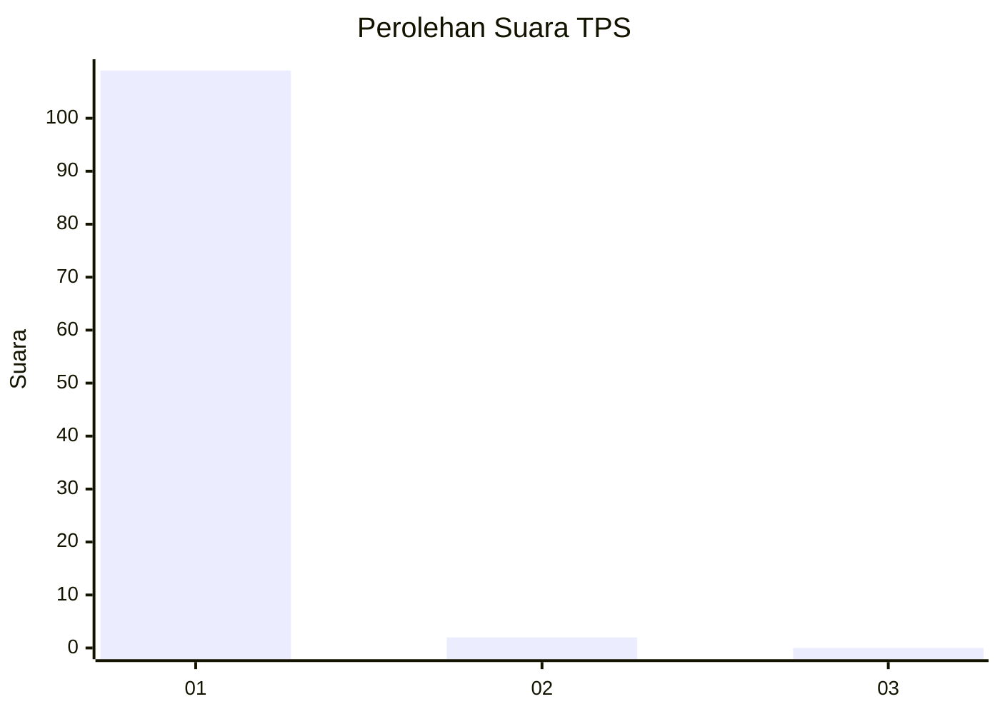
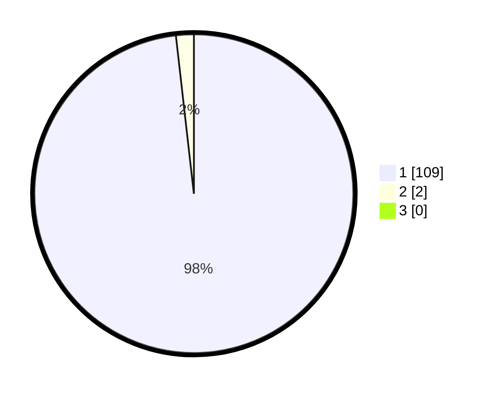

# Hasil

## Grafik

## Tabel

| No. | Nama Paslon    | Suara | Suara (raw) | Persentase |
|:--- |:-------------- | -----:| -----------:| ----------:|
| 1   | ANIES MUHAIMIN | 109   | [109][p-1]  | 98,20      |
| 2   | PRABOWO GIBRAN | 2     | [2][p-2]    | 1,80       |
| 3   | GANJAR MAHFUD  | 0     | [0][p-3]    | 0,00       |

[p-1]: https://github.com/gigit-pemilu/pemilu-2024-35-jawa-timur/blob/main/pilpres/hitung-suara/sub/35-jawa-timur/sub/11-bondowoso/sub/22-botolinggo/sub/2006-klekehan/sub/004-tps/sub/paslon-1.txt
[p-2]: https://github.com/gigit-pemilu/pemilu-2024-35-jawa-timur/blob/main/pilpres/hitung-suara/sub/35-jawa-timur/sub/11-bondowoso/sub/22-botolinggo/sub/2006-klekehan/sub/004-tps/sub/paslon-2.txt
[p-3]: https://github.com/gigit-pemilu/pemilu-2024-35-jawa-timur/blob/main/pilpres/hitung-suara/sub/35-jawa-timur/sub/11-bondowoso/sub/22-botolinggo/sub/2006-klekehan/sub/004-tps/sub/paslon-3.txt

## Foto C Plano

https://sirekap-obj-formc.kpu.go.id/c7bb/pemilu/ppwp/35/11/22/20/06/3511222006004-20240215-110441--7cc324ee-ed2a-4ce1-ad18-622d33bddb1c.jpg

https://sirekap-obj-formc.kpu.go.id/c7bb/pemilu/ppwp/35/11/22/20/06/3511222006004-20240215-115217--c425d98a-57ee-4630-8257-7c73dd387626.jpg

https://sirekap-obj-formc.kpu.go.id/c7bb/pemilu/ppwp/35/11/22/20/06/3511222006004-20240215-110659--bf4ec353-6648-4852-b5ed-cca3f307c225.jpg

## Metadata

| Key        | Value               |
| ---------- | ------------------- |
| Time Stamp | 2024-02-17 19:00:04 |

