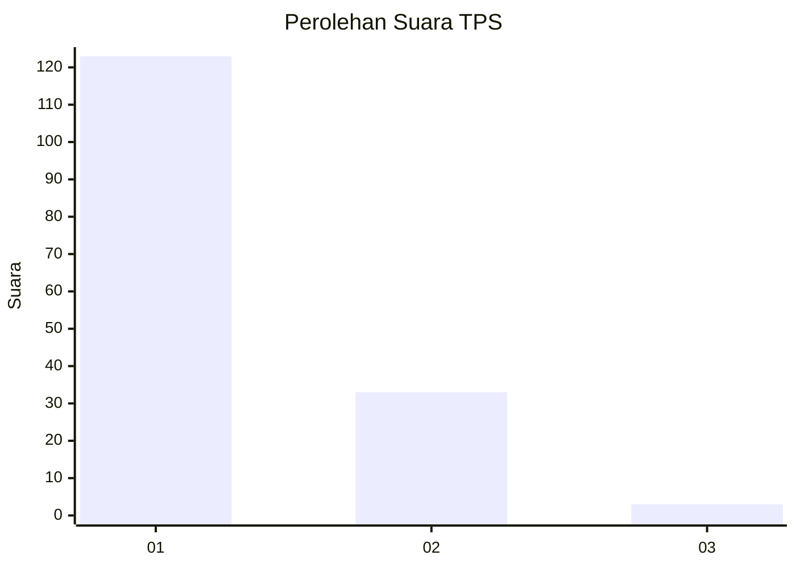
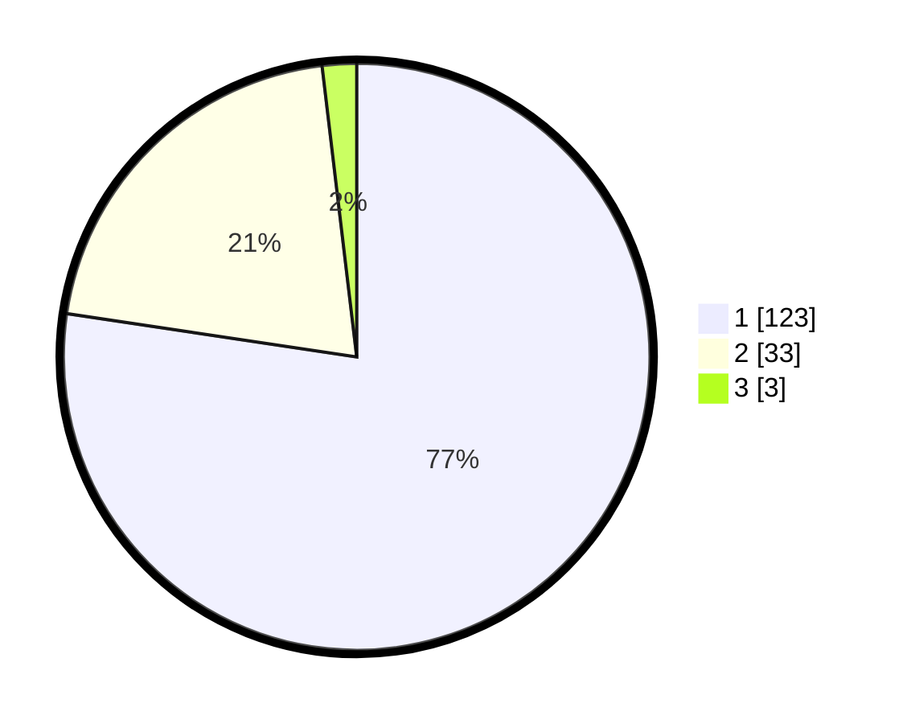

# Hasil

## Grafik

## Tabel

| No. | Nama Paslon    | Suara | Suara (raw) | Persentase |
|:--- |:-------------- | -----:| -----------:| ----------:|
| 1   | ANIES MUHAIMIN | 123   | [123][p-1]  | 77,36      |
| 2   | PRABOWO GIBRAN | 33    | [33][p-2]   | 20,75      |
| 3   | GANJAR MAHFUD  | 3     | [3][p-3]    | 1,89       |

[p-1]: https://github.com/gigit-pemilu/pemilu-2024/blob/main/pilpres/hitung-suara/sub/35-jawa-timur/sub/11-bondowoso/sub/22-botolinggo/sub/2007-sumber-canting/sub/012-tps/sub/paslon-1.txt
[p-2]: https://github.com/gigit-pemilu/pemilu-2024/blob/main/pilpres/hitung-suara/sub/35-jawa-timur/sub/11-bondowoso/sub/22-botolinggo/sub/2007-sumber-canting/sub/012-tps/sub/paslon-2.txt
[p-3]: https://github.com/gigit-pemilu/pemilu-2024/blob/main/pilpres/hitung-suara/sub/35-jawa-timur/sub/11-bondowoso/sub/22-botolinggo/sub/2007-sumber-canting/sub/012-tps/sub/paslon-3.txt

## Foto C Plano

https://sirekap-obj-formc.kpu.go.id/bb66/pemilu/ppwp/35/11/22/20/07/3511222007012-20240220-210043--ea65638e-dbc6-4c19-9af6-2f37d75393c4.jpg

https://sirekap-obj-formc.kpu.go.id/bb66/pemilu/ppwp/35/11/22/20/07/3511222007012-20240217-183125--88449138-201b-4f9d-8193-228bc5cbd6dd.jpg

https://sirekap-obj-formc.kpu.go.id/bb66/pemilu/ppwp/35/11/22/20/07/3511222007012-20240215-075358--ee26036b-9037-495d-978b-7bb3fc41114e.jpg

## Metadata

| Key        | Value               |
| ---------- | ------------------- |
| Time Stamp | 2024-02-24 22:31:28 |

