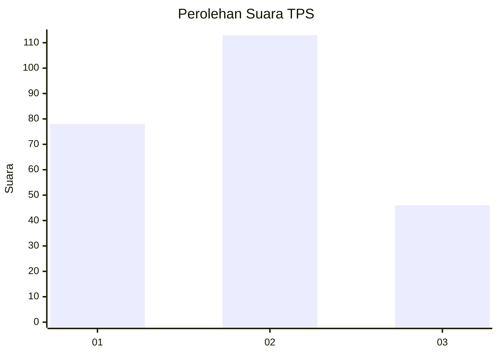
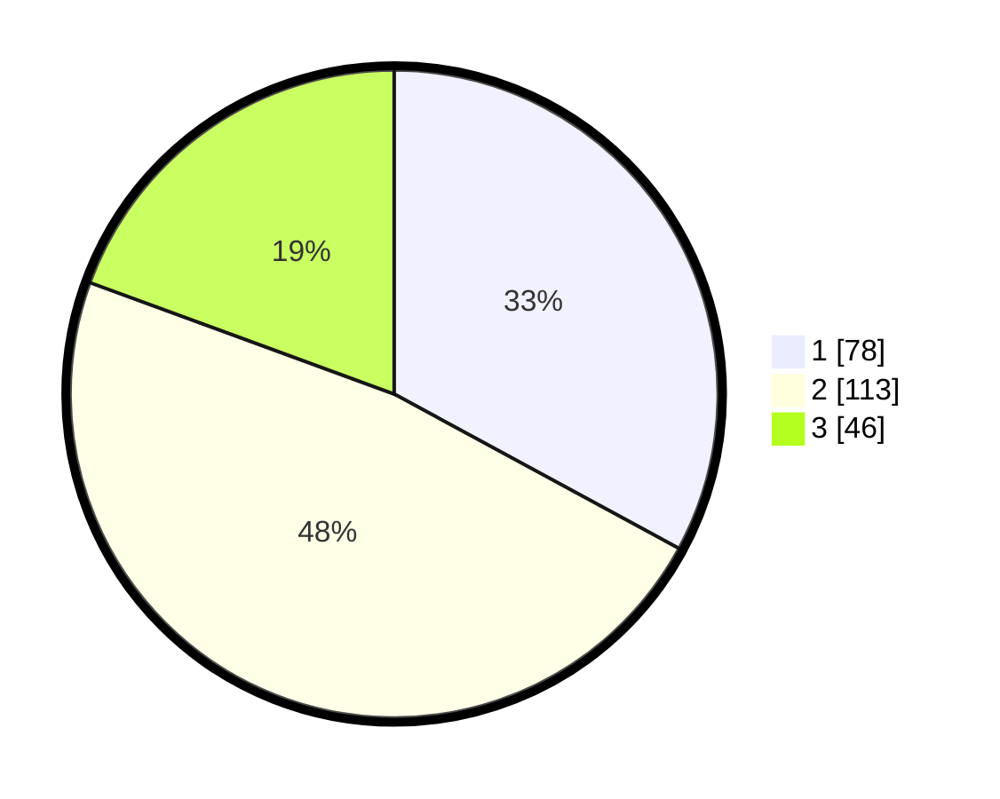

# Hasil

## Grafik

## Tabel

| No. | Nama Paslon    | Suara | Suara (raw) | Persentase |
|:--- |:-------------- | -----:| -----------:| ----------:|
| 1   | ANIES MUHAIMIN | 78    | [78][p-1]   | 32,91      |
| 2   | PRABOWO GIBRAN | 113   | [113][p-2]  | 47,68      |
| 3   | GANJAR MAHFUD  | 46    | [46][p-3]   | 19,41      |

[p-1]: https://github.com/gigit-pemilu/pemilu-2024-35-jawa-timur/blob/main/pilpres/hitung-suara/sub/35-jawa-timur/sub/11-bondowoso/sub/23-jambesari-darus-sholah/sub/2001-jambesari/sub/008-tps/sub/paslon-1.txt
[p-2]: https://github.com/gigit-pemilu/pemilu-2024-35-jawa-timur/blob/main/pilpres/hitung-suara/sub/35-jawa-timur/sub/11-bondowoso/sub/23-jambesari-darus-sholah/sub/2001-jambesari/sub/008-tps/sub/paslon-2.txt
[p-3]: https://github.com/gigit-pemilu/pemilu-2024-35-jawa-timur/blob/main/pilpres/hitung-suara/sub/35-jawa-timur/sub/11-bondowoso/sub/23-jambesari-darus-sholah/sub/2001-jambesari/sub/008-tps/sub/paslon-3.txt

## Foto C Plano

https://sirekap-obj-formc.kpu.go.id/634a/pemilu/ppwp/35/11/23/20/01/3511232001008-20240214-222425--3a76cbfd-f176-4fe7-81c6-a87b059b1df7.jpg

https://sirekap-obj-formc.kpu.go.id/634a/pemilu/ppwp/35/11/23/20/01/3511232001008-20240214-222602--5db71647-6632-4c00-8e60-c74a92a7367b.jpg

https://sirekap-obj-formc.kpu.go.id/634a/pemilu/ppwp/35/11/23/20/01/3511232001008-20240214-222830--5604648a-42b4-4d86-afad-947cd35673bb.jpg

## Metadata

| Key        | Value               |
| ---------- | ------------------- |
| Time Stamp | 2024-02-16 10:30:29 |

