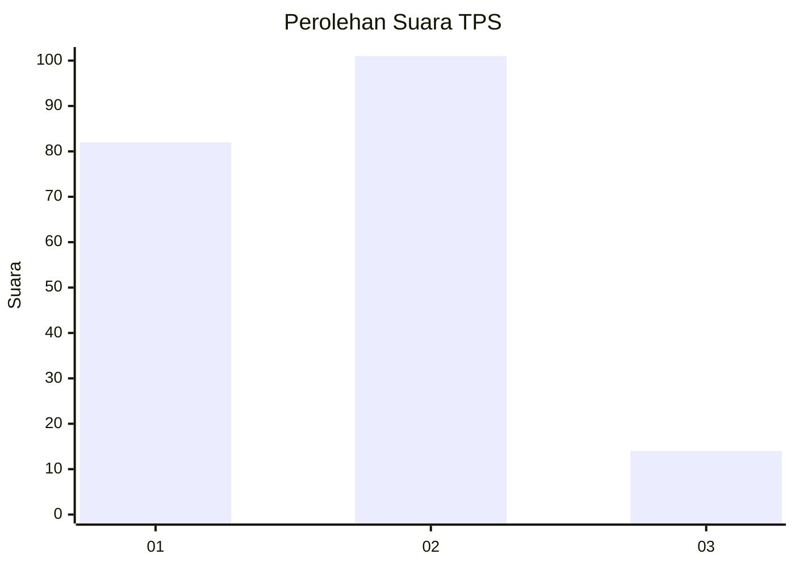
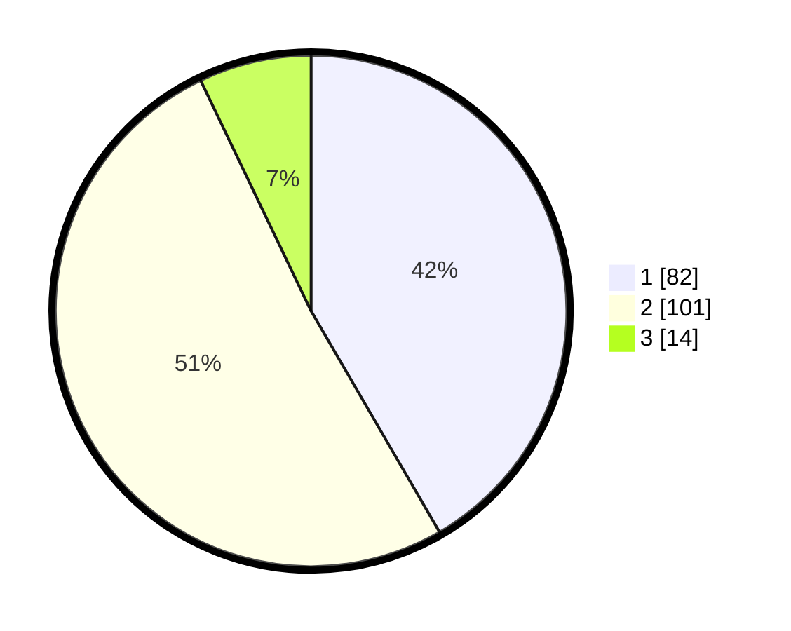

# Hasil

## Grafik

## Tabel

| No. | Nama Paslon    | Suara | Suara (raw) | Persentase |
|:--- |:-------------- | -----:| -----------:| ----------:|
| 1   | ANIES MUHAIMIN | 82    | [82][p-1]   | 41,62      |
| 2   | PRABOWO GIBRAN | 101   | [101][p-2]  | 51,27      |
| 3   | GANJAR MAHFUD  | 14    | [14][p-3]   | 7,11       |

[p-1]: https://github.com/gigit-pemilu/pemilu-2024/blob/main/pilpres/hitung-suara/sub/35-jawa-timur/sub/11-bondowoso/sub/23-jambesari-darus-sholah/sub/2003-pucanganom/sub/008-tps/sub/paslon-1.txt
[p-2]: https://github.com/gigit-pemilu/pemilu-2024/blob/main/pilpres/hitung-suara/sub/35-jawa-timur/sub/11-bondowoso/sub/23-jambesari-darus-sholah/sub/2003-pucanganom/sub/008-tps/sub/paslon-2.txt
[p-3]: https://github.com/gigit-pemilu/pemilu-2024/blob/main/pilpres/hitung-suara/sub/35-jawa-timur/sub/11-bondowoso/sub/23-jambesari-darus-sholah/sub/2003-pucanganom/sub/008-tps/sub/paslon-3.txt

## Foto C Plano

https://sirekap-obj-formc.kpu.go.id/6096/pemilu/ppwp/35/11/23/20/03/3511232003008-20240217-182631--34d942ee-8b36-42bb-bc87-a00d9ca7c0c6.jpg

https://sirekap-obj-formc.kpu.go.id/6096/pemilu/ppwp/35/11/23/20/03/3511232003008-20240217-182842--2c63c550-68bb-4dff-878e-d7b9225255a0.jpg

https://sirekap-obj-formc.kpu.go.id/6096/pemilu/ppwp/35/11/23/20/03/3511232003008-20240217-143503--7b2a3888-fd78-40b1-861f-41f2b7631292.jpg

## Metadata

| Key        | Value               |
| ---------- | ------------------- |
| Time Stamp | 2024-02-24 22:31:28 |

