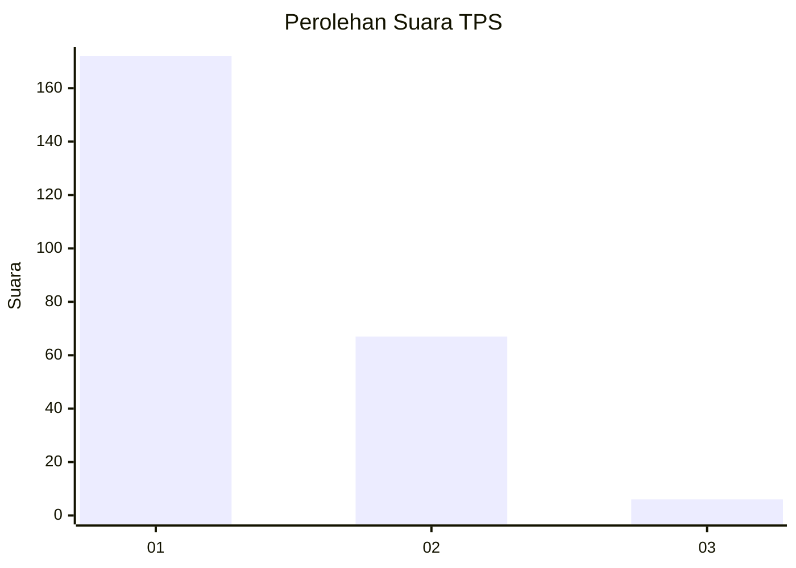
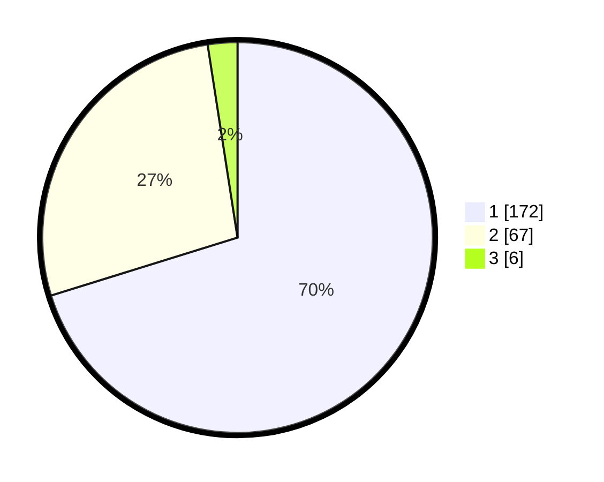

# Hasil

## Grafik

## Tabel

| No. | Nama Paslon    | Suara | Suara (raw) | Persentase |
|:--- |:-------------- | -----:| -----------:| ----------:|
| 1   | ANIES MUHAIMIN | 172   | [172][p-1]  | 70,20      |
| 2   | PRABOWO GIBRAN | 67    | [67][p-2]   | 27,35      |
| 3   | GANJAR MAHFUD  | 6     | [6][p-3]    | 2,45       |

[p-1]: https://github.com/gigit-pemilu/pemilu-2024/blob/main/pilpres/hitung-suara/sub/35-jawa-timur/sub/11-bondowoso/sub/23-jambesari-darus-sholah/sub/2006-pengarang/sub/008-tps/sub/paslon-1.txt
[p-2]: https://github.com/gigit-pemilu/pemilu-2024/blob/main/pilpres/hitung-suara/sub/35-jawa-timur/sub/11-bondowoso/sub/23-jambesari-darus-sholah/sub/2006-pengarang/sub/008-tps/sub/paslon-2.txt
[p-3]: https://github.com/gigit-pemilu/pemilu-2024/blob/main/pilpres/hitung-suara/sub/35-jawa-timur/sub/11-bondowoso/sub/23-jambesari-darus-sholah/sub/2006-pengarang/sub/008-tps/sub/paslon-3.txt

## Foto C Plano

https://sirekap-obj-formc.kpu.go.id/f377/pemilu/ppwp/35/11/23/20/06/3511232006008-20240216-220815--7f95da27-a689-48b7-b0c6-7f638fb7a132.jpg

https://sirekap-obj-formc.kpu.go.id/f377/pemilu/ppwp/35/11/23/20/06/3511232006008-20240216-212544--3ac1ac03-2966-4743-ac52-afe1aeda4855.jpg

https://sirekap-obj-formc.kpu.go.id/f377/pemilu/ppwp/35/11/23/20/06/3511232006008-20240217-165630--eb06c8c7-bb55-4319-9b25-2affdc421fdb.jpg

## Metadata

| Key        | Value               |
| ---------- | ------------------- |
| Time Stamp | 2024-02-21 16:00:00 |

