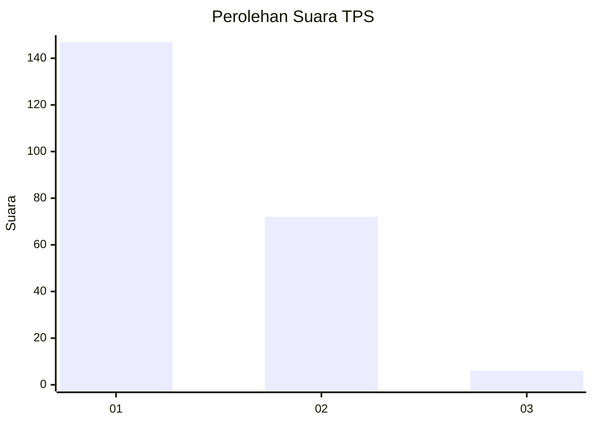
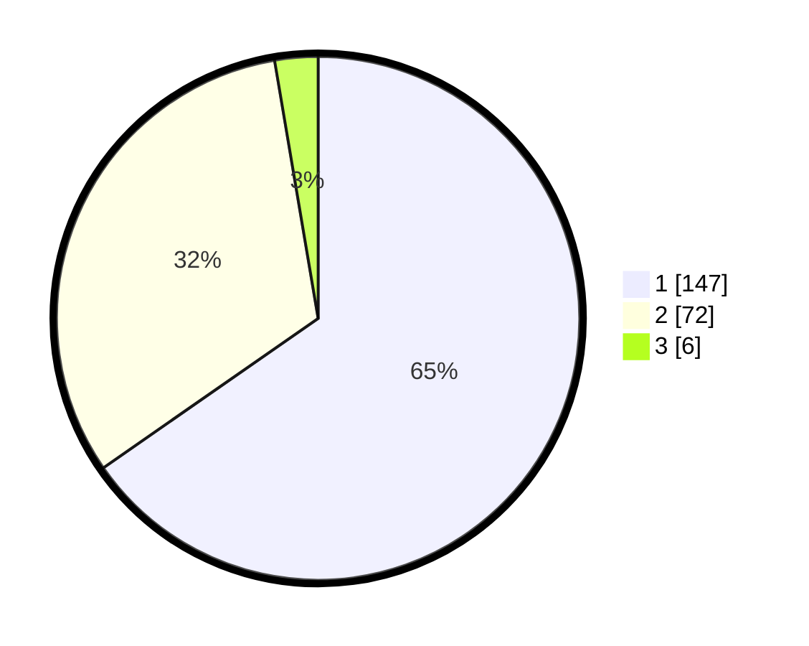

# Hasil

## Grafik

## Tabel

| No. | Nama Paslon    | Suara | Suara (raw) | Persentase |
|:--- |:-------------- | -----:| -----------:| ----------:|
| 1   | ANIES MUHAIMIN | 147   | [147][p-1]  | 65,33      |
| 2   | PRABOWO GIBRAN | 72    | [72][p-2]   | 32,00      |
| 3   | GANJAR MAHFUD  | 6     | [6][p-3]    | 2,67       |

[p-1]: https://github.com/gigit-pemilu/pemilu-2024/blob/main/pilpres/hitung-suara/sub/35-jawa-timur/sub/11-bondowoso/sub/23-jambesari-darus-sholah/sub/2009-sumber-anyar/sub/001-tps/sub/paslon-1.txt
[p-2]: https://github.com/gigit-pemilu/pemilu-2024/blob/main/pilpres/hitung-suara/sub/35-jawa-timur/sub/11-bondowoso/sub/23-jambesari-darus-sholah/sub/2009-sumber-anyar/sub/001-tps/sub/paslon-2.txt
[p-3]: https://github.com/gigit-pemilu/pemilu-2024/blob/main/pilpres/hitung-suara/sub/35-jawa-timur/sub/11-bondowoso/sub/23-jambesari-darus-sholah/sub/2009-sumber-anyar/sub/001-tps/sub/paslon-3.txt

## Foto C Plano

https://sirekap-obj-formc.kpu.go.id/c99e/pemilu/ppwp/35/11/23/20/09/3511232009001-20240216-132934--e4d78a67-f637-4fb6-a49d-0ed4a49f6b56.jpg

https://sirekap-obj-formc.kpu.go.id/c99e/pemilu/ppwp/35/11/23/20/09/3511232009001-20240217-235108--7290ff23-7295-4a8b-8ec0-179d6c7ddaf4.jpg

https://sirekap-obj-formc.kpu.go.id/c99e/pemilu/ppwp/35/11/23/20/09/3511232009001-20240217-235609--9887d469-48dd-45bf-b77c-0bb476a70c9e.jpg

## Metadata

| Key        | Value               |
| ---------- | ------------------- |
| Time Stamp | 2024-02-22 11:00:00 |

