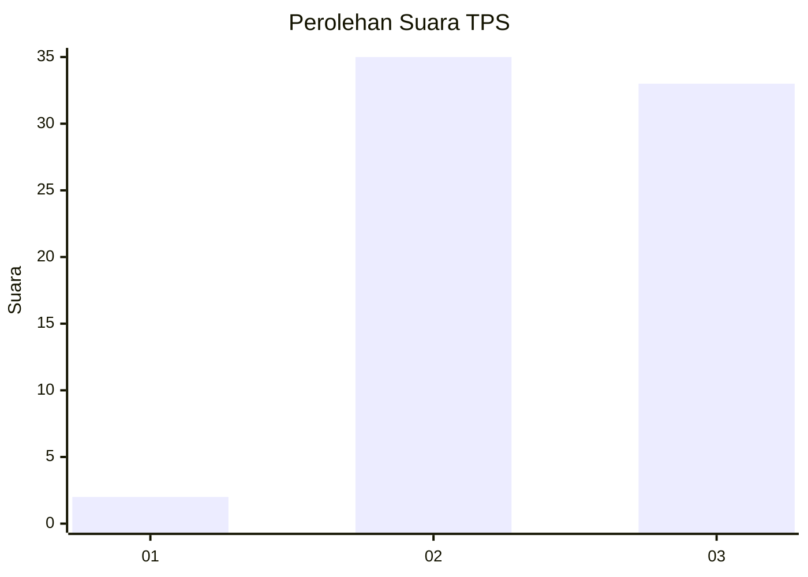
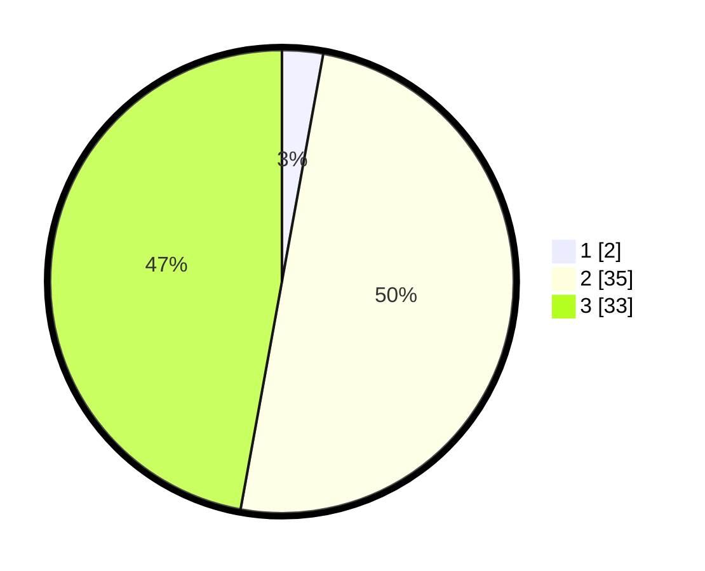

# Hasil

## Grafik

## Tabel

| No. | Nama Paslon    | Suara | Suara (raw) | Persentase |
|:--- |:-------------- | -----:| -----------:| ----------:|
| 1   | ANIES MUHAIMIN | 2     | [2][p-1]    | 2,86       |
| 2   | PRABOWO GIBRAN | 35    | [35][p-2]   | 50,00      |
| 3   | GANJAR MAHFUD  | 33    | [33][p-3]   | 47,14      |

[p-1]: https://github.com/gigit-pemilu/pemilu-2024-35-jawa-timur/blob/main/pilpres/hitung-suara/sub/35-jawa-timur/sub/12-situbondo/sub/01-jatibanteng/sub/2001-pategalan/sub/001-tps/sub/paslon-1.txt
[p-2]: https://github.com/gigit-pemilu/pemilu-2024-35-jawa-timur/blob/main/pilpres/hitung-suara/sub/35-jawa-timur/sub/12-situbondo/sub/01-jatibanteng/sub/2001-pategalan/sub/001-tps/sub/paslon-2.txt
[p-3]: https://github.com/gigit-pemilu/pemilu-2024-35-jawa-timur/blob/main/pilpres/hitung-suara/sub/35-jawa-timur/sub/12-situbondo/sub/01-jatibanteng/sub/2001-pategalan/sub/001-tps/sub/paslon-3.txt

## Foto C Plano

https://sirekap-obj-formc.kpu.go.id/558e/pemilu/ppwp/35/12/01/20/01/3512012001001-20240218-152407--fbcfaef5-0f7b-4a4c-90cd-b27870d3f9a2.jpg

https://sirekap-obj-formc.kpu.go.id/558e/pemilu/ppwp/35/12/01/20/01/3512012001001-20240218-120124--160b3903-830c-4605-8da8-fd072a9343e6.jpg

https://sirekap-obj-formc.kpu.go.id/558e/pemilu/ppwp/35/12/01/20/01/3512012001001-20240218-120531--849f52fc-2d43-4051-b2df-6069f6181258.jpg

## Metadata

| Key        | Value               |
| ---------- | ------------------- |
| Time Stamp | 2024-02-20 20:00:00 |

## DATA PEMILIH TETAP

Jumlah pemilih dalam DPT: **79**.
 * L: **39**.
 * P: **40**.

## DATA PENGGUNA HAK PILIH

Jumlah pengguna hak pilih dalam DPT: **79**.
 * L: **39**.
 * P: **40**.

Jumlah pengguna hak pilih dalam DPTb: **4**.
 * L: **4**.
 * P: **0**.

Jumlah pengguna hak pilih dalam DPK: **0**.
 * L: **0**.
 * P: **0**.

Jumlah pengguna hak pilih: **72**.
 * L: **36**.
 * P: **36**.

## JUMLAH SUARA SAH DAN TIDAK SAH

JUMLAH SELURUH SUARA SAH: **70**.

JUMLAH SUARA TIDAK SAH: **2**.

JUMLAH SELURUH SUARA SAH DAN SUARA TIDAK SAH: **72**.

