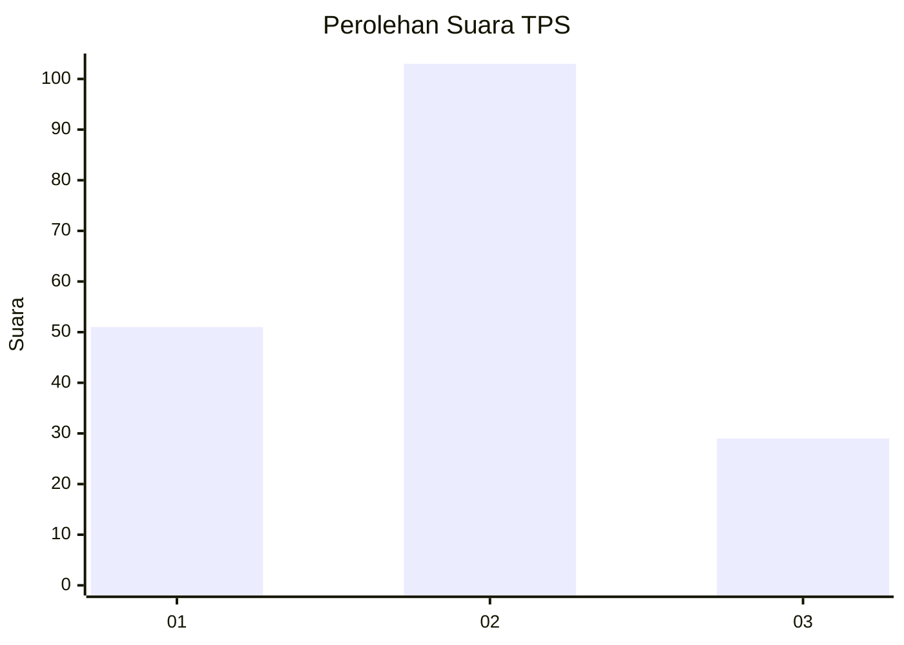
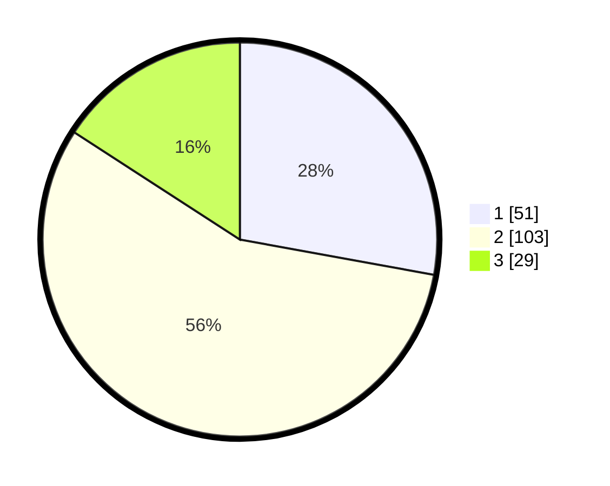

# Hasil

## Grafik

## Tabel

| No. | Nama Paslon    | Suara | Suara (raw) | Persentase |
|:--- |:-------------- | -----:| -----------:| ----------:|
| 1   | ANIES MUHAIMIN | 51    | [51][p-1]   | 27,87      |
| 2   | PRABOWO GIBRAN | 103   | [103][p-2]  | 56,28      |
| 3   | GANJAR MAHFUD  | 29    | [29][p-3]   | 15,85      |

[p-1]: https://github.com/gigit-pemilu/pemilu-2024/blob/main/pilpres/hitung-suara/sub/35-jawa-timur/sub/12-situbondo/sub/01-jatibanteng/sub/2001-pategalan/sub/006-tps/sub/paslon-1.txt
[p-2]: https://github.com/gigit-pemilu/pemilu-2024/blob/main/pilpres/hitung-suara/sub/35-jawa-timur/sub/12-situbondo/sub/01-jatibanteng/sub/2001-pategalan/sub/006-tps/sub/paslon-2.txt
[p-3]: https://github.com/gigit-pemilu/pemilu-2024/blob/main/pilpres/hitung-suara/sub/35-jawa-timur/sub/12-situbondo/sub/01-jatibanteng/sub/2001-pategalan/sub/006-tps/sub/paslon-3.txt

## Foto C Plano

https://sirekap-obj-formc.kpu.go.id/6198/pemilu/ppwp/35/12/01/20/01/3512012001006-20240216-131821--3e0bc1ab-bdcb-402f-a7c1-ec9a2bed8fc9.jpg

https://sirekap-obj-formc.kpu.go.id/6198/pemilu/ppwp/35/12/01/20/01/3512012001006-20240216-131822--c34d0452-6741-4bb9-9bbe-2ae2fde84e32.jpg

https://sirekap-obj-formc.kpu.go.id/6198/pemilu/ppwp/35/12/01/20/01/3512012001006-20240216-131822--fe0cbbe8-63a3-40c1-85d8-d55b2ee1c50b.jpg

## Metadata

| Key        | Value               |
| ---------- | ------------------- |
| Time Stamp | 2024-02-16 16:25:10 |

## DATA PEMILIH TETAP

Jumlah pemilih dalam DPT: **242**.
 * L: **127**.
 * P: **115**.

## DATA PENGGUNA HAK PILIH

Jumlah pengguna hak pilih dalam DPT: **194**.
 * L: **96**.
 * P: **98**.

Jumlah pengguna hak pilih dalam DPTb: **0**.
 * L: **0**.
 * P: **0**.

Jumlah pengguna hak pilih dalam DPK: **0**.
 * L: **0**.
 * P: **0**.

Jumlah pengguna hak pilih: **194**.
 * L: **96**.
 * P: **98**.

## JUMLAH SUARA SAH DAN TIDAK SAH

JUMLAH SELURUH SUARA SAH: **183**.

JUMLAH SUARA TIDAK SAH: **11**.

JUMLAH SELURUH SUARA SAH DAN SUARA TIDAK SAH: **194**.

