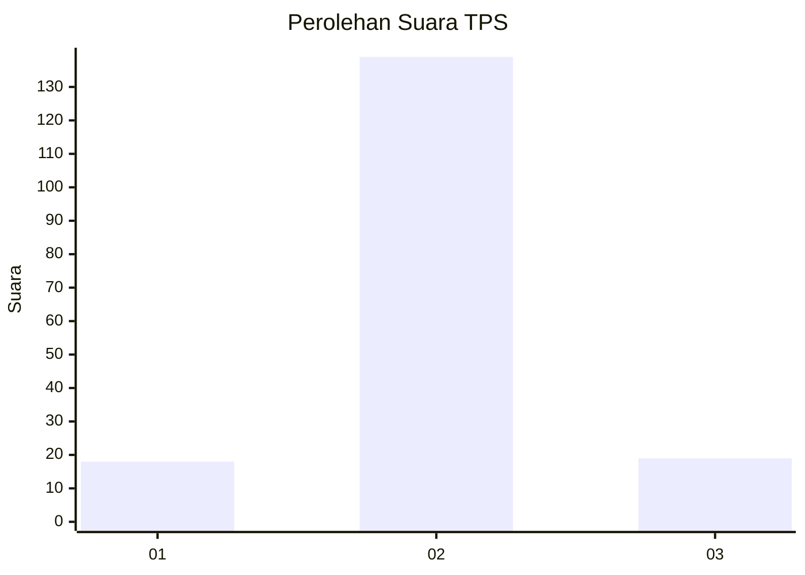
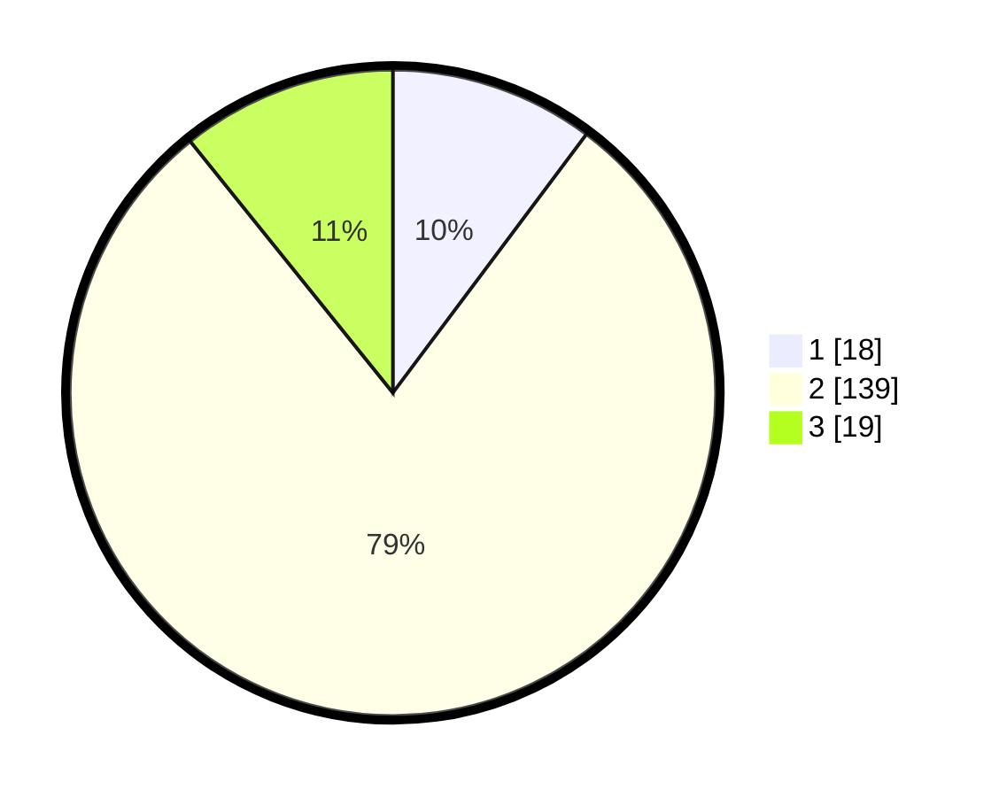

# Hasil

## Grafik

## Tabel

| No. | Nama Paslon    | Suara | Suara (raw) | Persentase |
|:--- |:-------------- | -----:| -----------:| ----------:|
| 1   | ANIES MUHAIMIN | 18    | [18][p-1]   | 10,23      |
| 2   | PRABOWO GIBRAN | 139   | [139][p-2]  | 78,98      |
| 3   | GANJAR MAHFUD  | 19    | [19][p-3]   | 10,80      |

[p-1]: https://github.com/gigit-pemilu/pemilu-2024-35-jawa-timur/blob/main/pilpres/hitung-suara/sub/35-jawa-timur/sub/12-situbondo/sub/01-jatibanteng/sub/2006-wringinanom/sub/004-tps/sub/paslon-1.txt
[p-2]: https://github.com/gigit-pemilu/pemilu-2024-35-jawa-timur/blob/main/pilpres/hitung-suara/sub/35-jawa-timur/sub/12-situbondo/sub/01-jatibanteng/sub/2006-wringinanom/sub/004-tps/sub/paslon-2.txt
[p-3]: https://github.com/gigit-pemilu/pemilu-2024-35-jawa-timur/blob/main/pilpres/hitung-suara/sub/35-jawa-timur/sub/12-situbondo/sub/01-jatibanteng/sub/2006-wringinanom/sub/004-tps/sub/paslon-3.txt

## Foto C Plano

https://sirekap-obj-formc.kpu.go.id/382c/pemilu/ppwp/35/12/01/20/06/3512012006004-20240215-005942--81416584-6f15-4584-b175-275a1adfa517.jpg

https://sirekap-obj-formc.kpu.go.id/382c/pemilu/ppwp/35/12/01/20/06/3512012006004-20240214-221406--5dd3a45b-0e82-49fc-83ee-c3e2f4750c23.jpg

https://sirekap-obj-formc.kpu.go.id/382c/pemilu/ppwp/35/12/01/20/06/3512012006004-20240217-171557--20043863-028f-4fd9-940a-5d3888249cf6.jpg

## Metadata

| Key        | Value               |
| ---------- | ------------------- |
| Time Stamp | 2024-02-17 17:30:00 |

