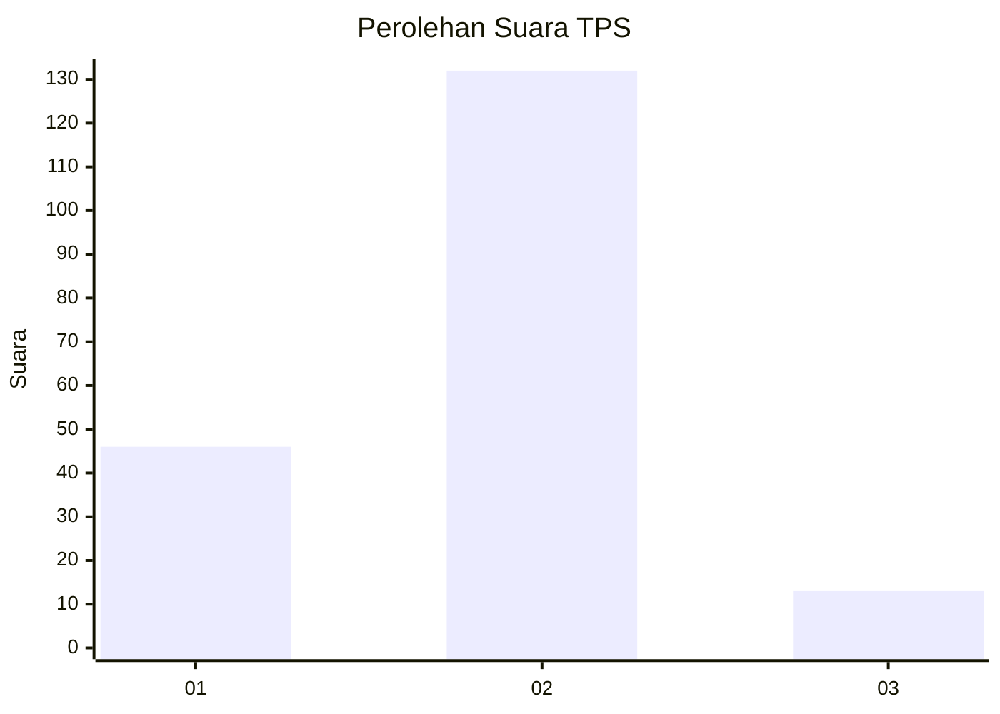

# Hasil

## Grafik

## Tabel

| No. | Nama Paslon    | Suara | Suara (raw) | Persentase |
|:--- |:-------------- | -----:| -----------:| ----------:|
| 1   | ANIES MUHAIMIN | 46    | [46][p-1]   | 24,08      |
| 2   | PRABOWO GIBRAN | 132   | [132][p-2]  | 69,11      |
| 3   | GANJAR MAHFUD  | 13    | [13][p-3]   | 6,81       |

[p-1]: https://github.com/gigit-pemilu/pemilu-2024/blob/main/pilpres/hitung-suara/sub/35-jawa-timur/sub/12-situbondo/sub/03-suboh/sub/2002-mojodungkol/sub/001-tps/sub/paslon-1.txt
[p-2]: https://github.com/gigit-pemilu/pemilu-2024/blob/main/pilpres/hitung-suara/sub/35-jawa-timur/sub/12-situbondo/sub/03-suboh/sub/2002-mojodungkol/sub/001-tps/sub/paslon-2.txt
[p-3]: https://github.com/gigit-pemilu/pemilu-2024/blob/main/pilpres/hitung-suara/sub/35-jawa-timur/sub/12-situbondo/sub/03-suboh/sub/2002-mojodungkol/sub/001-tps/sub/paslon-3.txt

## Foto C Plano

https://sirekap-obj-formc.kpu.go.id/1e2f/pemilu/ppwp/35/12/03/20/02/3512032002001-20240222-193853--05cabeff-46be-4eaf-b8b9-5851df7631e8.jpg

https://sirekap-obj-formc.kpu.go.id/1e2f/pemilu/ppwp/35/12/03/20/02/3512032002001-20240221-213224--0c34c8f6-10cd-4d77-a17f-b309d9f7650c.jpg

https://sirekap-obj-formc.kpu.go.id/1e2f/pemilu/ppwp/35/12/03/20/02/3512032002001-20240222-194156--60b6a710-d370-4d65-a8c1-580b9cc17f58.jpg

## Metadata

| Key        | Value               |
| ---------- | ------------------- |
| Time Stamp | 2024-02-25 15:00:00 |

