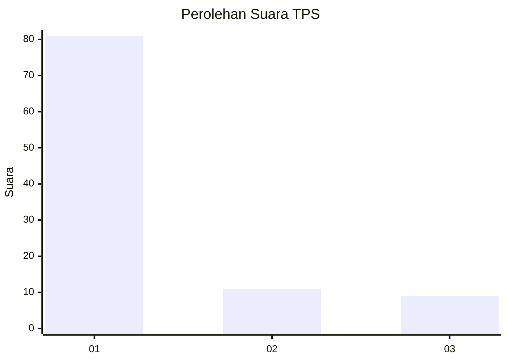
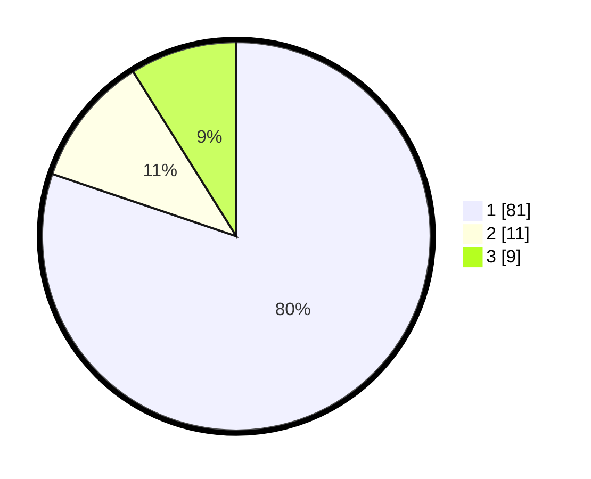

# Hasil

## Grafik

## Tabel

| No. | Nama Paslon    | Suara | Suara (raw) | Persentase |
|:--- |:-------------- | -----:| -----------:| ----------:|
| 1   | ANIES MUHAIMIN | 81    | [81][p-1]   | 80,20      |
| 2   | PRABOWO GIBRAN | 11    | [11][p-2]   | 10,89      |
| 3   | GANJAR MAHFUD  | 9     | [9][p-3]    | 8,91       |

[p-1]: https://github.com/gigit-pemilu/pemilu-2024-35-jawa-timur/blob/main/pilpres/hitung-suara/sub/35-jawa-timur/sub/12-situbondo/sub/03-suboh/sub/2002-mojodungkol/sub/002-tps/sub/paslon-1.txt
[p-2]: https://github.com/gigit-pemilu/pemilu-2024-35-jawa-timur/blob/main/pilpres/hitung-suara/sub/35-jawa-timur/sub/12-situbondo/sub/03-suboh/sub/2002-mojodungkol/sub/002-tps/sub/paslon-2.txt
[p-3]: https://github.com/gigit-pemilu/pemilu-2024-35-jawa-timur/blob/main/pilpres/hitung-suara/sub/35-jawa-timur/sub/12-situbondo/sub/03-suboh/sub/2002-mojodungkol/sub/002-tps/sub/paslon-3.txt

## Foto C Plano

https://sirekap-obj-formc.kpu.go.id/debb/pemilu/ppwp/35/12/03/20/02/3512032002002-20240221-204234--64cd1b30-24cd-429c-9b76-c0d5f8638663.jpg

https://sirekap-obj-formc.kpu.go.id/debb/pemilu/ppwp/35/12/03/20/02/3512032002002-20240221-204532--604190e1-2a21-4da8-b3b3-d956243f487d.jpg

https://sirekap-obj-formc.kpu.go.id/debb/pemilu/ppwp/35/12/03/20/02/3512032002002-20240221-204838--3799b260-64bc-4483-b3a8-20a7e325a3c7.jpg

## Metadata

| Key        | Value               |
| ---------- | ------------------- |
| Time Stamp | 2024-02-25 14:00:00 |

