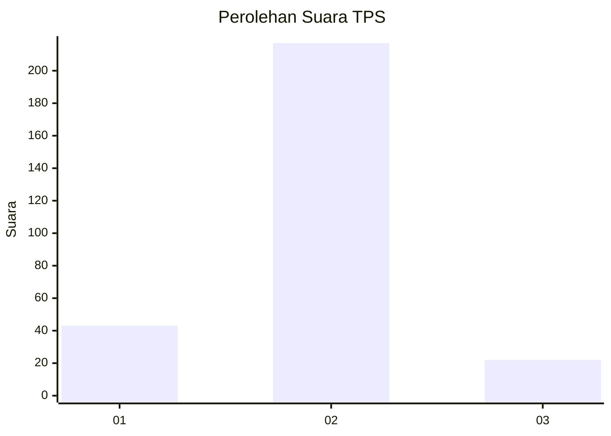
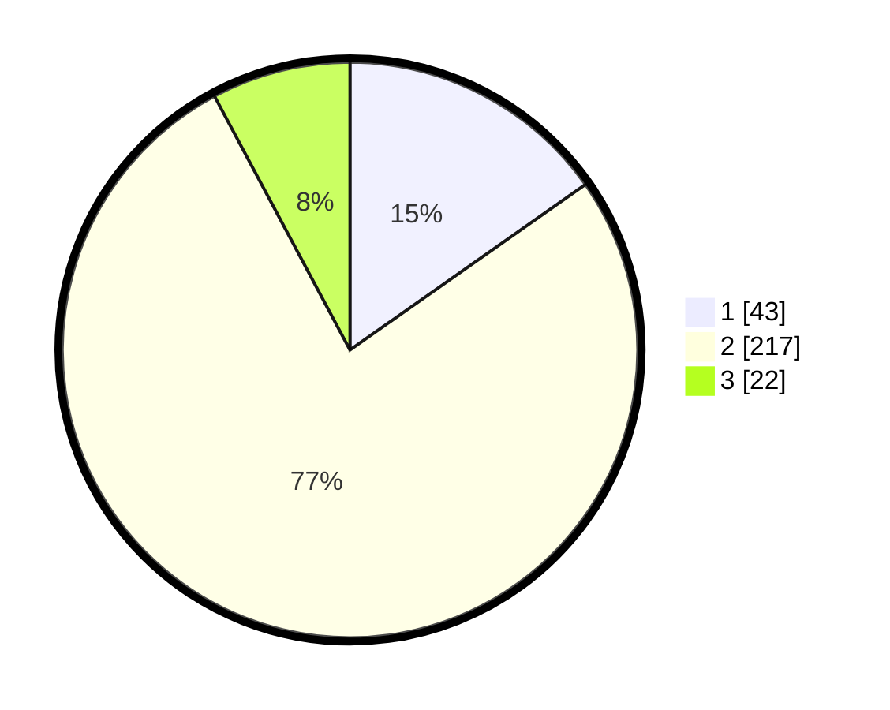

# Hasil

## Grafik

## Tabel

| No. | Nama Paslon    | Suara | Suara (raw) | Persentase |
|:--- |:-------------- | -----:| -----------:| ----------:|
| 1   | ANIES MUHAIMIN | 43    | [43][p-1]   | 15,25      |
| 2   | PRABOWO GIBRAN | 217   | [217][p-2]  | 76,95      |
| 3   | GANJAR MAHFUD  | 22    | [22][p-3]   | 7,80       |

[p-1]: https://github.com/gigit-pemilu/pemilu-2024-35-jawa-timur/blob/main/pilpres/hitung-suara/sub/35-jawa-timur/sub/12-situbondo/sub/03-suboh/sub/2004-gunung-putri/sub/002-tps/sub/paslon-1.txt
[p-2]: https://github.com/gigit-pemilu/pemilu-2024-35-jawa-timur/blob/main/pilpres/hitung-suara/sub/35-jawa-timur/sub/12-situbondo/sub/03-suboh/sub/2004-gunung-putri/sub/002-tps/sub/paslon-2.txt
[p-3]: https://github.com/gigit-pemilu/pemilu-2024-35-jawa-timur/blob/main/pilpres/hitung-suara/sub/35-jawa-timur/sub/12-situbondo/sub/03-suboh/sub/2004-gunung-putri/sub/002-tps/sub/paslon-3.txt

## Foto C Plano

https://sirekap-obj-formc.kpu.go.id/b3e5/pemilu/ppwp/35/12/03/20/04/3512032004002-20240223-224009--677fcfc4-8d2a-4379-9e45-dea6ca6dcd52.jpg

https://sirekap-obj-formc.kpu.go.id/b3e5/pemilu/ppwp/35/12/03/20/04/3512032004002-20240223-222025--c2dde16d-9902-40ee-8ea1-f3e317e11990.jpg

https://sirekap-obj-formc.kpu.go.id/b3e5/pemilu/ppwp/35/12/03/20/04/3512032004002-20240223-222211--729e6fe2-0b4c-43df-b432-71f39fceb612.jpg

## Metadata

| Key        | Value               |
| ---------- | ------------------- |
| Time Stamp | 2024-02-25 16:00:00 |

