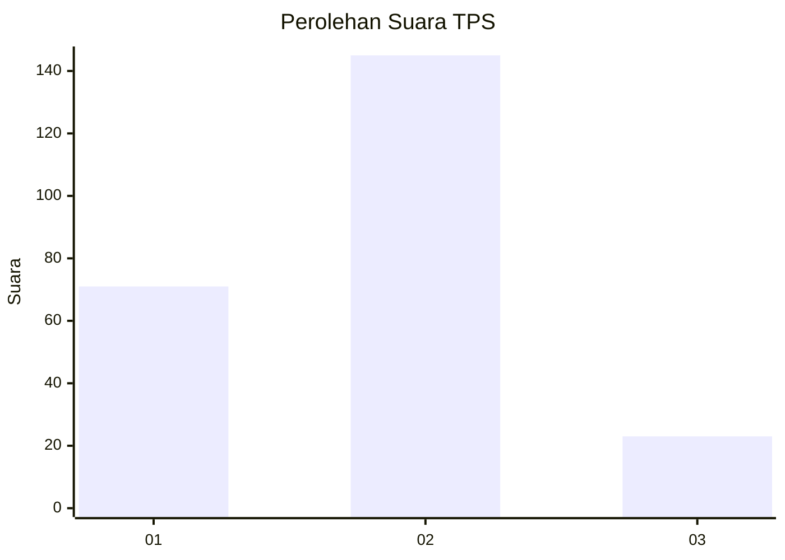
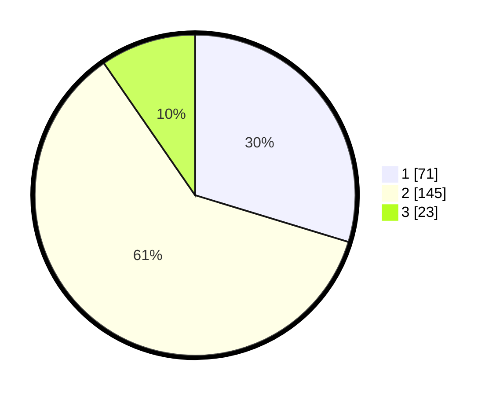

# Hasil

## Grafik

## Tabel

| No. | Nama Paslon    | Suara | Suara (raw) | Persentase |
|:--- |:-------------- | -----:| -----------:| ----------:|
| 1   | ANIES MUHAIMIN | 71    | [71][p-1]   | 29,71      |
| 2   | PRABOWO GIBRAN | 145   | [145][p-2]  | 60,67      |
| 3   | GANJAR MAHFUD  | 23    | [23][p-3]   | 9,62       |

[p-1]: https://github.com/gigit-pemilu/pemilu-2024/blob/main/pilpres/hitung-suara/sub/35-jawa-timur/sub/12-situbondo/sub/03-suboh/sub/2004-gunung-putri/sub/011-tps/sub/paslon-1.txt
[p-2]: https://github.com/gigit-pemilu/pemilu-2024/blob/main/pilpres/hitung-suara/sub/35-jawa-timur/sub/12-situbondo/sub/03-suboh/sub/2004-gunung-putri/sub/011-tps/sub/paslon-2.txt
[p-3]: https://github.com/gigit-pemilu/pemilu-2024/blob/main/pilpres/hitung-suara/sub/35-jawa-timur/sub/12-situbondo/sub/03-suboh/sub/2004-gunung-putri/sub/011-tps/sub/paslon-3.txt

## Foto C Plano

https://sirekap-obj-formc.kpu.go.id/0b1f/pemilu/ppwp/35/12/03/20/04/3512032004011-20240214-223715--d5d85d9f-2fd9-44d6-bd28-c12571cb5369.jpg

https://sirekap-obj-formc.kpu.go.id/0b1f/pemilu/ppwp/35/12/03/20/04/3512032004011-20240214-234315--069aaccb-1962-4825-ba0b-545a1c5c8e0a.jpg

https://sirekap-obj-formc.kpu.go.id/0b1f/pemilu/ppwp/35/12/03/20/04/3512032004011-20240214-234536--85fe6630-f776-4038-882e-85324b6faef8.jpg

## Metadata

| Key        | Value               |
| ---------- | ------------------- |
| Time Stamp | 2024-02-15 15:00:29 |

