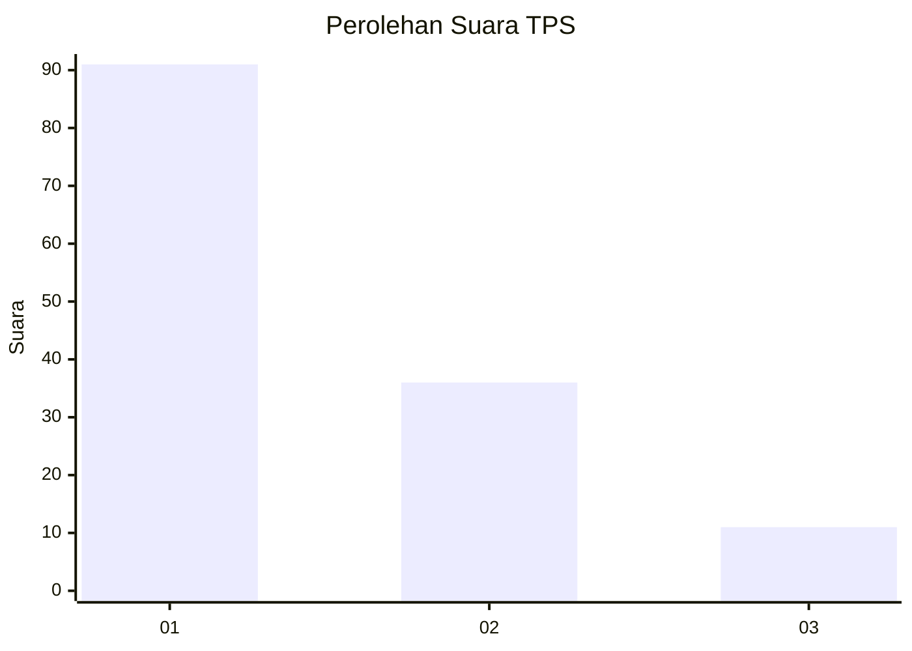
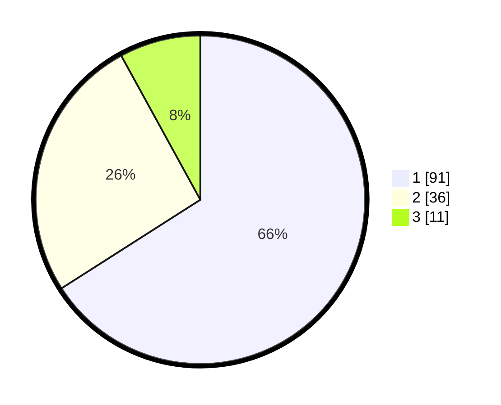

# Hasil

## Grafik

## Tabel

| No. | Nama Paslon    | Suara | Suara (raw) | Persentase |
|:--- |:-------------- | -----:| -----------:| ----------:|
| 1   | ANIES MUHAIMIN | 91    | [91][p-1]   | 65,94      |
| 2   | PRABOWO GIBRAN | 36    | [36][p-2]   | 26,09      |
| 3   | GANJAR MAHFUD  | 11    | [11][p-3]   | 7,97       |

[p-1]: https://github.com/gigit-pemilu/pemilu-2024/blob/main/pilpres/hitung-suara/sub/35-jawa-timur/sub/12-situbondo/sub/04-mlandingan/sub/2001-alas-bayur/sub/003-tps/sub/paslon-1.txt
[p-2]: https://github.com/gigit-pemilu/pemilu-2024/blob/main/pilpres/hitung-suara/sub/35-jawa-timur/sub/12-situbondo/sub/04-mlandingan/sub/2001-alas-bayur/sub/003-tps/sub/paslon-2.txt
[p-3]: https://github.com/gigit-pemilu/pemilu-2024/blob/main/pilpres/hitung-suara/sub/35-jawa-timur/sub/12-situbondo/sub/04-mlandingan/sub/2001-alas-bayur/sub/003-tps/sub/paslon-3.txt

## Foto C Plano

https://sirekap-obj-formc.kpu.go.id/7722/pemilu/ppwp/35/12/04/20/01/3512042001003-20240216-112905--0ac3bb78-a1d0-4120-8df0-c8360f9519a6.jpg

https://sirekap-obj-formc.kpu.go.id/7722/pemilu/ppwp/35/12/04/20/01/3512042001003-20240216-115633--58255347-2921-4ff1-b2f8-522b754bc4ab.jpg

https://sirekap-obj-formc.kpu.go.id/7722/pemilu/ppwp/35/12/04/20/01/3512042001003-20240216-124524--e482bedb-2a6a-45f1-8087-1f0994a82796.jpg

## Metadata

| Key        | Value               |
| ---------- | ------------------- |
| Time Stamp | 2024-02-16 12:51:22 |

## DATA PEMILIH TETAP

Jumlah pemilih dalam DPT: **186**.
 * L: **96**.
 * P: **90**.

## DATA PENGGUNA HAK PILIH

Jumlah pengguna hak pilih dalam DPT: **148**.
 * L: **80**.
 * P: **68**.

Jumlah pengguna hak pilih dalam DPTb: **0**.
 * L: **0**.
 * P: **0**.

Jumlah pengguna hak pilih dalam DPK: **0**.
 * L: **0**.
 * P: **0**.

Jumlah pengguna hak pilih: **148**.
 * L: **80**.
 * P: **68**.

## JUMLAH SUARA SAH DAN TIDAK SAH

JUMLAH SELURUH SUARA SAH: **138**.

JUMLAH SUARA TIDAK SAH: **10**.

JUMLAH SELURUH SUARA SAH DAN SUARA TIDAK SAH: **148**.

