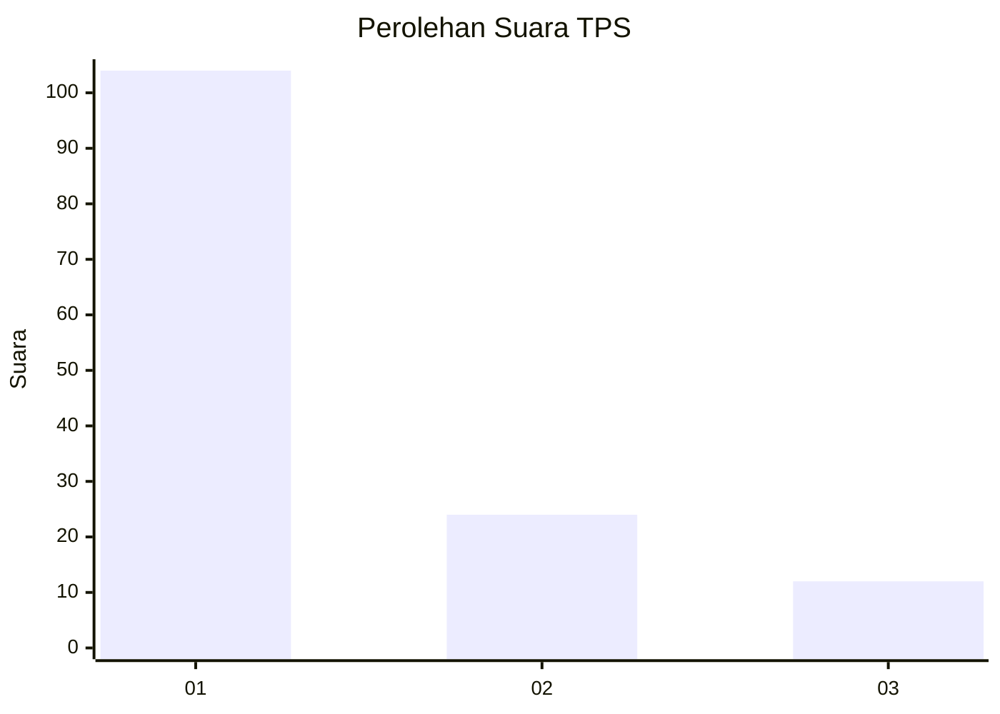
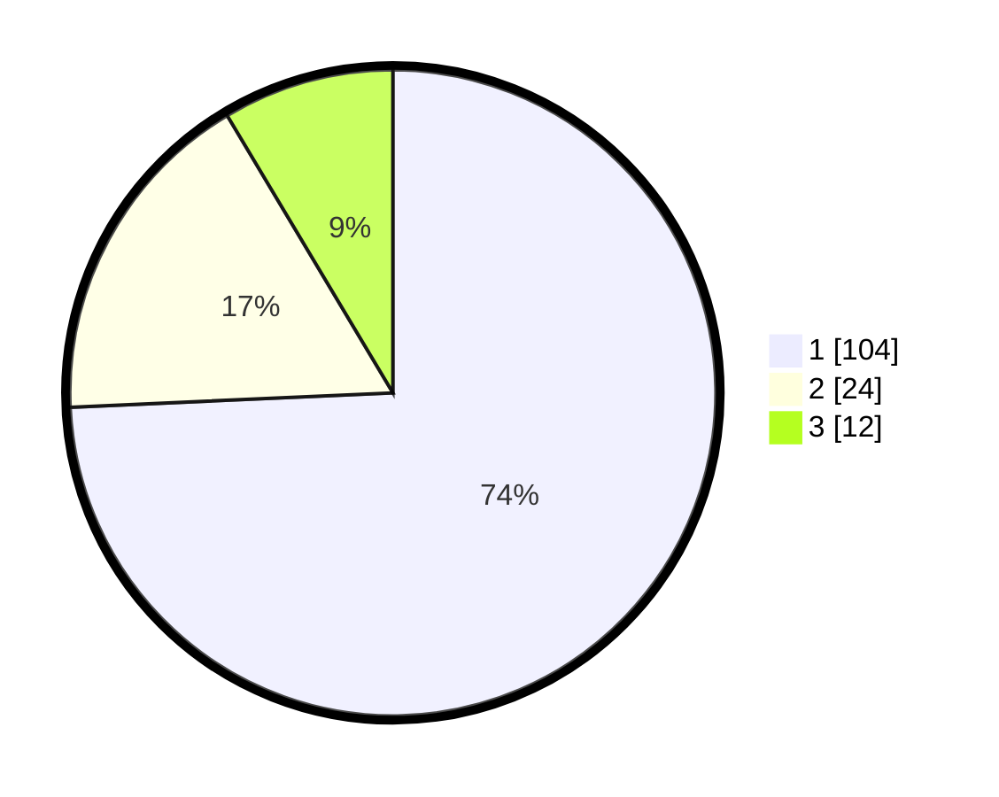

# Hasil

## Grafik

## Tabel

| No. | Nama Paslon    | Suara | Suara (raw) | Persentase |
|:--- |:-------------- | -----:| -----------:| ----------:|
| 1   | ANIES MUHAIMIN | 104   | [104][p-1]  | 74,29      |
| 2   | PRABOWO GIBRAN | 24    | [24][p-2]   | 17,14      |
| 3   | GANJAR MAHFUD  | 12    | [12][p-3]   | 8,57       |

[p-1]: https://github.com/gigit-pemilu/pemilu-2024-35-jawa-timur/blob/main/pilpres/hitung-suara/sub/35-jawa-timur/sub/12-situbondo/sub/04-mlandingan/sub/2001-alas-bayur/sub/004-tps/sub/paslon-1.txt
[p-2]: https://github.com/gigit-pemilu/pemilu-2024-35-jawa-timur/blob/main/pilpres/hitung-suara/sub/35-jawa-timur/sub/12-situbondo/sub/04-mlandingan/sub/2001-alas-bayur/sub/004-tps/sub/paslon-2.txt
[p-3]: https://github.com/gigit-pemilu/pemilu-2024-35-jawa-timur/blob/main/pilpres/hitung-suara/sub/35-jawa-timur/sub/12-situbondo/sub/04-mlandingan/sub/2001-alas-bayur/sub/004-tps/sub/paslon-3.txt

## Foto C Plano

https://sirekap-obj-formc.kpu.go.id/2cd3/pemilu/ppwp/35/12/04/20/01/3512042001004-20240216-072141--0e97ffa0-97d1-4f00-a9af-82c06c463ca8.jpg

https://sirekap-obj-formc.kpu.go.id/2cd3/pemilu/ppwp/35/12/04/20/01/3512042001004-20240216-072925--f3d8cdc1-d611-4a59-8e58-25e8964e54eb.jpg

https://sirekap-obj-formc.kpu.go.id/2cd3/pemilu/ppwp/35/12/04/20/01/3512042001004-20240216-073127--25b9213b-7a2a-498a-bfc8-c64c3bbf98db.jpg

## Metadata

| Key        | Value               |
| ---------- | ------------------- |
| Time Stamp | 2024-02-16 08:00:28 |

## DATA PEMILIH TETAP

Jumlah pemilih dalam DPT: **196**.
 * L: **95**.
 * P: **101**.

## DATA PENGGUNA HAK PILIH

Jumlah pengguna hak pilih dalam DPT: **159**.
 * L: **80**.
 * P: **79**.

Jumlah pengguna hak pilih dalam DPTb: **0**.
 * L: **0**.
 * P: **0**.

Jumlah pengguna hak pilih dalam DPK: **0**.
 * L: **0**.
 * P: **0**.

Jumlah pengguna hak pilih: **159**.
 * L: **80**.
 * P: **79**.

## JUMLAH SUARA SAH DAN TIDAK SAH

JUMLAH SELURUH SUARA SAH: **140**.

JUMLAH SUARA TIDAK SAH: **19**.

JUMLAH SELURUH SUARA SAH DAN SUARA TIDAK SAH: **159**.

