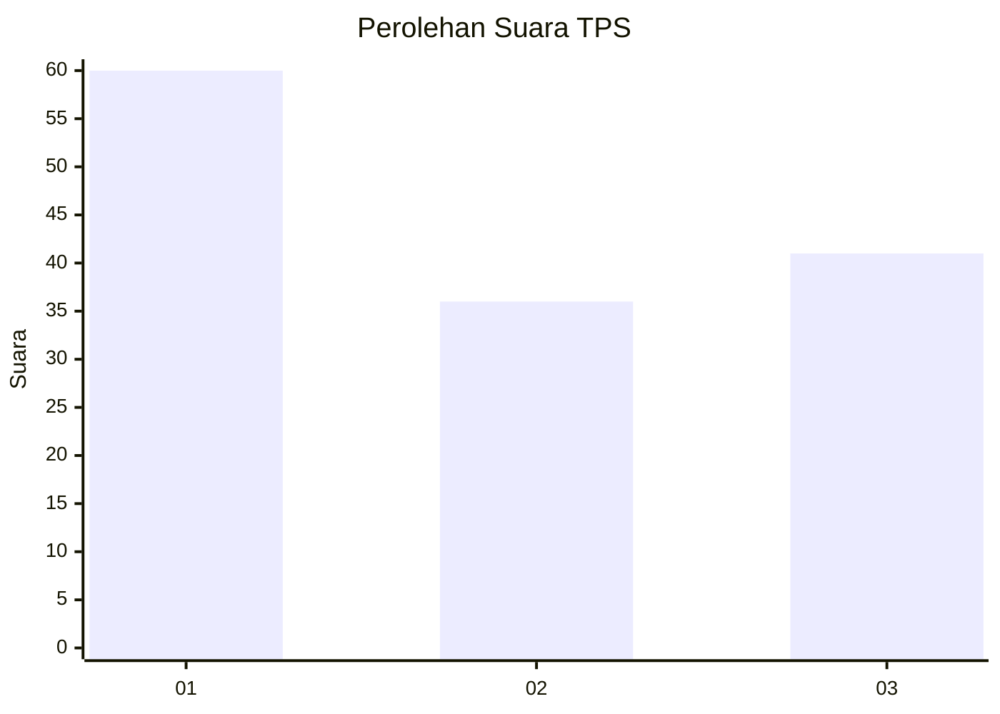
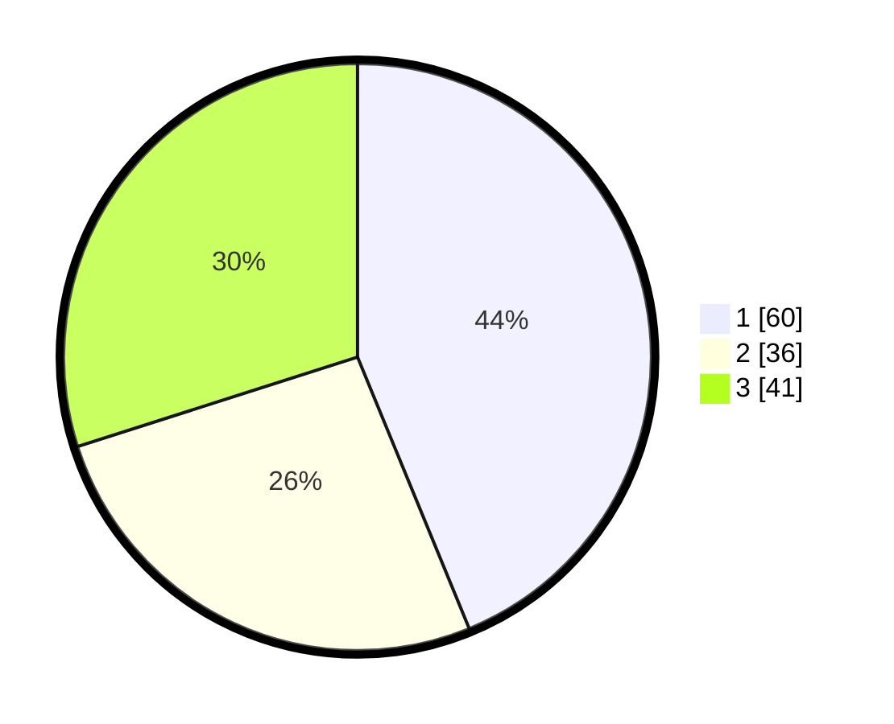

# Hasil

## Grafik

## Tabel

| No. | Nama Paslon    | Suara | Suara (raw) | Persentase |
|:--- |:-------------- | -----:| -----------:| ----------:|
| 1   | ANIES MUHAIMIN | 60    | [60][p-1]   | 43,80      |
| 2   | PRABOWO GIBRAN | 36    | [36][p-2]   | 26,28      |
| 3   | GANJAR MAHFUD  | 41    | [41][p-3]   | 29,93      |

[p-1]: https://github.com/gigit-pemilu/pemilu-2024/blob/main/pilpres/hitung-suara/sub/35-jawa-timur/sub/12-situbondo/sub/04-mlandingan/sub/2001-alas-bayur/sub/006-tps/sub/paslon-1.txt
[p-2]: https://github.com/gigit-pemilu/pemilu-2024/blob/main/pilpres/hitung-suara/sub/35-jawa-timur/sub/12-situbondo/sub/04-mlandingan/sub/2001-alas-bayur/sub/006-tps/sub/paslon-2.txt
[p-3]: https://github.com/gigit-pemilu/pemilu-2024/blob/main/pilpres/hitung-suara/sub/35-jawa-timur/sub/12-situbondo/sub/04-mlandingan/sub/2001-alas-bayur/sub/006-tps/sub/paslon-3.txt

## Foto C Plano

https://sirekap-obj-formc.kpu.go.id/04b7/pemilu/ppwp/35/12/04/20/01/3512042001006-20240215-002142--e87f984b-44b1-4266-985d-1b4e3e671562.jpg

https://sirekap-obj-formc.kpu.go.id/04b7/pemilu/ppwp/35/12/04/20/01/3512042001006-20240215-002224--5602e327-0272-48be-9b78-1f9342c8ec1f.jpg

https://sirekap-obj-formc.kpu.go.id/04b7/pemilu/ppwp/35/12/04/20/01/3512042001006-20240215-002308--0591cfbb-0937-4fec-bb68-ddd15d873d33.jpg

## Metadata

| Key        | Value               |
| ---------- | ------------------- |
| Time Stamp | 2024-02-15 15:00:29 |

## DATA PEMILIH TETAP

Jumlah pemilih dalam DPT: **207**.
 * L: **95**.
 * P: **112**.

## DATA PENGGUNA HAK PILIH

Jumlah pengguna hak pilih dalam DPT: **152**.
 * L: **67**.
 * P: **85**.

Jumlah pengguna hak pilih dalam DPTb: **0**.
 * L: **0**.
 * P: **0**.

Jumlah pengguna hak pilih dalam DPK: **0**.
 * L: **0**.
 * P: **0**.

Jumlah pengguna hak pilih: **152**.
 * L: **67**.
 * P: **85**.

## JUMLAH SUARA SAH DAN TIDAK SAH

JUMLAH SELURUH SUARA SAH: **137**.

JUMLAH SUARA TIDAK SAH: **15**.

JUMLAH SELURUH SUARA SAH DAN SUARA TIDAK SAH: **152**.

