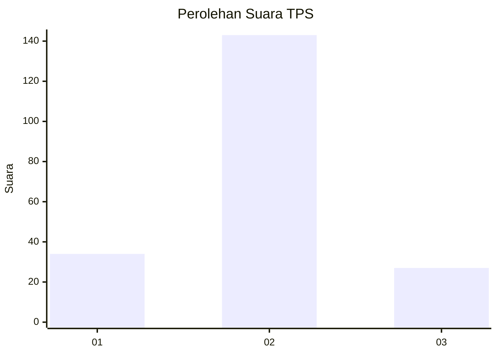
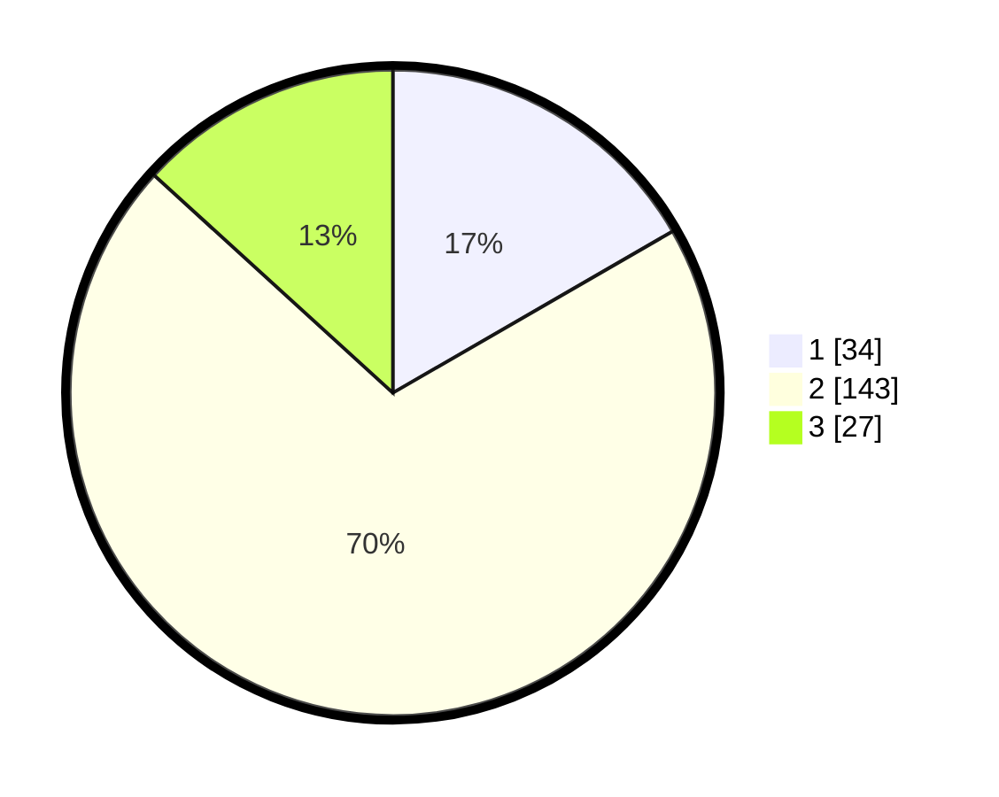

# Hasil

## Grafik

## Tabel

| No. | Nama Paslon    | Suara | Suara (raw) | Persentase |
|:--- |:-------------- | -----:| -----------:| ----------:|
| 1   | ANIES MUHAIMIN | 34    | [34][p-1]   | 16,67      |
| 2   | PRABOWO GIBRAN | 143   | [143][p-2]  | 70,10      |
| 3   | GANJAR MAHFUD  | 27    | [27][p-3]   | 13,24      |

[p-1]: https://github.com/gigit-pemilu/pemilu-2024/blob/main/pilpres/hitung-suara/sub/35-jawa-timur/sub/12-situbondo/sub/05-kendit/sub/2007-klatakan/sub/011-tps/sub/paslon-1.txt
[p-2]: https://github.com/gigit-pemilu/pemilu-2024/blob/main/pilpres/hitung-suara/sub/35-jawa-timur/sub/12-situbondo/sub/05-kendit/sub/2007-klatakan/sub/011-tps/sub/paslon-2.txt
[p-3]: https://github.com/gigit-pemilu/pemilu-2024/blob/main/pilpres/hitung-suara/sub/35-jawa-timur/sub/12-situbondo/sub/05-kendit/sub/2007-klatakan/sub/011-tps/sub/paslon-3.txt

## Foto C Plano

https://sirekap-obj-formc.kpu.go.id/da1e/pemilu/ppwp/35/12/05/20/07/3512052007011-20240214-214000--9c6f149c-ac0d-4e0b-91a9-7e2b298bd902.jpg

https://sirekap-obj-formc.kpu.go.id/da1e/pemilu/ppwp/35/12/05/20/07/3512052007011-20240214-214419--7ea2c1fa-3e5b-44e6-b499-5cfa63b14c8f.jpg

https://sirekap-obj-formc.kpu.go.id/da1e/pemilu/ppwp/35/12/05/20/07/3512052007011-20240214-214616--8b9dd514-9884-47e6-921b-b12e0519d80e.jpg

## Metadata

| Key        | Value               |
| ---------- | ------------------- |
| Time Stamp | 2024-02-15 20:00:44 |

## DATA PEMILIH TETAP

Jumlah pemilih dalam DPT: **291**.
 * L: **122**.
 * P: **119**.

## DATA PENGGUNA HAK PILIH

Jumlah pengguna hak pilih dalam DPT: **209**.
 * L: **161**.
 * P: **193**.

Jumlah pengguna hak pilih dalam DPTb: **722**.
 * L: **880**.
 * P: **80**.

Jumlah pengguna hak pilih dalam DPK: **1**.
 * L: **207**.
 * P: **0**.

Jumlah pengguna hak pilih: **295**.
 * L: **102**.
 * P: **103**.

## JUMLAH SUARA SAH DAN TIDAK SAH

JUMLAH SELURUH SUARA SAH: **204**.

JUMLAH SUARA TIDAK SAH: **1**.

JUMLAH SELURUH SUARA SAH DAN SUARA TIDAK SAH: **205**.

