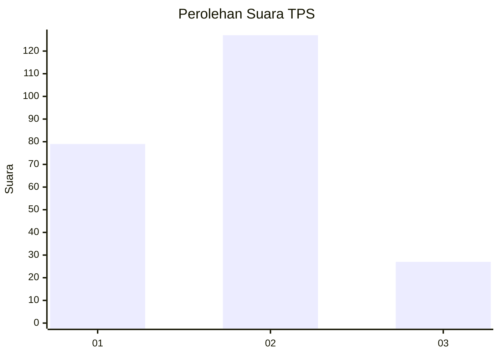
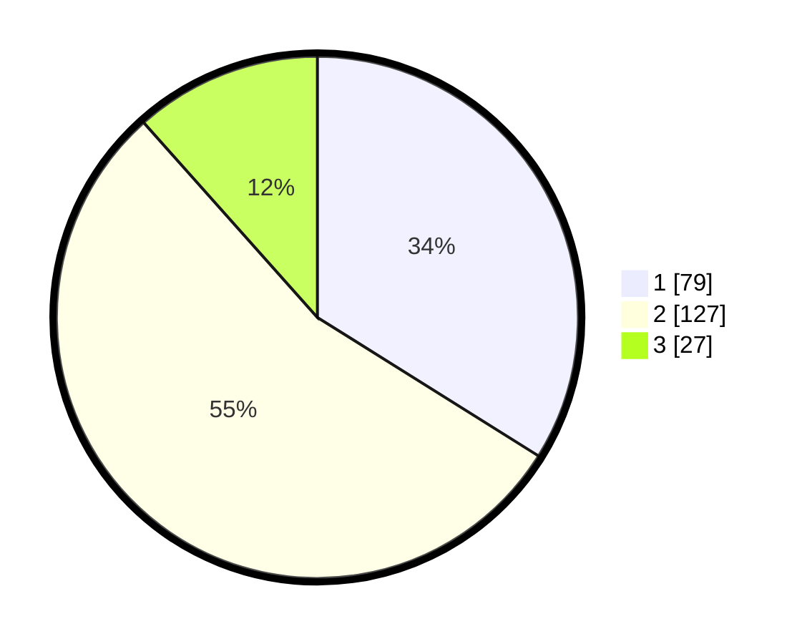

# Hasil

## Grafik

## Tabel

| No. | Nama Paslon    | Suara | Suara (raw) | Persentase |
|:--- |:-------------- | -----:| -----------:| ----------:|
| 1   | ANIES MUHAIMIN | 79    | [79][p-1]   | 33,91      |
| 2   | PRABOWO GIBRAN | 127   | [127][p-2]  | 54,51      |
| 3   | GANJAR MAHFUD  | 27    | [27][p-3]   | 11,59      |

[p-1]: https://github.com/gigit-pemilu/pemilu-2024/blob/main/pilpres/hitung-suara/sub/35-jawa-timur/sub/12-situbondo/sub/06-panarukan/sub/2008-gelung/sub/003-tps/sub/paslon-1.txt
[p-2]: https://github.com/gigit-pemilu/pemilu-2024/blob/main/pilpres/hitung-suara/sub/35-jawa-timur/sub/12-situbondo/sub/06-panarukan/sub/2008-gelung/sub/003-tps/sub/paslon-2.txt
[p-3]: https://github.com/gigit-pemilu/pemilu-2024/blob/main/pilpres/hitung-suara/sub/35-jawa-timur/sub/12-situbondo/sub/06-panarukan/sub/2008-gelung/sub/003-tps/sub/paslon-3.txt

## Foto C Plano

https://sirekap-obj-formc.kpu.go.id/43b6/pemilu/ppwp/35/12/06/20/08/3512062008003-20240215-085022--34993b17-2cc2-48c3-aeac-9263e94e124c.jpg

https://sirekap-obj-formc.kpu.go.id/43b6/pemilu/ppwp/35/12/06/20/08/3512062008003-20240215-085903--1031a07b-9284-4db8-a4e8-f4d5c83e3bd6.jpg

https://sirekap-obj-formc.kpu.go.id/43b6/pemilu/ppwp/35/12/06/20/08/3512062008003-20240215-090005--a65cc3b9-6c87-490e-af4f-69d569ec0de3.jpg

## Metadata

| Key        | Value               |
| ---------- | ------------------- |
| Time Stamp | 2024-02-16 00:30:27 |

