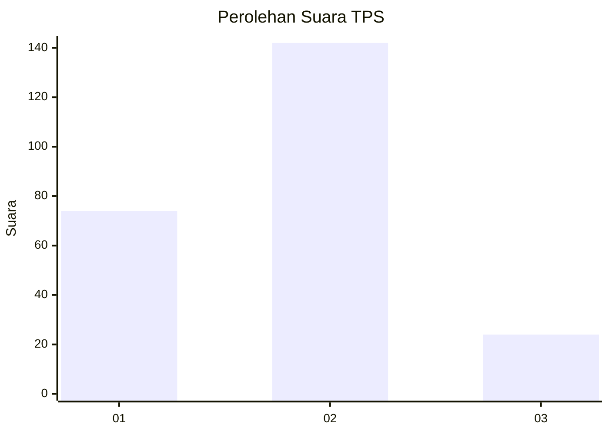
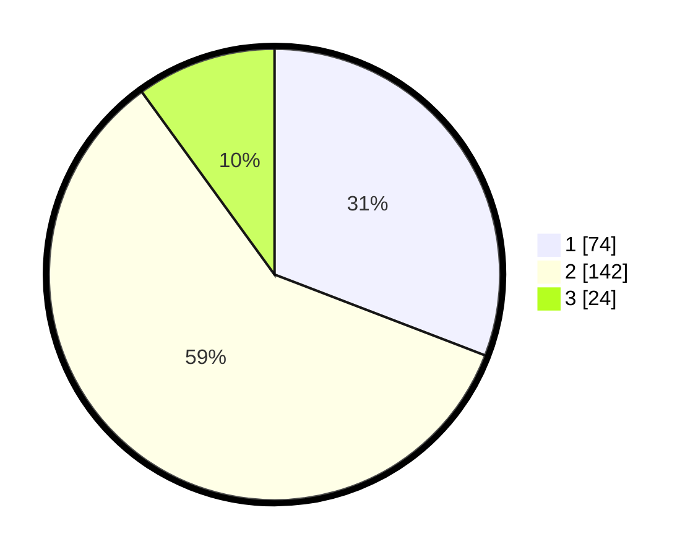

# Hasil

## Grafik

## Tabel

| No. | Nama Paslon    | Suara | Suara (raw) | Persentase |
|:--- |:-------------- | -----:| -----------:| ----------:|
| 1   | ANIES MUHAIMIN | 74    | [74][p-1]   | 30,83      |
| 2   | PRABOWO GIBRAN | 142   | [142][p-2]  | 59,17      |
| 3   | GANJAR MAHFUD  | 24    | [24][p-3]   | 10,00      |

[p-1]: https://github.com/gigit-pemilu/pemilu-2024/blob/main/pilpres/hitung-suara/sub/35-jawa-timur/sub/12-situbondo/sub/06-panarukan/sub/2008-gelung/sub/004-tps/sub/paslon-1.txt
[p-2]: https://github.com/gigit-pemilu/pemilu-2024/blob/main/pilpres/hitung-suara/sub/35-jawa-timur/sub/12-situbondo/sub/06-panarukan/sub/2008-gelung/sub/004-tps/sub/paslon-2.txt
[p-3]: https://github.com/gigit-pemilu/pemilu-2024/blob/main/pilpres/hitung-suara/sub/35-jawa-timur/sub/12-situbondo/sub/06-panarukan/sub/2008-gelung/sub/004-tps/sub/paslon-3.txt

## Foto C Plano

https://sirekap-obj-formc.kpu.go.id/f538/pemilu/ppwp/35/12/06/20/08/3512062008004-20240219-150244--02b2377f-8c0f-42ba-9fa3-1a2c77e97693.jpg

https://sirekap-obj-formc.kpu.go.id/f538/pemilu/ppwp/35/12/06/20/08/3512062008004-20240219-150403--aca4f43f-1141-41de-8f38-8e5e32362c8f.jpg

https://sirekap-obj-formc.kpu.go.id/f538/pemilu/ppwp/35/12/06/20/08/3512062008004-20240215-031234--85b2a261-dc03-458d-b770-03bc56e2be8e.jpg

## Metadata

| Key        | Value               |
| ---------- | ------------------- |
| Time Stamp | 2024-02-19 17:00:00 |

