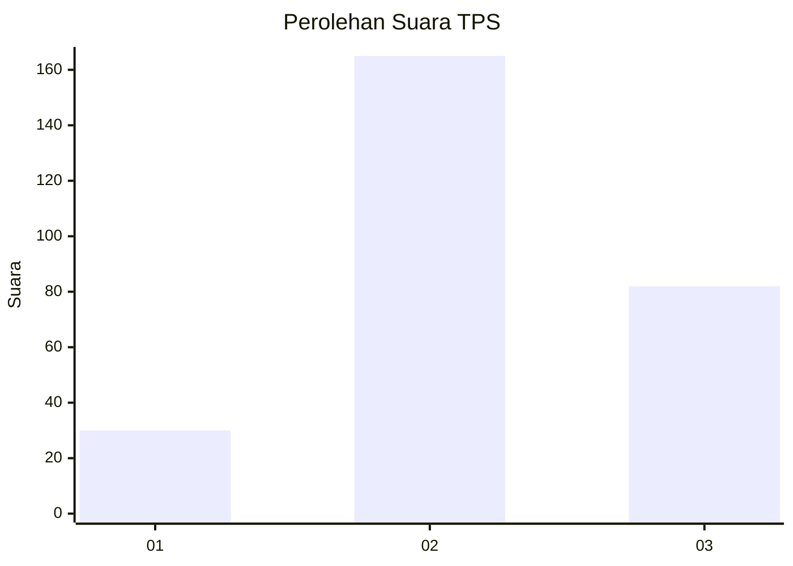
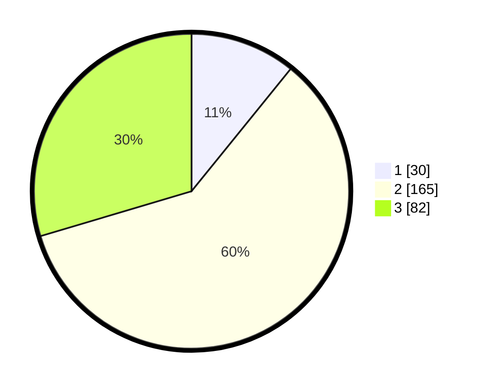

# Hasil

## Grafik

## Tabel

| No. | Nama Paslon    | Suara | Suara (raw) | Persentase |
|:--- |:-------------- | -----:| -----------:| ----------:|
| 1   | ANIES MUHAIMIN | 30    | [30][p-1]   | 10,83      |
| 2   | PRABOWO GIBRAN | 165   | [165][p-2]  | 59,57      |
| 3   | GANJAR MAHFUD  | 82    | [82][p-3]   | 29,60      |

[p-1]: https://github.com/gigit-pemilu/pemilu-2024-35-jawa-timur/blob/main/pilpres/hitung-suara/sub/35-jawa-timur/sub/12-situbondo/sub/07-situbondo/sub/1003-dawuhan/sub/901-tps/sub/paslon-1.txt
[p-2]: https://github.com/gigit-pemilu/pemilu-2024-35-jawa-timur/blob/main/pilpres/hitung-suara/sub/35-jawa-timur/sub/12-situbondo/sub/07-situbondo/sub/1003-dawuhan/sub/901-tps/sub/paslon-2.txt
[p-3]: https://github.com/gigit-pemilu/pemilu-2024-35-jawa-timur/blob/main/pilpres/hitung-suara/sub/35-jawa-timur/sub/12-situbondo/sub/07-situbondo/sub/1003-dawuhan/sub/901-tps/sub/paslon-3.txt

## Foto C Plano

https://sirekap-obj-formc.kpu.go.id/0bd6/pemilu/ppwp/35/12/07/10/03/3512071003901-20240214-155457--b60305aa-2fb4-4a20-83f5-0a72f76f94db.jpg

https://sirekap-obj-formc.kpu.go.id/0bd6/pemilu/ppwp/35/12/07/10/03/3512071003901-20240214-155712--d745b22d-fe46-4ad7-ad10-b042c03088dd.jpg

https://sirekap-obj-formc.kpu.go.id/0bd6/pemilu/ppwp/35/12/07/10/03/3512071003901-20240214-155813--184b6cfd-5736-4185-b80b-e783ad251ce6.jpg

## Metadata

| Key        | Value               |
| ---------- | ------------------- |
| Time Stamp | 2024-02-14 21:46:01 |

## DATA PEMILIH TETAP

Jumlah pemilih dalam DPT: **297**.
 * L: **284**.
 * P: **13**.

## DATA PENGGUNA HAK PILIH

Jumlah pengguna hak pilih dalam DPT: **179**.
 * L: **170**.
 * P: **9**.

Jumlah pengguna hak pilih dalam DPTb: **101**.
 * L: **96**.
 * P: **5**.

Jumlah pengguna hak pilih dalam DPK: **0**.
 * L: **0**.
 * P: **0**.

Jumlah pengguna hak pilih: **280**.
 * L: **266**.
 * P: **14**.

## JUMLAH SUARA SAH DAN TIDAK SAH

JUMLAH SELURUH SUARA SAH: **277**.

JUMLAH SUARA TIDAK SAH: **3**.

JUMLAH SELURUH SUARA SAH DAN SUARA TIDAK SAH: **280**.

