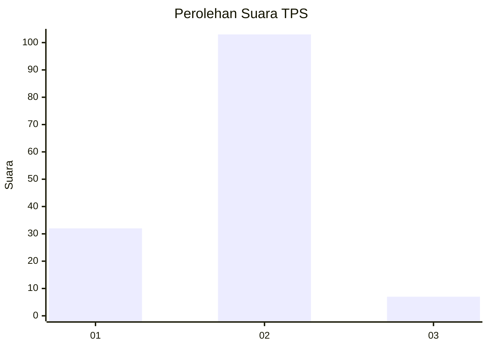
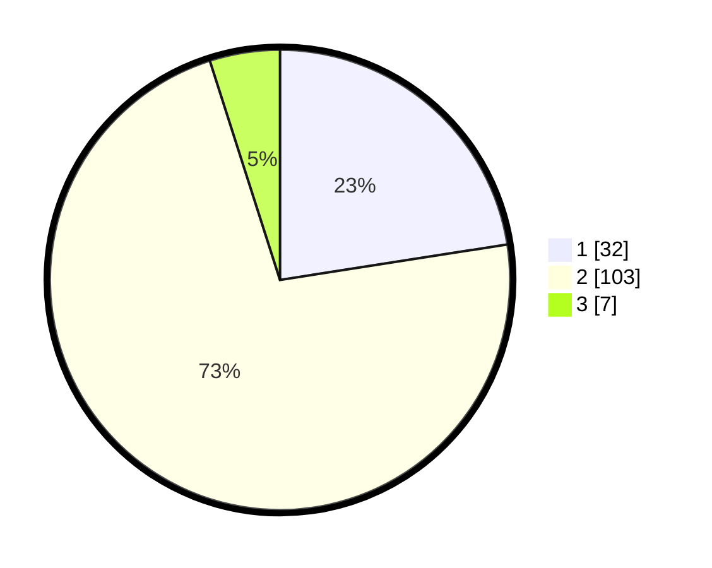

# Hasil

## Grafik

## Tabel

| No. | Nama Paslon    | Suara | Suara (raw) | Persentase |
|:--- |:-------------- | -----:| -----------:| ----------:|
| 1   | ANIES MUHAIMIN | 32    | [32][p-1]   | 22,54      |
| 2   | PRABOWO GIBRAN | 103   | [103][p-2]  | 72,54      |
| 3   | GANJAR MAHFUD  | 7     | [7][p-3]    | 4,93       |

[p-1]: https://github.com/gigit-pemilu/pemilu-2024-35-jawa-timur/blob/main/pilpres/hitung-suara/sub/35-jawa-timur/sub/12-situbondo/sub/08-panji/sub/2006-panji-kidul/sub/004-tps/sub/paslon-1.txt
[p-2]: https://github.com/gigit-pemilu/pemilu-2024-35-jawa-timur/blob/main/pilpres/hitung-suara/sub/35-jawa-timur/sub/12-situbondo/sub/08-panji/sub/2006-panji-kidul/sub/004-tps/sub/paslon-2.txt
[p-3]: https://github.com/gigit-pemilu/pemilu-2024-35-jawa-timur/blob/main/pilpres/hitung-suara/sub/35-jawa-timur/sub/12-situbondo/sub/08-panji/sub/2006-panji-kidul/sub/004-tps/sub/paslon-3.txt

## Foto C Plano

https://sirekap-obj-formc.kpu.go.id/d05d/pemilu/ppwp/35/12/08/20/06/3512082006004-20240214-223244--dfe270c5-2fd4-40cb-94d1-580c322e52ff.jpg

https://sirekap-obj-formc.kpu.go.id/d05d/pemilu/ppwp/35/12/08/20/06/3512082006004-20240214-223410--1f489c5e-dfae-418b-acae-0b247367afa4.jpg

https://sirekap-obj-formc.kpu.go.id/d05d/pemilu/ppwp/35/12/08/20/06/3512082006004-20240214-223503--3a6cb0de-2905-419b-aa98-d12ba189680b.jpg

## Metadata

| Key        | Value               |
| ---------- | ------------------- |
| Time Stamp | 2024-02-16 00:00:26 |

