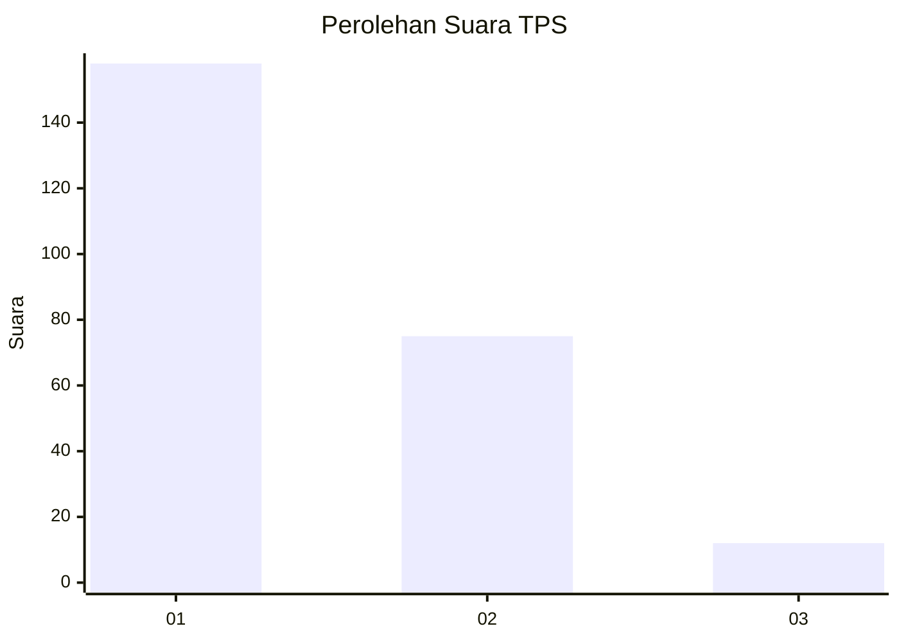
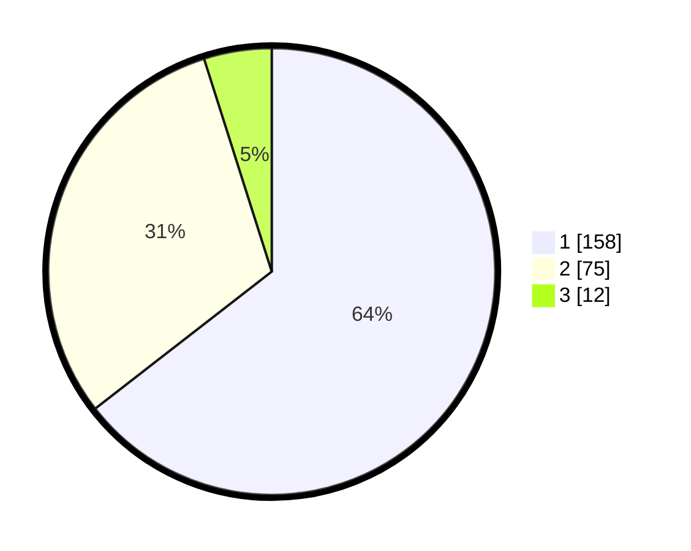

# Hasil

## Grafik

## Tabel

| No. | Nama Paslon    | Suara | Suara (raw) | Persentase |
|:--- |:-------------- | -----:| -----------:| ----------:|
| 1   | ANIES MUHAIMIN | 158   | [158][p-1]  | 64,49      |
| 2   | PRABOWO GIBRAN | 75    | [75][p-2]   | 30,61      |
| 3   | GANJAR MAHFUD  | 12    | [12][p-3]   | 4,90       |

[p-1]: https://github.com/gigit-pemilu/pemilu-2024/blob/main/pilpres/hitung-suara/sub/35-jawa-timur/sub/12-situbondo/sub/09-mangaran/sub/2001-tanjung-glugur/sub/003-tps/sub/paslon-1.txt
[p-2]: https://github.com/gigit-pemilu/pemilu-2024/blob/main/pilpres/hitung-suara/sub/35-jawa-timur/sub/12-situbondo/sub/09-mangaran/sub/2001-tanjung-glugur/sub/003-tps/sub/paslon-2.txt
[p-3]: https://github.com/gigit-pemilu/pemilu-2024/blob/main/pilpres/hitung-suara/sub/35-jawa-timur/sub/12-situbondo/sub/09-mangaran/sub/2001-tanjung-glugur/sub/003-tps/sub/paslon-3.txt

## Foto C Plano

https://sirekap-obj-formc.kpu.go.id/9ae2/pemilu/ppwp/35/12/09/20/01/3512092001003-20240218-112145--0da258c2-3cc6-40c6-b16e-db765b622474.jpg

https://sirekap-obj-formc.kpu.go.id/9ae2/pemilu/ppwp/35/12/09/20/01/3512092001003-20240218-112147--ef268ba5-2c45-4d51-9dca-0f525221ea75.jpg

https://sirekap-obj-formc.kpu.go.id/9ae2/pemilu/ppwp/35/12/09/20/01/3512092001003-20240218-112146--6b949b92-9bc3-4e35-9c4f-226f9e327841.jpg

## Metadata

| Key        | Value               |
| ---------- | ------------------- |
| Time Stamp | 2024-02-19 12:00:00 |

## DATA PEMILIH TETAP

Jumlah pemilih dalam DPT: **0**.
 * L: **0**.
 * P: **0**.

## DATA PENGGUNA HAK PILIH

Jumlah pengguna hak pilih dalam DPT: **0**.
 * L: **0**.
 * P: **0**.

Jumlah pengguna hak pilih dalam DPTb: **0**.
 * L: **0**.
 * P: **0**.

Jumlah pengguna hak pilih dalam DPK: **0**.
 * L: **0**.
 * P: **0**.

Jumlah pengguna hak pilih: **0**.
 * L: **0**.
 * P: **0**.

## JUMLAH SUARA SAH DAN TIDAK SAH

JUMLAH SELURUH SUARA SAH: **245**.

JUMLAH SUARA TIDAK SAH: **9**.

JUMLAH SELURUH SUARA SAH DAN SUARA TIDAK SAH: **254**.

