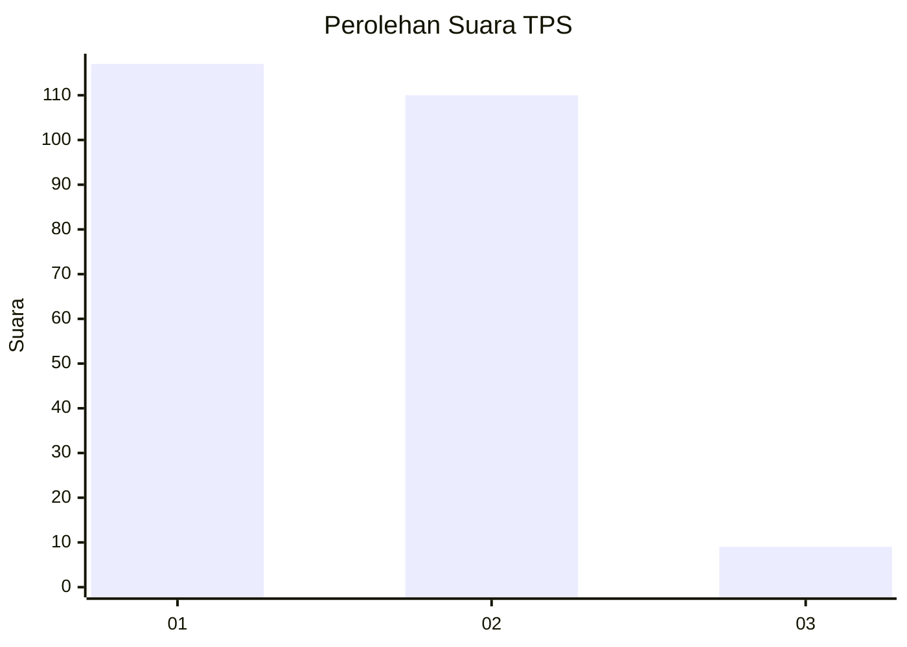
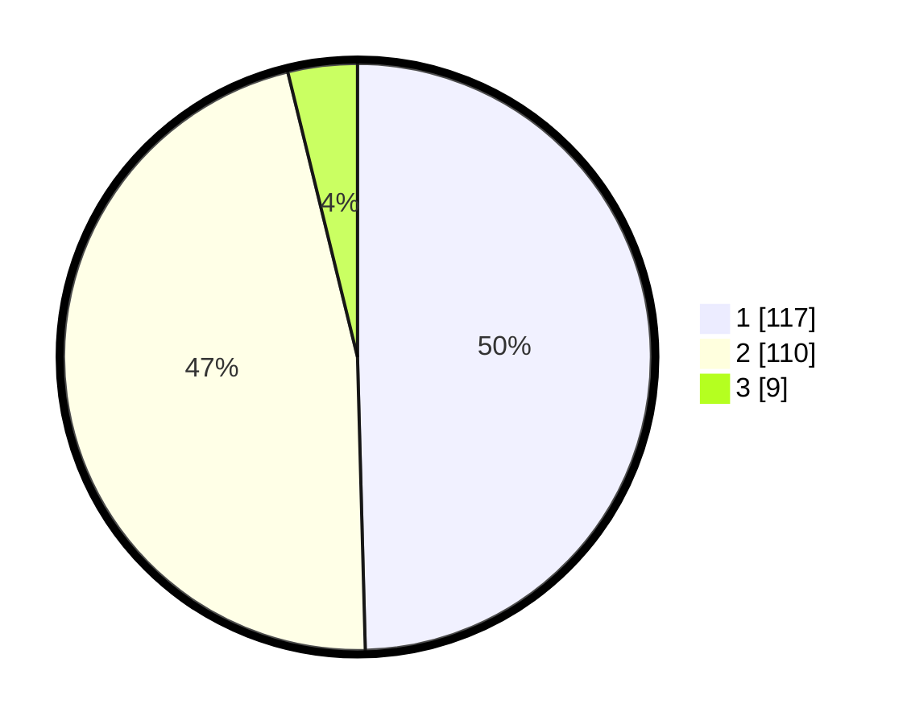

# Hasil

## Grafik

## Tabel

| No. | Nama Paslon    | Suara | Suara (raw) | Persentase |
|:--- |:-------------- | -----:| -----------:| ----------:|
| 1   | ANIES MUHAIMIN | 117   | [117][p-1]  | 49,58      |
| 2   | PRABOWO GIBRAN | 110   | [110][p-2]  | 46,61      |
| 3   | GANJAR MAHFUD  | 9     | [9][p-3]    | 3,81       |

[p-1]: https://github.com/gigit-pemilu/pemilu-2024/blob/main/pilpres/hitung-suara/sub/35-jawa-timur/sub/12-situbondo/sub/09-mangaran/sub/2001-tanjung-glugur/sub/004-tps/sub/paslon-1.txt
[p-2]: https://github.com/gigit-pemilu/pemilu-2024/blob/main/pilpres/hitung-suara/sub/35-jawa-timur/sub/12-situbondo/sub/09-mangaran/sub/2001-tanjung-glugur/sub/004-tps/sub/paslon-2.txt
[p-3]: https://github.com/gigit-pemilu/pemilu-2024/blob/main/pilpres/hitung-suara/sub/35-jawa-timur/sub/12-situbondo/sub/09-mangaran/sub/2001-tanjung-glugur/sub/004-tps/sub/paslon-3.txt

## Foto C Plano

https://sirekap-obj-formc.kpu.go.id/5a5f/pemilu/ppwp/35/12/09/20/01/3512092001004-20240215-015015--c26e2961-85d9-4516-808c-581da11021a9.jpg

https://sirekap-obj-formc.kpu.go.id/5a5f/pemilu/ppwp/35/12/09/20/01/3512092001004-20240215-014020--519ec027-8c72-4774-a79c-1a4ce66103b3.jpg

https://sirekap-obj-formc.kpu.go.id/5a5f/pemilu/ppwp/35/12/09/20/01/3512092001004-20240215-014157--933dc3c7-a77b-46b1-a1ee-cebad8ce3327.jpg

## Metadata

| Key        | Value               |
| ---------- | ------------------- |
| Time Stamp | 2024-02-16 00:30:27 |

## DATA PEMILIH TETAP

Jumlah pemilih dalam DPT: **278**.
 * L: **130**.
 * P: **148**.

## DATA PENGGUNA HAK PILIH

Jumlah pengguna hak pilih dalam DPT: **253**.
 * L: **117**.
 * P: **136**.

Jumlah pengguna hak pilih dalam DPTb: **2**.
 * L: **1**.
 * P: **1**.

Jumlah pengguna hak pilih dalam DPK: **1**.
 * L: **0**.
 * P: **1**.

Jumlah pengguna hak pilih: **256**.
 * L: **118**.
 * P: **138**.

## JUMLAH SUARA SAH DAN TIDAK SAH

JUMLAH SELURUH SUARA SAH: **236**.

JUMLAH SUARA TIDAK SAH: **20**.

JUMLAH SELURUH SUARA SAH DAN SUARA TIDAK SAH: **256**.

