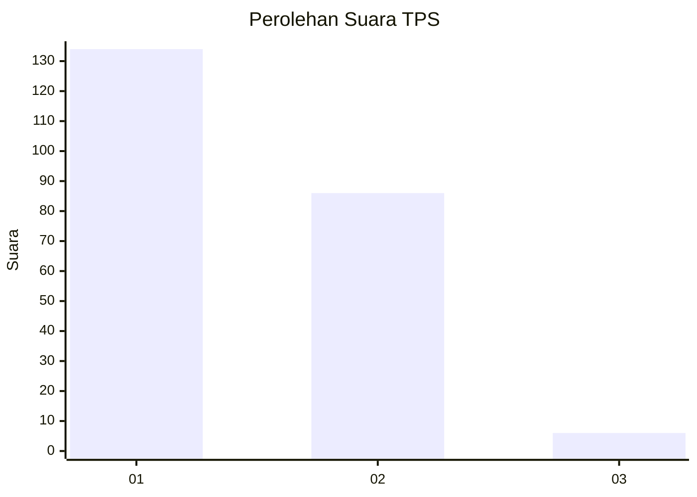
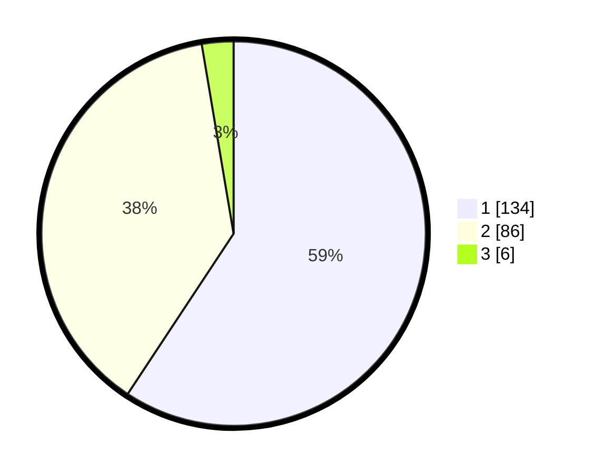

# Hasil

## Grafik

## Tabel

| No. | Nama Paslon    | Suara | Suara (raw) | Persentase |
|:--- |:-------------- | -----:| -----------:| ----------:|
| 1   | ANIES MUHAIMIN | 134   | [134][p-1]  | 59,29      |
| 2   | PRABOWO GIBRAN | 86    | [86][p-2]   | 38,05      |
| 3   | GANJAR MAHFUD  | 6     | [6][p-3]    | 2,65       |

[p-1]: https://github.com/gigit-pemilu/pemilu-2024/blob/main/pilpres/hitung-suara/sub/35-jawa-timur/sub/12-situbondo/sub/09-mangaran/sub/2001-tanjung-glugur/sub/005-tps/sub/paslon-1.txt
[p-2]: https://github.com/gigit-pemilu/pemilu-2024/blob/main/pilpres/hitung-suara/sub/35-jawa-timur/sub/12-situbondo/sub/09-mangaran/sub/2001-tanjung-glugur/sub/005-tps/sub/paslon-2.txt
[p-3]: https://github.com/gigit-pemilu/pemilu-2024/blob/main/pilpres/hitung-suara/sub/35-jawa-timur/sub/12-situbondo/sub/09-mangaran/sub/2001-tanjung-glugur/sub/005-tps/sub/paslon-3.txt

## Foto C Plano

https://sirekap-obj-formc.kpu.go.id/aa95/pemilu/ppwp/35/12/09/20/01/3512092001005-20240215-022501--5802b1a1-b6b0-4e80-860a-eed04b213a39.jpg

https://sirekap-obj-formc.kpu.go.id/aa95/pemilu/ppwp/35/12/09/20/01/3512092001005-20240215-022216--f66afcae-eba1-4f36-b31f-acd4591f1dc7.jpg

https://sirekap-obj-formc.kpu.go.id/aa95/pemilu/ppwp/35/12/09/20/01/3512092001005-20240215-022342--fcd7375c-be76-4f9f-bb92-adc511bbd24e.jpg

## Metadata

| Key        | Value               |
| ---------- | ------------------- |
| Time Stamp | 2024-02-15 15:00:29 |

## DATA PEMILIH TETAP

Jumlah pemilih dalam DPT: **271**.
 * L: **126**.
 * P: **145**.

## DATA PENGGUNA HAK PILIH

Jumlah pengguna hak pilih dalam DPT: **236**.
 * L: **109**.
 * P: **127**.

Jumlah pengguna hak pilih dalam DPTb: **0**.
 * L: **0**.
 * P: **0**.

Jumlah pengguna hak pilih dalam DPK: **0**.
 * L: **0**.
 * P: **0**.

Jumlah pengguna hak pilih: **236**.
 * L: **109**.
 * P: **127**.

## JUMLAH SUARA SAH DAN TIDAK SAH

JUMLAH SELURUH SUARA SAH: **226**.

JUMLAH SUARA TIDAK SAH: **10**.

JUMLAH SELURUH SUARA SAH DAN SUARA TIDAK SAH: **236**.

