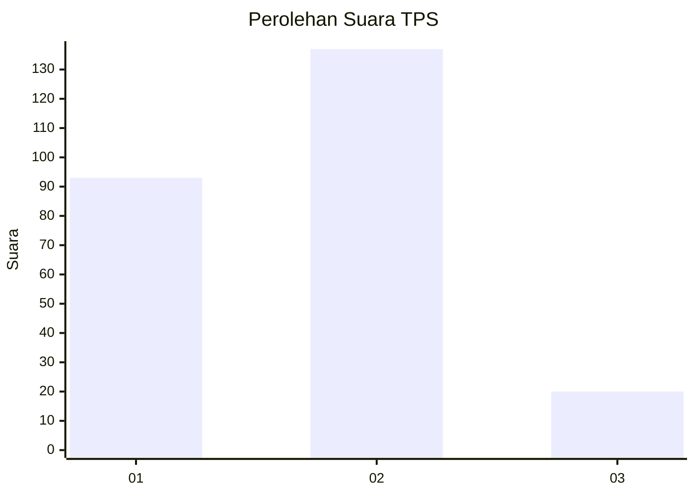

# Hasil

## Grafik

## Tabel

| No. | Nama Paslon    | Suara | Suara (raw) | Persentase |
|:--- |:-------------- | -----:| -----------:| ----------:|
| 1   | ANIES MUHAIMIN | 93    | [93][p-1]   | 37,20      |
| 2   | PRABOWO GIBRAN | 137   | [137][p-2]  | 54,80      |
| 3   | GANJAR MAHFUD  | 20    | [20][p-3]   | 8,00       |

[p-1]: https://github.com/gigit-pemilu/pemilu-2024-35-jawa-timur/blob/main/pilpres/hitung-suara/sub/35-jawa-timur/sub/12-situbondo/sub/11-arjasa/sub/2001-kayumas/sub/004-tps/sub/paslon-1.txt
[p-2]: https://github.com/gigit-pemilu/pemilu-2024-35-jawa-timur/blob/main/pilpres/hitung-suara/sub/35-jawa-timur/sub/12-situbondo/sub/11-arjasa/sub/2001-kayumas/sub/004-tps/sub/paslon-2.txt
[p-3]: https://github.com/gigit-pemilu/pemilu-2024-35-jawa-timur/blob/main/pilpres/hitung-suara/sub/35-jawa-timur/sub/12-situbondo/sub/11-arjasa/sub/2001-kayumas/sub/004-tps/sub/paslon-3.txt

## Foto C Plano

https://sirekap-obj-formc.kpu.go.id/5495/pemilu/ppwp/35/12/11/20/01/3512112001004-20240214-233426--55d647a4-2b65-4360-a0a7-34ce708edf1b.jpg

https://sirekap-obj-formc.kpu.go.id/5495/pemilu/ppwp/35/12/11/20/01/3512112001004-20240214-233602--e781ba91-77d5-4638-b977-b1886537a0ca.jpg

## Metadata

| Key        | Value               |
| ---------- | ------------------- |
| Time Stamp | 2024-02-21 16:00:00 |

