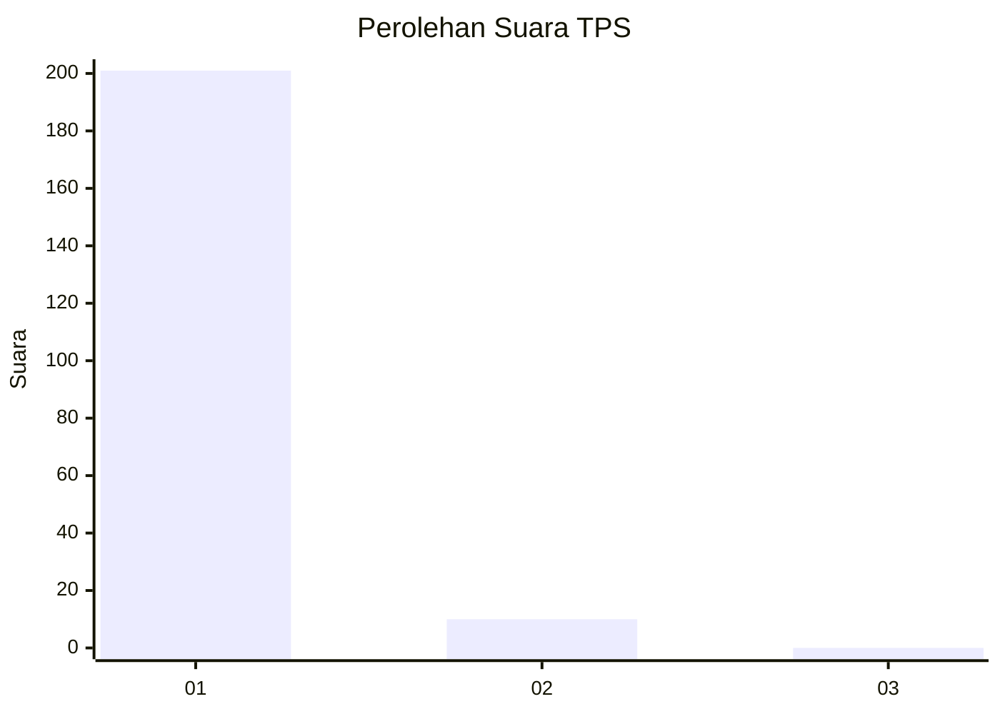
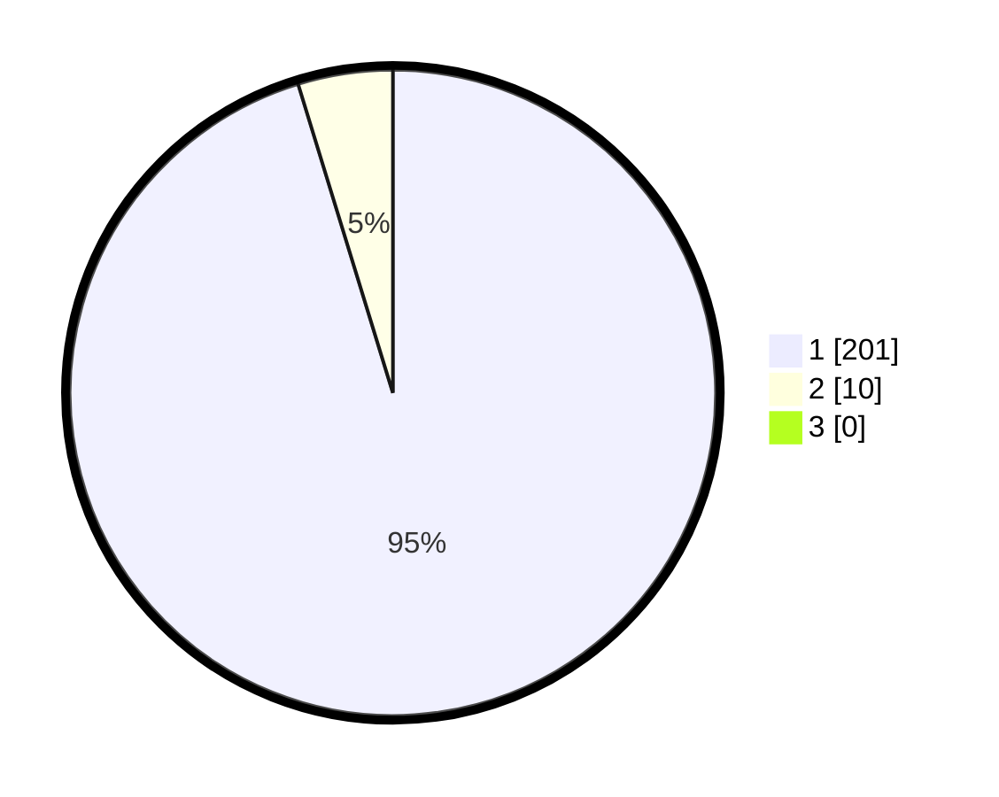

# Hasil

## Grafik

## Tabel

| No. | Nama Paslon    | Suara | Suara (raw) | Persentase |
|:--- |:-------------- | -----:| -----------:| ----------:|
| 1   | ANIES MUHAIMIN | 201   | [201][p-1]  | 95,26      |
| 2   | PRABOWO GIBRAN | 10    | [10][p-2]   | 4,74       |
| 3   | GANJAR MAHFUD  | 0     | [0][p-3]    | 0,00       |

[p-1]: https://github.com/gigit-pemilu/pemilu-2024-35-jawa-timur/blob/main/pilpres/hitung-suara/sub/35-jawa-timur/sub/12-situbondo/sub/11-arjasa/sub/2006-curah-tatal/sub/020-tps/sub/paslon-1.txt
[p-2]: https://github.com/gigit-pemilu/pemilu-2024-35-jawa-timur/blob/main/pilpres/hitung-suara/sub/35-jawa-timur/sub/12-situbondo/sub/11-arjasa/sub/2006-curah-tatal/sub/020-tps/sub/paslon-2.txt
[p-3]: https://github.com/gigit-pemilu/pemilu-2024-35-jawa-timur/blob/main/pilpres/hitung-suara/sub/35-jawa-timur/sub/12-situbondo/sub/11-arjasa/sub/2006-curah-tatal/sub/020-tps/sub/paslon-3.txt

## Foto C Plano

https://sirekap-obj-formc.kpu.go.id/7649/pemilu/ppwp/35/12/11/20/06/3512112006020-20240214-233756--e603f07e-876e-489f-bc92-997a812eedeb.jpg

https://sirekap-obj-formc.kpu.go.id/7649/pemilu/ppwp/35/12/11/20/06/3512112006020-20240214-234402--5a71ef84-2a62-4507-8bb0-f60e55fd2775.jpg

https://sirekap-obj-formc.kpu.go.id/7649/pemilu/ppwp/35/12/11/20/06/3512112006020-20240214-235258--e1c0b76c-17cb-4e76-b8ae-5f808f5e9dc2.jpg

## Metadata

| Key        | Value               |
| ---------- | ------------------- |
| Time Stamp | 2024-02-15 04:00:24 |

