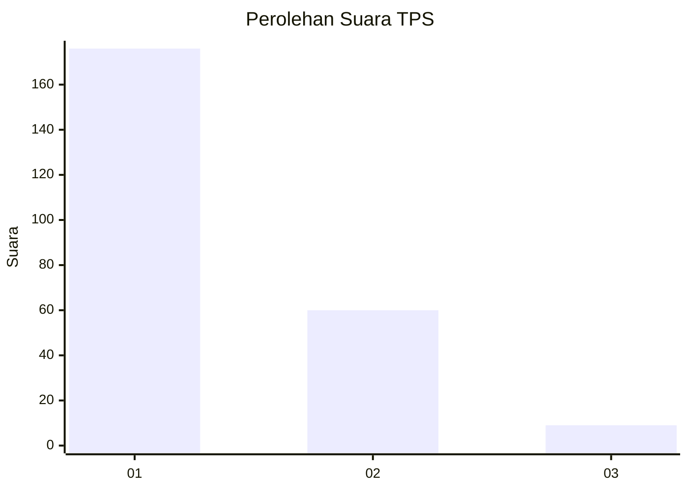
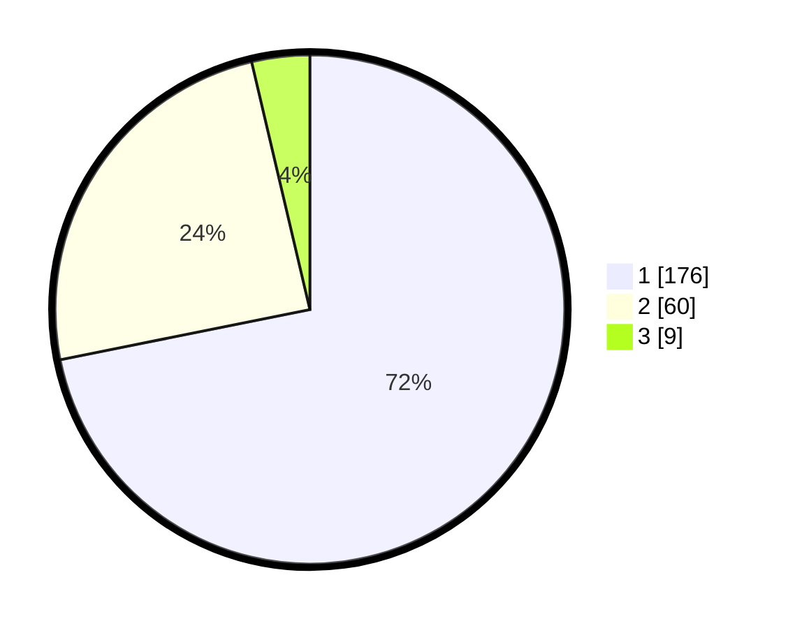

# Hasil

## Grafik

## Tabel

| No. | Nama Paslon    | Suara | Suara (raw) | Persentase |
|:--- |:-------------- | -----:| -----------:| ----------:|
| 1   | ANIES MUHAIMIN | 176   | [176][p-1]  | 71,84      |
| 2   | PRABOWO GIBRAN | 60    | [60][p-2]   | 24,49      |
| 3   | GANJAR MAHFUD  | 9     | [9][p-3]    | 3,67       |

[p-1]: https://github.com/gigit-pemilu/pemilu-2024/blob/main/pilpres/hitung-suara/sub/35-jawa-timur/sub/12-situbondo/sub/11-arjasa/sub/2006-curah-tatal/sub/022-tps/sub/paslon-1.txt
[p-2]: https://github.com/gigit-pemilu/pemilu-2024/blob/main/pilpres/hitung-suara/sub/35-jawa-timur/sub/12-situbondo/sub/11-arjasa/sub/2006-curah-tatal/sub/022-tps/sub/paslon-2.txt
[p-3]: https://github.com/gigit-pemilu/pemilu-2024/blob/main/pilpres/hitung-suara/sub/35-jawa-timur/sub/12-situbondo/sub/11-arjasa/sub/2006-curah-tatal/sub/022-tps/sub/paslon-3.txt

## Foto C Plano

https://sirekap-obj-formc.kpu.go.id/f43e/pemilu/ppwp/35/12/11/20/06/3512112006022-20240215-145650--4d22d1f8-b2ae-4e3a-a50d-b7bc4db8ebfa.jpg

https://sirekap-obj-formc.kpu.go.id/f43e/pemilu/ppwp/35/12/11/20/06/3512112006022-20240215-134353--df47aaf1-3c8c-4c0b-969f-fa9eb8b660ee.jpg

https://sirekap-obj-formc.kpu.go.id/f43e/pemilu/ppwp/35/12/11/20/06/3512112006022-20240214-213344--1d36d34a-131a-4fa7-87d5-3a1de1590ced.jpg

## Metadata

| Key        | Value               |
| ---------- | ------------------- |
| Time Stamp | 2024-02-15 22:30:27 |

