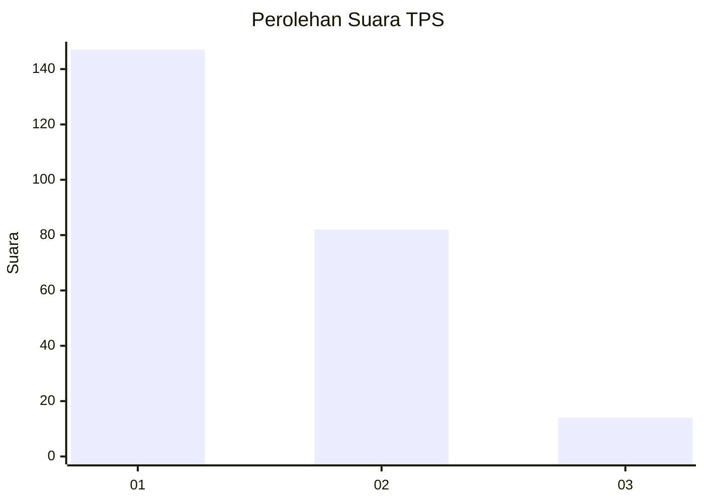
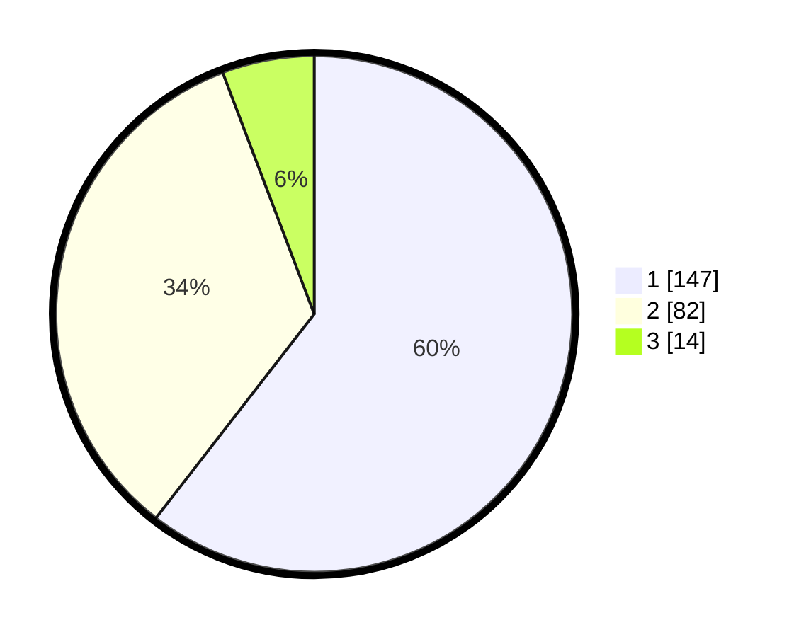

# Hasil

## Grafik

## Tabel

| No. | Nama Paslon    | Suara | Suara (raw) | Persentase |
|:--- |:-------------- | -----:| -----------:| ----------:|
| 1   | ANIES MUHAIMIN | 147   | [147][p-1]  | 60,49      |
| 2   | PRABOWO GIBRAN | 82    | [82][p-2]   | 33,74      |
| 3   | GANJAR MAHFUD  | 14    | [14][p-3]   | 5,76       |

[p-1]: https://github.com/gigit-pemilu/pemilu-2024-35-jawa-timur/blob/main/pilpres/hitung-suara/sub/35-jawa-timur/sub/12-situbondo/sub/11-arjasa/sub/2008-lamongan/sub/002-tps/sub/paslon-1.txt
[p-2]: https://github.com/gigit-pemilu/pemilu-2024-35-jawa-timur/blob/main/pilpres/hitung-suara/sub/35-jawa-timur/sub/12-situbondo/sub/11-arjasa/sub/2008-lamongan/sub/002-tps/sub/paslon-2.txt
[p-3]: https://github.com/gigit-pemilu/pemilu-2024-35-jawa-timur/blob/main/pilpres/hitung-suara/sub/35-jawa-timur/sub/12-situbondo/sub/11-arjasa/sub/2008-lamongan/sub/002-tps/sub/paslon-3.txt

## Foto C Plano

https://sirekap-obj-formc.kpu.go.id/fe42/pemilu/ppwp/35/12/11/20/08/3512112008002-20240214-214341--7c55269d-726b-43d6-a9af-46d6884e4ef2.jpg

https://sirekap-obj-formc.kpu.go.id/fe42/pemilu/ppwp/35/12/11/20/08/3512112008002-20240214-214436--7f24d068-6cf9-4937-9b2c-3ea4d538e8d6.jpg

https://sirekap-obj-formc.kpu.go.id/fe42/pemilu/ppwp/35/12/11/20/08/3512112008002-20240214-214728--9e755c7f-928d-4672-a697-f82cb564126d.jpg

## Metadata

| Key        | Value               |
| ---------- | ------------------- |
| Time Stamp | 2024-02-15 21:01:18 |

