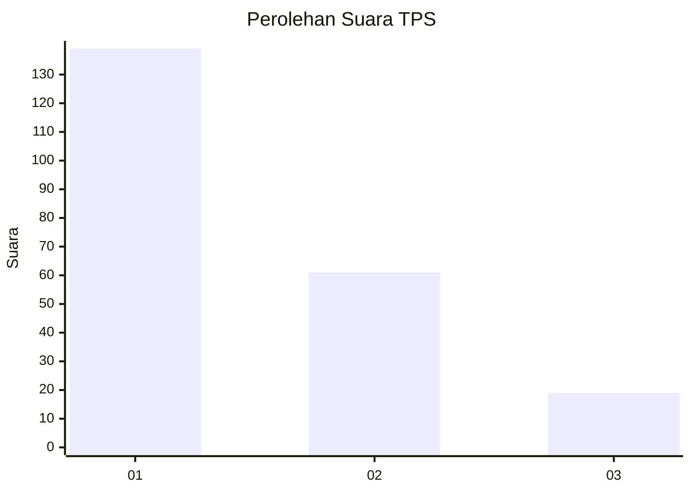
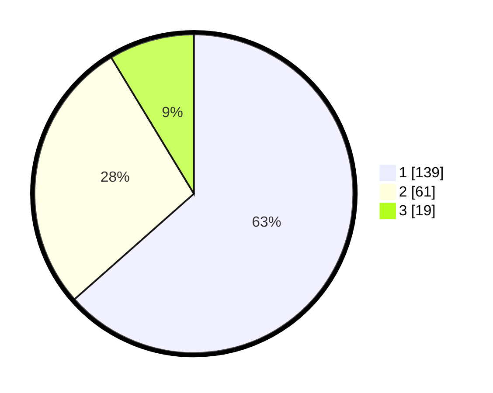

# Hasil

## Grafik

## Tabel

| No. | Nama Paslon    | Suara | Suara (raw) | Persentase |
|:--- |:-------------- | -----:| -----------:| ----------:|
| 1   | ANIES MUHAIMIN | 139   | [139][p-1]  | 63,47      |
| 2   | PRABOWO GIBRAN | 61    | [61][p-2]   | 27,85      |
| 3   | GANJAR MAHFUD  | 19    | [19][p-3]   | 8,68       |

[p-1]: https://github.com/gigit-pemilu/pemilu-2024/blob/main/pilpres/hitung-suara/sub/35-jawa-timur/sub/12-situbondo/sub/11-arjasa/sub/2008-lamongan/sub/009-tps/sub/paslon-1.txt
[p-2]: https://github.com/gigit-pemilu/pemilu-2024/blob/main/pilpres/hitung-suara/sub/35-jawa-timur/sub/12-situbondo/sub/11-arjasa/sub/2008-lamongan/sub/009-tps/sub/paslon-2.txt
[p-3]: https://github.com/gigit-pemilu/pemilu-2024/blob/main/pilpres/hitung-suara/sub/35-jawa-timur/sub/12-situbondo/sub/11-arjasa/sub/2008-lamongan/sub/009-tps/sub/paslon-3.txt

## Foto C Plano

https://sirekap-obj-formc.kpu.go.id/94dc/pemilu/ppwp/35/12/11/20/08/3512112008009-20240217-113500--b1193827-1079-4d6c-bb61-7003c31590a4.jpg

https://sirekap-obj-formc.kpu.go.id/94dc/pemilu/ppwp/35/12/11/20/08/3512112008009-20240215-165156--fd227fd1-f5b4-4c6f-9538-0343d3af897e.jpg

https://sirekap-obj-formc.kpu.go.id/94dc/pemilu/ppwp/35/12/11/20/08/3512112008009-20240214-211607--bdc290eb-d34e-4fd0-873f-1a333c22ae88.jpg

## Metadata

| Key        | Value               |
| ---------- | ------------------- |
| Time Stamp | 2024-02-17 12:00:00 |

