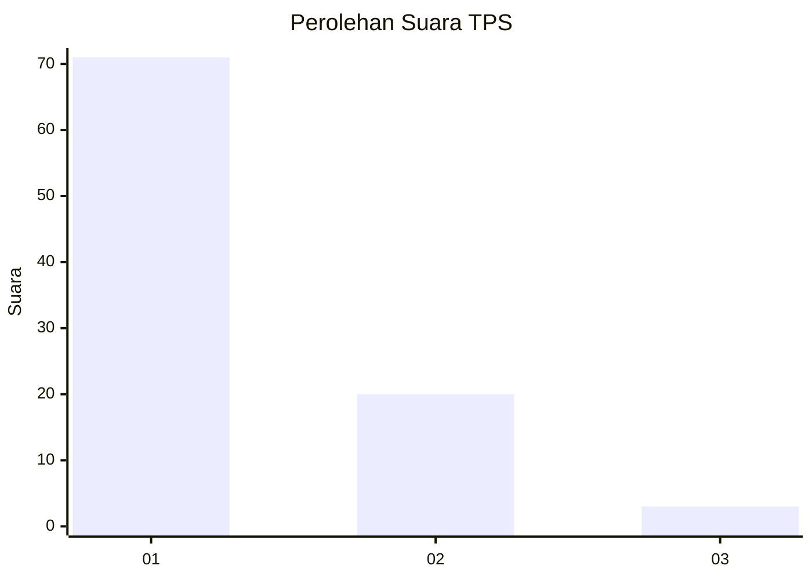
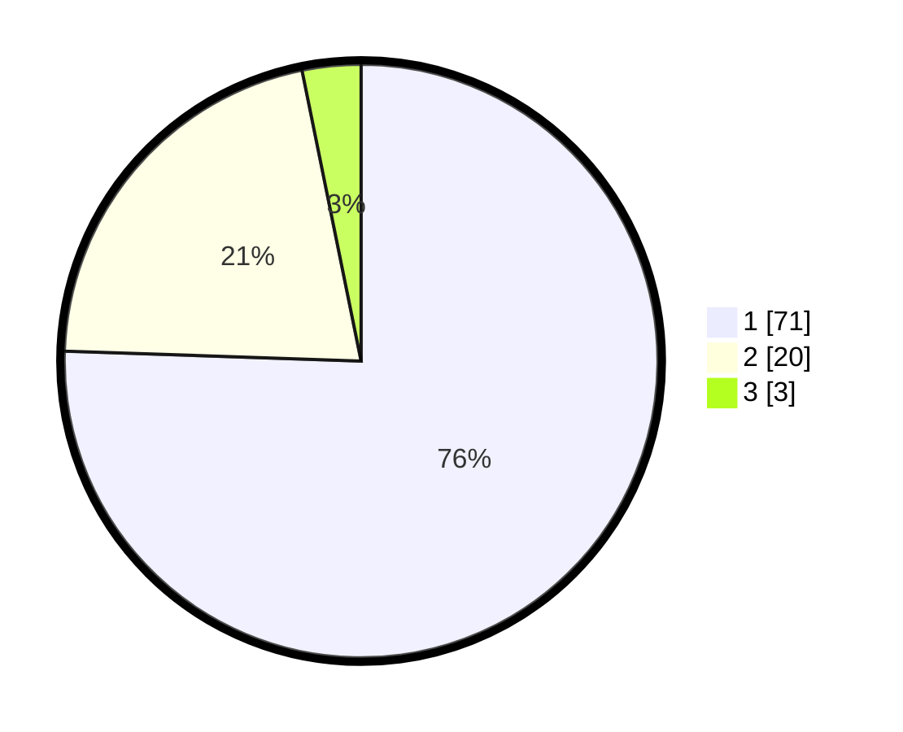

# Hasil

## Grafik

## Tabel

| No. | Nama Paslon    | Suara | Suara (raw) | Persentase |
|:--- |:-------------- | -----:| -----------:| ----------:|
| 1   | ANIES MUHAIMIN | 71    | [71][p-1]   | 75,53      |
| 2   | PRABOWO GIBRAN | 20    | [20][p-2]   | 21,28      |
| 3   | GANJAR MAHFUD  | 3     | [3][p-3]    | 3,19       |

[p-1]: https://github.com/gigit-pemilu/pemilu-2024/blob/main/pilpres/hitung-suara/sub/35-jawa-timur/sub/12-situbondo/sub/13-asembagus/sub/2001-kedunglo/sub/005-tps/sub/paslon-1.txt
[p-2]: https://github.com/gigit-pemilu/pemilu-2024/blob/main/pilpres/hitung-suara/sub/35-jawa-timur/sub/12-situbondo/sub/13-asembagus/sub/2001-kedunglo/sub/005-tps/sub/paslon-2.txt
[p-3]: https://github.com/gigit-pemilu/pemilu-2024/blob/main/pilpres/hitung-suara/sub/35-jawa-timur/sub/12-situbondo/sub/13-asembagus/sub/2001-kedunglo/sub/005-tps/sub/paslon-3.txt

## Foto C Plano

https://sirekap-obj-formc.kpu.go.id/3912/pemilu/ppwp/35/12/13/20/01/3512132001005-20240215-222347--14192c76-cd77-49f8-aacd-0f4a1af4316d.jpg

https://sirekap-obj-formc.kpu.go.id/3912/pemilu/ppwp/35/12/13/20/01/3512132001005-20240217-194445--1cfcc38b-d40e-4f8a-8e41-34d21f8e4cb3.jpg

https://sirekap-obj-formc.kpu.go.id/3912/pemilu/ppwp/35/12/13/20/01/3512132001005-20240217-160144--2ef4b18d-7ece-41fa-aaf4-0e2b122b02c0.jpg

## Metadata

| Key        | Value               |
| ---------- | ------------------- |
| Time Stamp | 2024-02-19 06:16:00 |

## DATA PEMILIH TETAP

Jumlah pemilih dalam DPT: **113**.
 * L: **55**.
 * P: **58**.

## DATA PENGGUNA HAK PILIH

Jumlah pengguna hak pilih dalam DPT: **100**.
 * L: **48**.
 * P: **52**.

Jumlah pengguna hak pilih dalam DPTb: **0**.
 * L: **0**.
 * P: **0**.

Jumlah pengguna hak pilih dalam DPK: **2**.
 * L: **1**.
 * P: **1**.

Jumlah pengguna hak pilih: **102**.
 * L: **49**.
 * P: **53**.

## JUMLAH SUARA SAH DAN TIDAK SAH

JUMLAH SELURUH SUARA SAH: **94**.

JUMLAH SUARA TIDAK SAH: **8**.

JUMLAH SELURUH SUARA SAH DAN SUARA TIDAK SAH: **102**.

