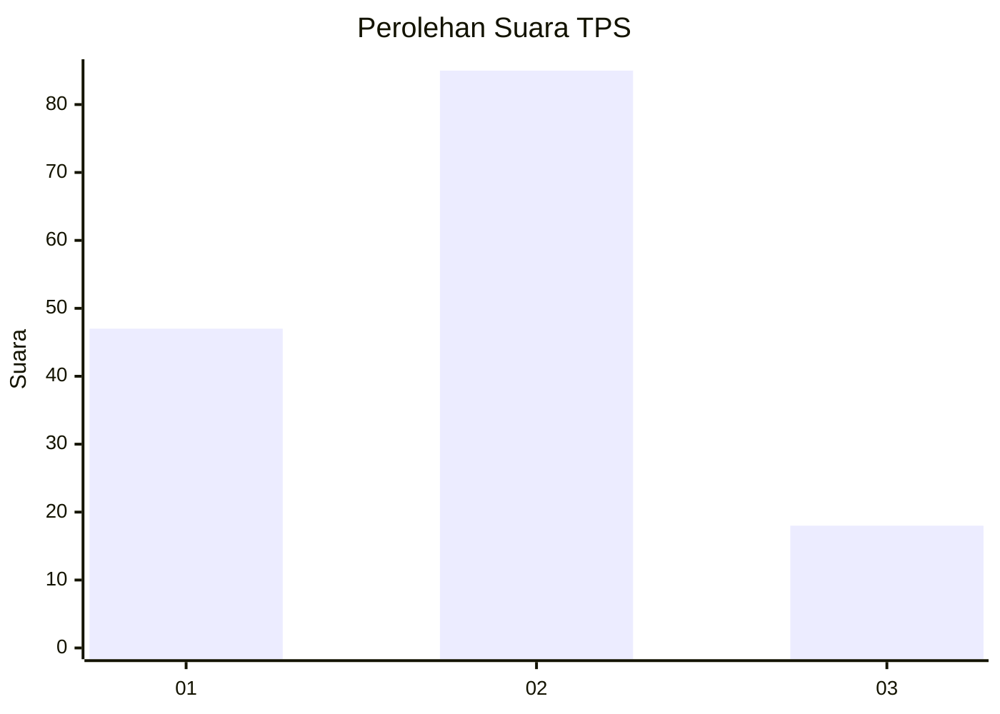
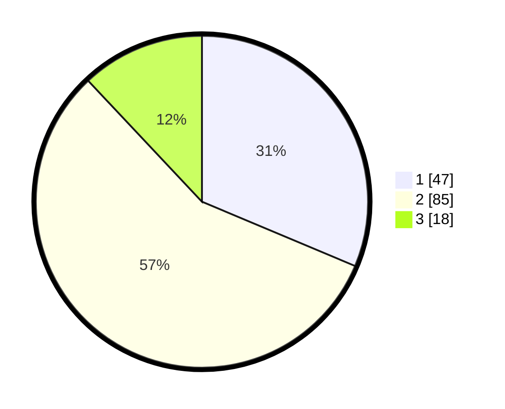

# Hasil

## Grafik

## Tabel

| No. | Nama Paslon    | Suara | Suara (raw) | Persentase |
|:--- |:-------------- | -----:| -----------:| ----------:|
| 1   | ANIES MUHAIMIN | 47    | [47][p-1]   | 31,33      |
| 2   | PRABOWO GIBRAN | 85    | [85][p-2]   | 56,67      |
| 3   | GANJAR MAHFUD  | 18    | [18][p-3]   | 12,00      |

[p-1]: https://github.com/gigit-pemilu/pemilu-2024-35-jawa-timur/blob/main/pilpres/hitung-suara/sub/35-jawa-timur/sub/12-situbondo/sub/14-banyuputih/sub/2002-sumberanyar/sub/004-tps/sub/paslon-1.txt
[p-2]: https://github.com/gigit-pemilu/pemilu-2024-35-jawa-timur/blob/main/pilpres/hitung-suara/sub/35-jawa-timur/sub/12-situbondo/sub/14-banyuputih/sub/2002-sumberanyar/sub/004-tps/sub/paslon-2.txt
[p-3]: https://github.com/gigit-pemilu/pemilu-2024-35-jawa-timur/blob/main/pilpres/hitung-suara/sub/35-jawa-timur/sub/12-situbondo/sub/14-banyuputih/sub/2002-sumberanyar/sub/004-tps/sub/paslon-3.txt

## Foto C Plano

https://sirekap-obj-formc.kpu.go.id/949d/pemilu/ppwp/35/12/14/20/02/3512142002004-20240218-223207--e8d71d3e-95e3-4ed2-836e-bb9d20c4364b.jpg

https://sirekap-obj-formc.kpu.go.id/949d/pemilu/ppwp/35/12/14/20/02/3512142002004-20240218-210116--1949e34a-63d0-414d-95c3-54a5492f3c05.jpg

https://sirekap-obj-formc.kpu.go.id/949d/pemilu/ppwp/35/12/14/20/02/3512142002004-20240218-210232--2be1d6c7-4ae0-47cb-8cf7-bd61982879c5.jpg

## Metadata

| Key        | Value               |
| ---------- | ------------------- |
| Time Stamp | 2024-02-19 17:00:00 |

