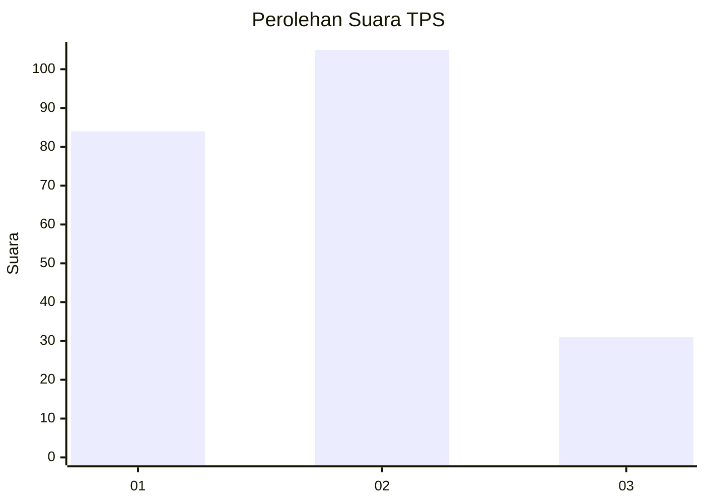
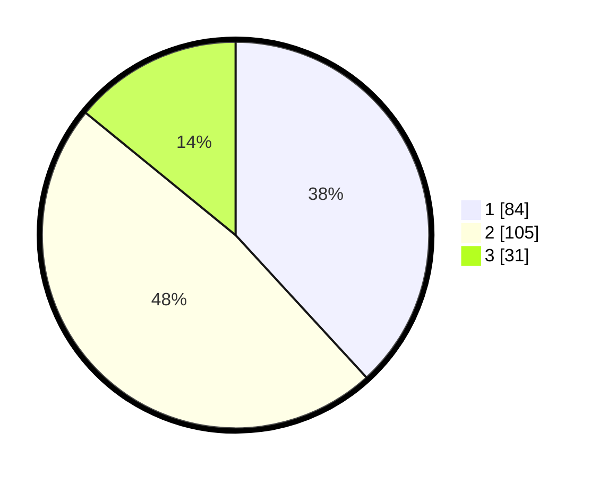

# Hasil

## Grafik

## Tabel

| No. | Nama Paslon    | Suara | Suara (raw) | Persentase |
|:--- |:-------------- | -----:| -----------:| ----------:|
| 1   | ANIES MUHAIMIN | 84    | [84][p-1]   | 38,18      |
| 2   | PRABOWO GIBRAN | 105   | [105][p-2]  | 47,73      |
| 3   | GANJAR MAHFUD  | 31    | [31][p-3]   | 14,09      |

[p-1]: https://github.com/gigit-pemilu/pemilu-2024/blob/main/pilpres/hitung-suara/sub/35-jawa-timur/sub/12-situbondo/sub/14-banyuputih/sub/2002-sumberanyar/sub/005-tps/sub/paslon-1.txt
[p-2]: https://github.com/gigit-pemilu/pemilu-2024/blob/main/pilpres/hitung-suara/sub/35-jawa-timur/sub/12-situbondo/sub/14-banyuputih/sub/2002-sumberanyar/sub/005-tps/sub/paslon-2.txt
[p-3]: https://github.com/gigit-pemilu/pemilu-2024/blob/main/pilpres/hitung-suara/sub/35-jawa-timur/sub/12-situbondo/sub/14-banyuputih/sub/2002-sumberanyar/sub/005-tps/sub/paslon-3.txt

## Foto C Plano

https://sirekap-obj-formc.kpu.go.id/6c3f/pemilu/ppwp/35/12/14/20/02/3512142002005-20240215-102712--219e76db-4b6f-420c-a47e-551f6d7e89cd.jpg

https://sirekap-obj-formc.kpu.go.id/6c3f/pemilu/ppwp/35/12/14/20/02/3512142002005-20240215-102811--ae742eba-f3b8-4a56-9924-40b40b4591a6.jpg

https://sirekap-obj-formc.kpu.go.id/6c3f/pemilu/ppwp/35/12/14/20/02/3512142002005-20240215-102836--ac6b85b8-d1f8-4587-bbaf-f1d0fd914c50.jpg

## Metadata

| Key        | Value               |
| ---------- | ------------------- |
| Time Stamp | 2024-02-16 00:30:27 |

