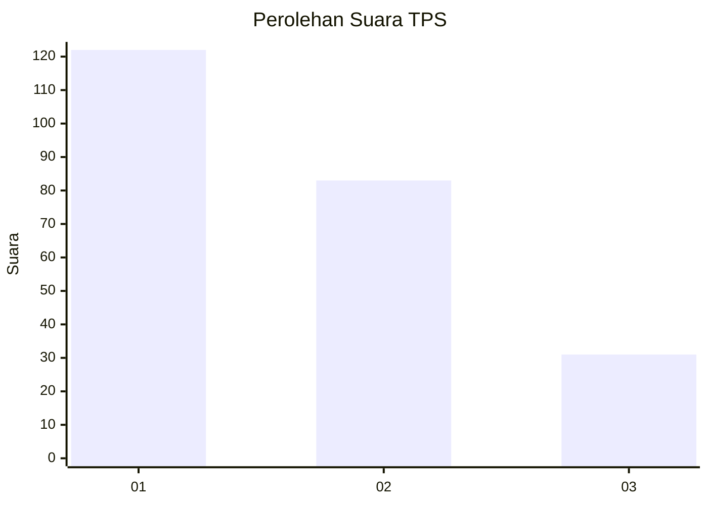
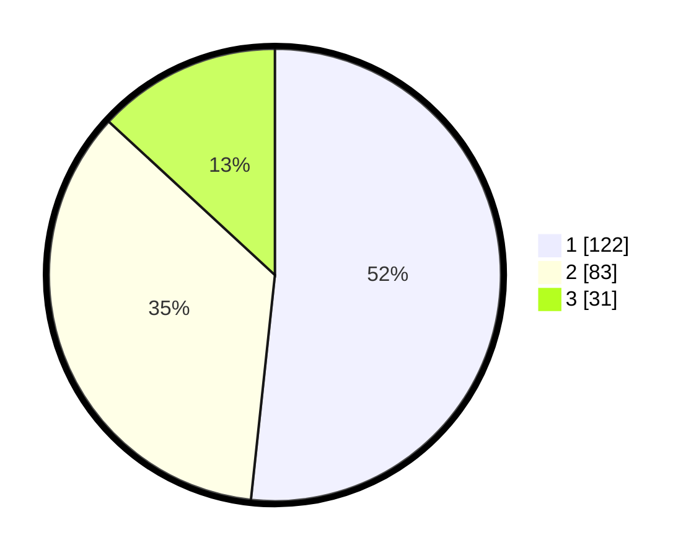

# Hasil

## Grafik

## Tabel

| No. | Nama Paslon    | Suara | Suara (raw) | Persentase |
|:--- |:-------------- | -----:| -----------:| ----------:|
| 1   | ANIES MUHAIMIN | 122   | [122][p-1]  | 51,69      |
| 2   | PRABOWO GIBRAN | 83    | [83][p-2]   | 35,17      |
| 3   | GANJAR MAHFUD  | 31    | [31][p-3]   | 13,14      |

[p-1]: https://github.com/gigit-pemilu/pemilu-2024-35-jawa-timur/blob/main/pilpres/hitung-suara/sub/35-jawa-timur/sub/12-situbondo/sub/14-banyuputih/sub/2003-sumberejo/sub/011-tps/sub/paslon-1.txt
[p-2]: https://github.com/gigit-pemilu/pemilu-2024-35-jawa-timur/blob/main/pilpres/hitung-suara/sub/35-jawa-timur/sub/12-situbondo/sub/14-banyuputih/sub/2003-sumberejo/sub/011-tps/sub/paslon-2.txt
[p-3]: https://github.com/gigit-pemilu/pemilu-2024-35-jawa-timur/blob/main/pilpres/hitung-suara/sub/35-jawa-timur/sub/12-situbondo/sub/14-banyuputih/sub/2003-sumberejo/sub/011-tps/sub/paslon-3.txt

## Foto C Plano

https://sirekap-obj-formc.kpu.go.id/e878/pemilu/ppwp/35/12/14/20/03/3512142003011-20240215-020405--aa6bafd9-39c5-4232-95d6-00888a2d035d.jpg

https://sirekap-obj-formc.kpu.go.id/e878/pemilu/ppwp/35/12/14/20/03/3512142003011-20240215-020503--a12d3aee-902f-42a2-bb29-76d485f35c67.jpg

https://sirekap-obj-formc.kpu.go.id/e878/pemilu/ppwp/35/12/14/20/03/3512142003011-20240215-020536--b0ee100a-8d63-4e13-ad6f-f965d5e7f55f.jpg

## Metadata

| Key        | Value               |
| ---------- | ------------------- |
| Time Stamp | 2024-02-15 22:30:27 |

