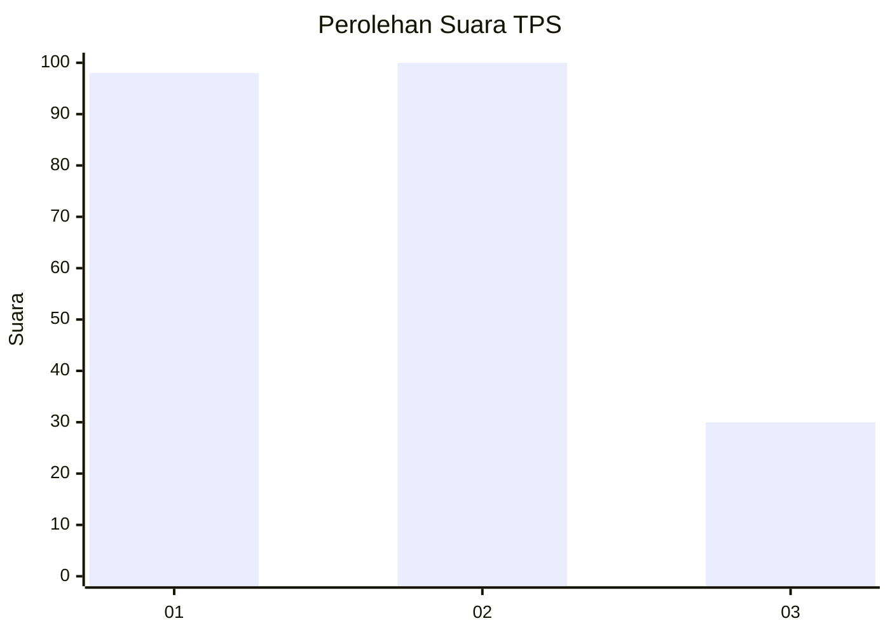
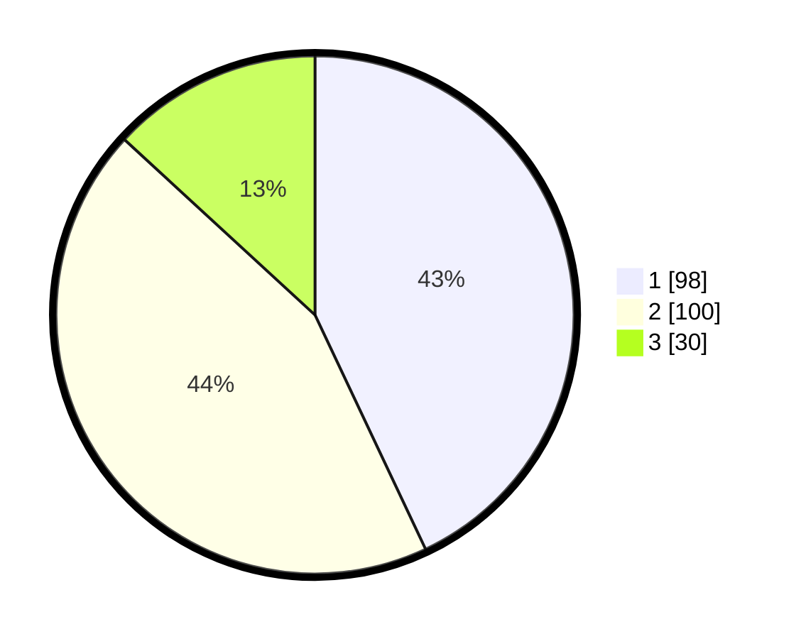

# Hasil

## Grafik

## Tabel

| No. | Nama Paslon    | Suara | Suara (raw) | Persentase |
|:--- |:-------------- | -----:| -----------:| ----------:|
| 1   | ANIES MUHAIMIN | 98    | [98][p-1]   | 42,98      |
| 2   | PRABOWO GIBRAN | 100   | [100][p-2]  | 43,86      |
| 3   | GANJAR MAHFUD  | 30    | [30][p-3]   | 13,16      |

[p-1]: https://github.com/gigit-pemilu/pemilu-2024/blob/main/pilpres/hitung-suara/sub/35-jawa-timur/sub/12-situbondo/sub/14-banyuputih/sub/2003-sumberejo/sub/016-tps/sub/paslon-1.txt
[p-2]: https://github.com/gigit-pemilu/pemilu-2024/blob/main/pilpres/hitung-suara/sub/35-jawa-timur/sub/12-situbondo/sub/14-banyuputih/sub/2003-sumberejo/sub/016-tps/sub/paslon-2.txt
[p-3]: https://github.com/gigit-pemilu/pemilu-2024/blob/main/pilpres/hitung-suara/sub/35-jawa-timur/sub/12-situbondo/sub/14-banyuputih/sub/2003-sumberejo/sub/016-tps/sub/paslon-3.txt

## Foto C Plano

https://sirekap-obj-formc.kpu.go.id/c825/pemilu/ppwp/35/12/14/20/03/3512142003016-20240218-060643--a51da389-598a-4314-8611-1cfc2a7af0c9.jpg

https://sirekap-obj-formc.kpu.go.id/c825/pemilu/ppwp/35/12/14/20/03/3512142003016-20240218-203825--c9fb7cf9-4f30-4838-b4e6-b192a3f71396.jpg

https://sirekap-obj-formc.kpu.go.id/c825/pemilu/ppwp/35/12/14/20/03/3512142003016-20240218-205221--f5008c33-8820-4605-8e89-df98e54f4b52.jpg

## Metadata

| Key        | Value               |
| ---------- | ------------------- |
| Time Stamp | 2024-02-19 13:00:00 |

