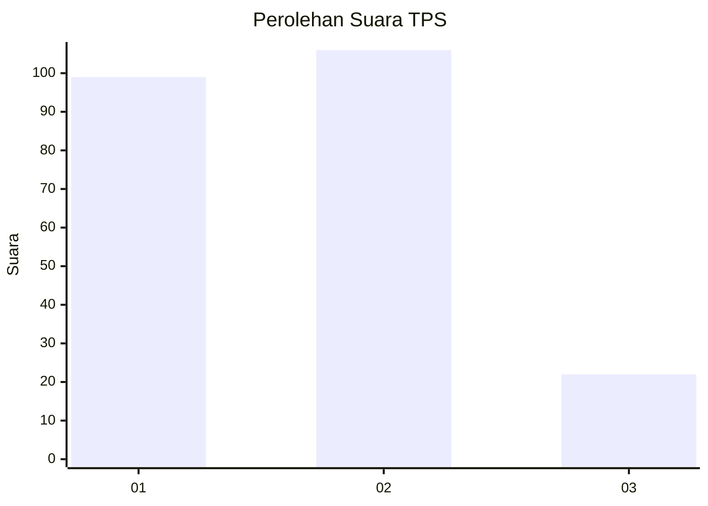
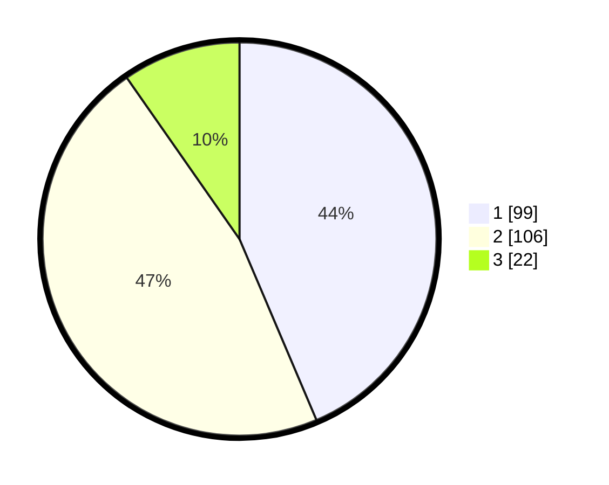

# Hasil

## Grafik

## Tabel

| No. | Nama Paslon    | Suara | Suara (raw) | Persentase |
|:--- |:-------------- | -----:| -----------:| ----------:|
| 1   | ANIES MUHAIMIN | 99    | [99][p-1]   | 43,61      |
| 2   | PRABOWO GIBRAN | 106   | [106][p-2]  | 46,70      |
| 3   | GANJAR MAHFUD  | 22    | [22][p-3]   | 9,69       |

[p-1]: https://github.com/gigit-pemilu/pemilu-2024/blob/main/pilpres/hitung-suara/sub/35-jawa-timur/sub/12-situbondo/sub/14-banyuputih/sub/2003-sumberejo/sub/017-tps/sub/paslon-1.txt
[p-2]: https://github.com/gigit-pemilu/pemilu-2024/blob/main/pilpres/hitung-suara/sub/35-jawa-timur/sub/12-situbondo/sub/14-banyuputih/sub/2003-sumberejo/sub/017-tps/sub/paslon-2.txt
[p-3]: https://github.com/gigit-pemilu/pemilu-2024/blob/main/pilpres/hitung-suara/sub/35-jawa-timur/sub/12-situbondo/sub/14-banyuputih/sub/2003-sumberejo/sub/017-tps/sub/paslon-3.txt

## Foto C Plano

https://sirekap-obj-formc.kpu.go.id/f2f0/pemilu/ppwp/35/12/14/20/03/3512142003017-20240215-011517--3f9f9de9-7468-49da-ad77-535e62359f9e.jpg

https://sirekap-obj-formc.kpu.go.id/f2f0/pemilu/ppwp/35/12/14/20/03/3512142003017-20240215-011242--ab160efa-12b6-48d0-b1b7-eb8524f5fbe3.jpg

https://sirekap-obj-formc.kpu.go.id/f2f0/pemilu/ppwp/35/12/14/20/03/3512142003017-20240218-214403--44b007df-70c4-4862-adac-6d74b212ac64.jpg

## Metadata

| Key        | Value               |
| ---------- | ------------------- |
| Time Stamp | 2024-02-19 06:16:00 |

