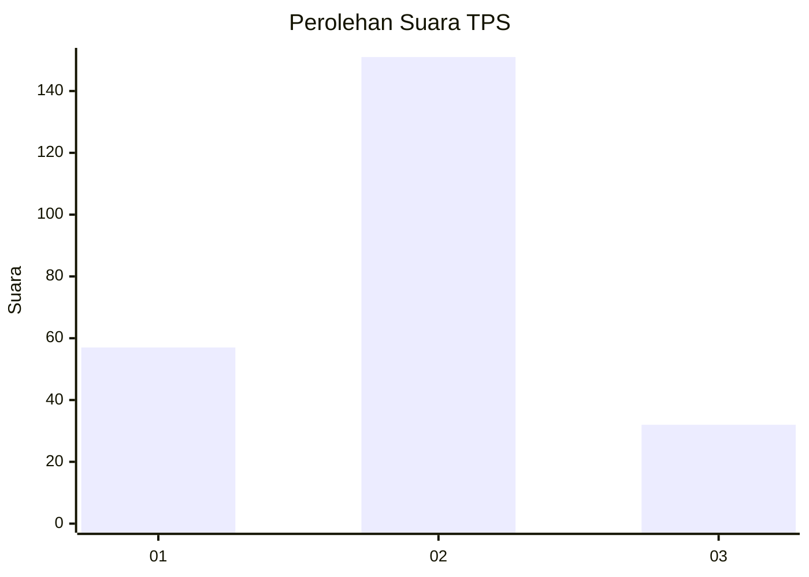
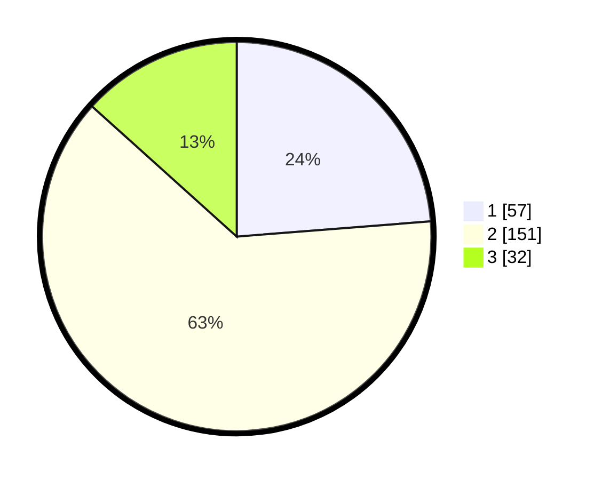

# Hasil

## Grafik

## Tabel

| No. | Nama Paslon    | Suara | Suara (raw) | Persentase |
|:--- |:-------------- | -----:| -----------:| ----------:|
| 1   | ANIES MUHAIMIN | 57    | [57][p-1]   | 23,75      |
| 2   | PRABOWO GIBRAN | 151   | [151][p-2]  | 62,92      |
| 3   | GANJAR MAHFUD  | 32    | [32][p-3]   | 13,33      |

[p-1]: https://github.com/gigit-pemilu/pemilu-2024/blob/main/pilpres/hitung-suara/sub/35-jawa-timur/sub/12-situbondo/sub/14-banyuputih/sub/2003-sumberejo/sub/031-tps/sub/paslon-1.txt
[p-2]: https://github.com/gigit-pemilu/pemilu-2024/blob/main/pilpres/hitung-suara/sub/35-jawa-timur/sub/12-situbondo/sub/14-banyuputih/sub/2003-sumberejo/sub/031-tps/sub/paslon-2.txt
[p-3]: https://github.com/gigit-pemilu/pemilu-2024/blob/main/pilpres/hitung-suara/sub/35-jawa-timur/sub/12-situbondo/sub/14-banyuputih/sub/2003-sumberejo/sub/031-tps/sub/paslon-3.txt

## Foto C Plano

https://sirekap-obj-formc.kpu.go.id/e229/pemilu/ppwp/35/12/14/20/03/3512142003031-20240215-153427--1c8f4e55-ca08-404c-8fe8-da9302ab630b.jpg

https://sirekap-obj-formc.kpu.go.id/e229/pemilu/ppwp/35/12/14/20/03/3512142003031-20240214-155303--10329130-ed3e-45e6-b5c3-8b4defe0116b.jpg

https://sirekap-obj-formc.kpu.go.id/e229/pemilu/ppwp/35/12/14/20/03/3512142003031-20240214-155532--996db36f-cd34-4ff9-ad03-9cbdfaed14dc.jpg

## Metadata

| Key        | Value               |
| ---------- | ------------------- |
| Time Stamp | 2024-02-16 01:00:27 |

