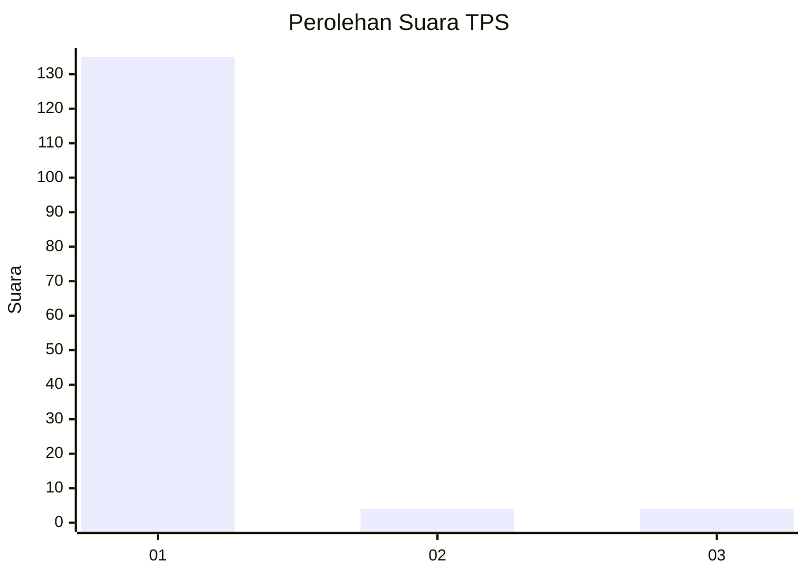
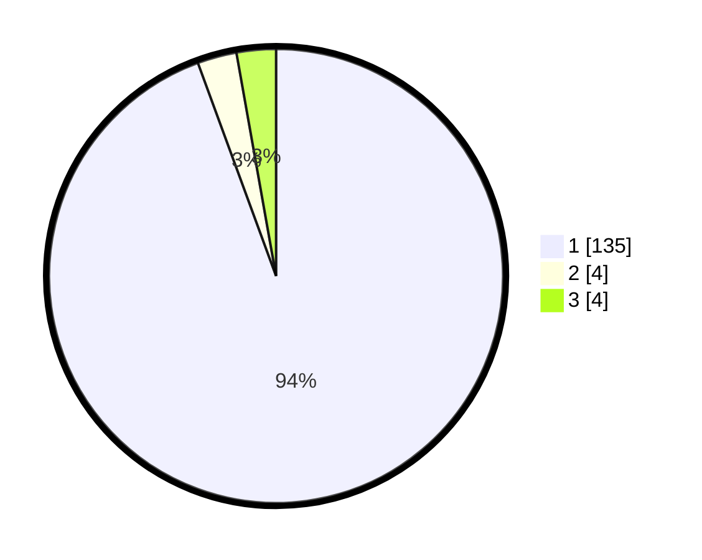

# Hasil

## Grafik

## Tabel

| No. | Nama Paslon    | Suara | Suara (raw) | Persentase |
|:--- |:-------------- | -----:| -----------:| ----------:|
| 1   | ANIES MUHAIMIN | 135   | [135][p-1]  | 94,41      |
| 2   | PRABOWO GIBRAN | 4     | [4][p-2]    | 2,80       |
| 3   | GANJAR MAHFUD  | 4     | [4][p-3]    | 2,80       |

[p-1]: https://github.com/gigit-pemilu/pemilu-2024/blob/main/pilpres/hitung-suara/sub/35-jawa-timur/sub/12-situbondo/sub/14-banyuputih/sub/2003-sumberejo/sub/909-tps/sub/paslon-1.txt
[p-2]: https://github.com/gigit-pemilu/pemilu-2024/blob/main/pilpres/hitung-suara/sub/35-jawa-timur/sub/12-situbondo/sub/14-banyuputih/sub/2003-sumberejo/sub/909-tps/sub/paslon-2.txt
[p-3]: https://github.com/gigit-pemilu/pemilu-2024/blob/main/pilpres/hitung-suara/sub/35-jawa-timur/sub/12-situbondo/sub/14-banyuputih/sub/2003-sumberejo/sub/909-tps/sub/paslon-3.txt

## Foto C Plano

https://sirekap-obj-formc.kpu.go.id/8238/pemilu/ppwp/35/12/14/20/03/3512142003909-20240214-223718--4a471f23-8df8-48cc-acc0-529b6dbaa19e.jpg

https://sirekap-obj-formc.kpu.go.id/8238/pemilu/ppwp/35/12/14/20/03/3512142003909-20240214-223219--c294d371-86fb-4fc7-92f8-8b760e5dc885.jpg

https://sirekap-obj-formc.kpu.go.id/8238/pemilu/ppwp/35/12/14/20/03/3512142003909-20240214-223504--3307666d-cf1c-40eb-a92c-19307db45a1b.jpg

## Metadata

| Key        | Value               |
| ---------- | ------------------- |
| Time Stamp | 2024-02-15 21:01:18 |

